# 第2天

**CSMA/CD, 交换和虚拟局域网**

**CSMA/CD, Switching, and VLANs**

## 第二天的任务

- 阅读今天的课文
- 复习昨天的课文
- 阅读 ICND1 记诵指南


思科工程师混饭吃的手艺就是安装、配置和调试（troubleshooting）交换机。而这又恰恰是这些工程师们不那么擅长的事情，这么说有些不思议吧。可能有些人靠的是交换机本身的即插即用能力，或是在问题出现后直面解决。这样的“凭感觉试试看”的风格，在出现交换相关的问题时，就会心态事与愿违了。（This "fly by the seat of your pants" mentality backfires for many enigeers when there is a switching-related issue.）

**我建议你在学习本书时，先粗略地过一遍，然后在回头读几次，每次都将那些重点做一下笔记或是划一下重点。**

今天你将学到以下内容：

- CSMA/CD
- 虚拟局域网，VLANs
- 配置 VLANs
- VLANs 故障排除

此模块涵盖 CCNA 大纲要求的以下方面：

- 掌握以太网络中用到的技术及介质访问控制方法
+ 理解基本的交换概念及思科交换机操作：
    - 冲突域
    - 广播域
    - 交换的不同类型
    - CAM 表
+ 配置并验证初始交换机配置，含远程访问管理
    - 执行基本交换机设置的那些思科 IOS 命令
- 使用如 ping、Telnet 以及 SSH 等基本工具程序来验证网络状态以及交换机的运作
+ 描述 VLANs 是如何创建出逻辑独立网络，以及这些网络之间的路由需求
    - 解释网络分段及基本的流量管理概念
- 配置和验证 VLANs

## 交换机基础知识

### 带有冲突检测载波侦听，多路复用，Carrier Sense, Multiple Access with Collision Detection

带有冲突检测载波侦听，多路复用(Carrier Sense, Multiple Access with Collision Detection, CSMA/CD) 一词可以分解为以下几个部分，“载波侦听” 的意思是线路为设备所侦听，以确定是否有信号在其上传输。如果线路正在使用中，那么以太网帧是不能发送出去的。“多路复用” 的意思是网段上有多余一台的设备在使用线缆。最后的“冲突检测” 是指协议运行着一套确定线路上的太网帧是否因为遇到另一个帧而已经损坏的算法。从下图 2.1 你可以看到交换机端口在监听着线路。

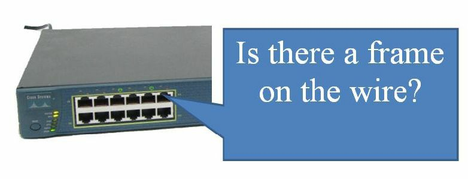

*图 2.1 -- 端口监听着线路*

如果线路上出现了冲突，则监听设备会发出一个拥塞信号，以通知其它设备发生了冲突，它们就不会尝试往线路上发送数据了。此时，协议算法运行起来，产生一个随机数时间间隔，在以此间隔后重传。在线路清空前，设备不会发送以太网帧。Wikipedia 上是这样解释该过程的：

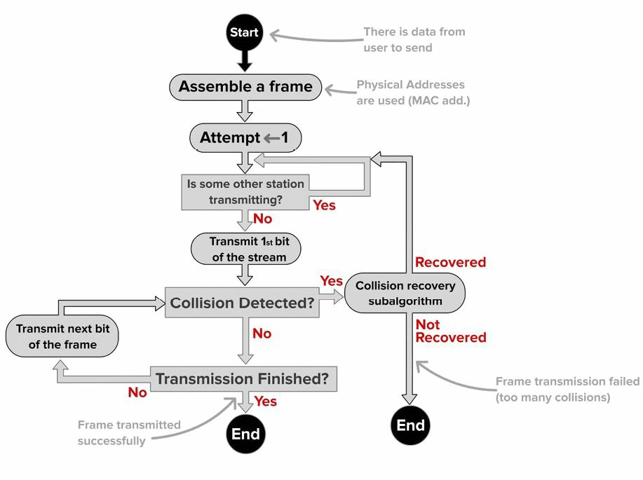

*图 2.2 -- CSMA/CD 过程*

> Farai 指出 -- “需要注意，现代交换机使用的是全双工连接交换机，因此而不会用到 CSMA/CD。但它仍然支持该技术，而这完全是为了向后兼容性。”

### 冲突域和广播域

网络集线器的一个缺点是在线路上发生冲突时，损坏的帧会发送到所有连接的设备。现代交换机的优势之一就是交换机的每个端口都是作为一个冲突域。在冲突发生时（全双工下是不可能出现的），损坏的帧不会通过接口。图 2.3 展示了一台交换机增加到使用两台集线器的小型网络上的情形。交换机将该网络分解成两个冲突域。

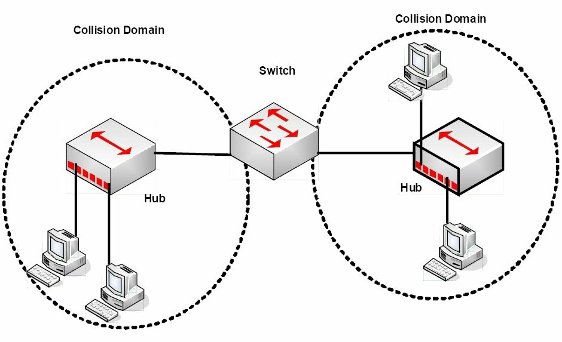

*图 2.3 -- 一台交换机创建出两个冲突域*

思科通常会在考试中以提问交换机是否减少冲突域数量的方式引诱你犯错。匆忙之下，你可能受导向说交换机会减少冲突域数量，但实际情况是相反的，交换机会增加冲突域的数量，而这是好事。交换机确实增加了冲突域的数量。因为集线器受限于其所采用的技术，而只能工作于半双工下，它就显得相当无用了。图 2.4 中，**4 台 PC 连接到交换机上，产生 4 个冲突域**。每台 PC 都工作在全双工下，能够完全用上 100Mbps 的带宽。

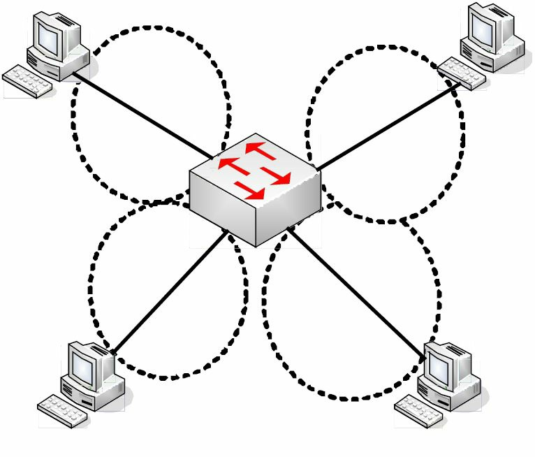

*图 2.4 -- 四个冲突域*

**交换机（这里说的是二层交换机）不会隔离广播域，路由器会**。如果交换机收到带有广播目的地址的以太网帧，就就转发给所有端口，不管该帧是从哪个端口收到的。需要一台路由器来隔离广播域。图 2.5 展示了使用交换机/网桥以及一台路由器的小型网络，用以说明冲突域是如何隔离的。

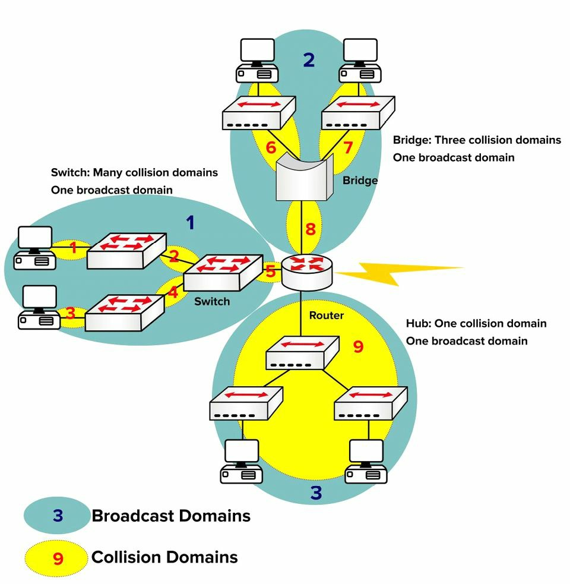

*图 2.5 -- 广播域和冲突域*

### 自动协商，Auto-negotiation

你已经见到在连接不同速率和双工设置时，可能会出问题。在网络的一部，你可能会经常予以升级，但因为财务预算的制约，网络的其它部分会有老旧设备。这就会导致双工和速率的不匹配，引起错误和丢帧现象的发生。后面的章节中，我们将涉及交换机故障排除的内容。

IEEE 将自动协商作为解决此问题的方案，该技术让设备在传输流量前，就双工和速率上达成一致。速率设置为低速设备的速率。在下面的输出中，速率可被手动设定为 10Mbps 或 100Mbps， 或者设定为 auto-negotiation。

```console
Switch(config)#int f1/0/1
Switch(config-if)#speed ?
10 Force 10 Mbps operation
100 Force 100 Mbps operation
auto Enable AUTO speed configuration
```

该设置可用命令 `show interface x` 进行查看。

```console
Switch#show int f1/0/1
FastEthernet1/0/1 is down, line protocol is down (notconnect)
    Hardware is FastEthernet, address is 001e.13da.c003 (bia 001e.13da.c003)
    MTU 1600 bytes, BW 10000 Kbit, DLY 1000 usec,
        reliability 255/255, txload 1/255, rxload 1/255
    Encapsulation ARPA, Loopback not set
    Keepalive set (10 sec)
    Auto-duplex, Auto-speed, media type is 10/100BaseTX
```

请务必牢记，尽管有如此设置，**auto-negotiation 仍可能会引起问题**。这就是为何许多生产性网络仍然坚持将端口直接配置成 100/full 或者千兆以太网的 1000/full。思科这样解释的：

> 不合格的应用(nonconforming implementation)、硬件不兼容或者软件缺陷(software defects)三种原因，可能会导致各种自动协商问题。在网卡或厂商交换机与 IEEE 802.3u 规范不完全一致时，问题就会发生。厂商特定的一些高级特性，比如自动正负极性或线缆完整性（auto-polarity or cable integrity）等在 IEEE 802.3u 的 10/100Mbps 自动协商标准中没有描述的那些特性，同样会导致硬件的不兼容或其它问题。（[Cisco.com](http://www.Cisco.com)）

### 帧交换，Switching Frames

**交换机是为交换帧而生（也就是说，将来自某进入接口的帧传输到正确的出口接口）**。广播帧被交换出所有接口（除了接收到广播帧的那个接口），带有不明目的地（目的地址不在 MAC 表中）的那些帧也一样，交换机执行下面三个动作：

- 根据目的 MAC 地址，进行帧转发或过滤(forwarding or filtering<dropping>)
- 从进来的帧学习 MAC 地址
- 使用 STP 协议来阻止二层环回的发生（STP 在 ICND2 第 31 天学习）

图 2.6 中，交换机将来自主机 `A` （`F0/1`）以主机 `C` 为目的地的帧正确转发出`F0/3`， 而阻止其离开接口 `F0/2`。

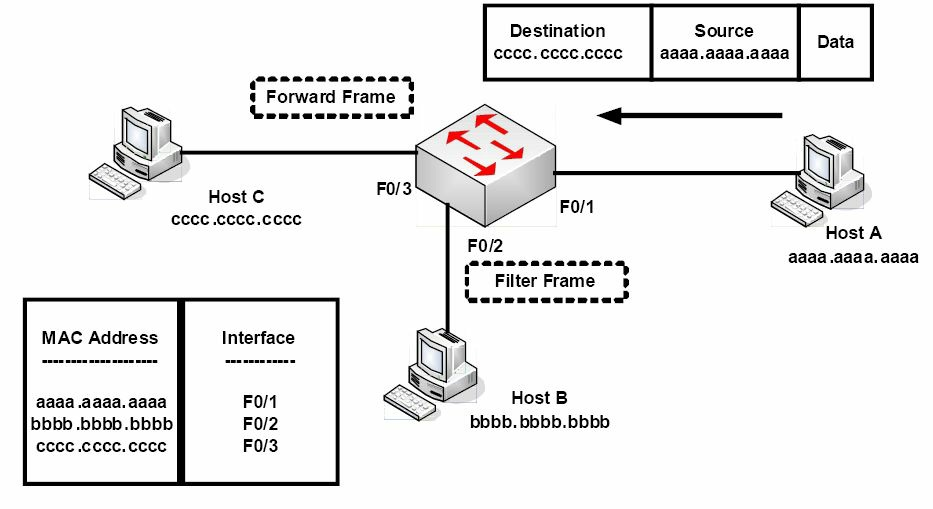

*图 2.6 -- 帧过滤*

如目的地址不在 MAC 地址表中，交换机将该帧泛洪(flooding)至除它收到该帧的那个接口外的所有接口上。**交换机也会存储那些连接在另一台交换机上的设备的 MAC 地址；不过在地址表中它们对应的接口名称会是同一个，这样下来多个 MAC 地址与一个同样的出口接口对应，列出在 MAC 地址表中。这是一种找出网络上你不熟悉设备的方法**。图 2.7 用以说明这个概念。

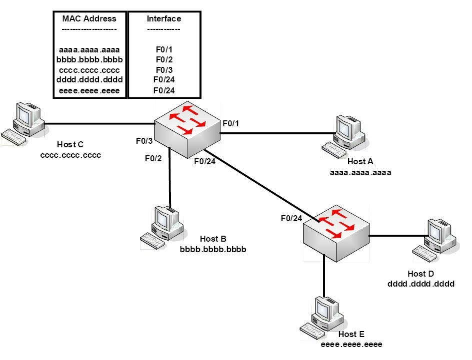

*图 2.7 -- 同一接口上的多 MAC 地址*

流量传输中的任何延时(delay)，都被称为传输延迟（latency）。**依据你所希望的在流量传输前对帧的检查程度，思科交换机提供了三种流量交换的方式**。对帧的检查越多，引入到交换机的延迟就越多。三种可供选择的交换模式(switching modes)为：

- 直通模式，Cut-through
- 存储转发模式(交换机默认)，Store-and-forward
- Fragment-free（改进的直通模式）

**直通模式**

直通模式交换是最快交换方式，它有最低的延迟。进入交换机的帧仅读至目的地址，便做出转发决定。在获知目的地址后，交换机马上检查 CAM 表，以找到正确的端口来转发出该帧并马上发出。因为没有错误检查，此方式才能提供最低的延迟。代价是交换机会转发任何带有错误的帧。

使用一个比方来说明交换机模式是最好不过了。你作为某夜店的保安，被要求每个进入夜店的人都要有一个带照片的出入卡 -- 却并没要求你去查看照片是否与那个人一致，只是出入卡要有就行。这种方式下，人们必定能快速进入夜店了。这就是直通模式的工作原理。


**存储转发模式**

交换机读取整个帧，并将其复制到它的缓冲区。对该帧执行一次循环冗余校验（cyclic redundancy check, CRC）以检查其存在的任何错误。如有发现错误，该帧就被丢弃。相反，就检查交换表，并转发该帧。存储转发模式确保帧至少有 64 字节大，且不大于 1518 字节。若小于 64 字节或大于 1518 字节，交换机就会丢弃帧。


现在请再次设想你是夜店保安，此时你务必要确保照片与那个人是相吻合的，同时你要在放进那些人之前记下他们的名字和地址。这样来查验出入卡就造成了相当大的延迟，这也是存储转发交换运行的方式。

三种交换方式中有着最高延迟的就是存储转发交换，也是 2900 系列交换机默认的交换方式。

**Fragment-free(修订的直通模/Runt-free 模式)**

因为直通交换不检查错误，而存储转发模式又耗时太长，我们需要一种又快又可靠的方式。使用夜店保安的例子，设想你被要求确保每个人都有出入卡同时照片又要吻合。此方式下，你确保每个人都是其宣称的那个人，但你不必记下他们的所有信息。在交换中，这是通过采用 fragment-free 交换方式实现的，低端的（lower-level）思科交换机默认配置为此种模式。

Fragment-free 交换是直通交换的一个修改变种。检查帧的前 64 字节有无错误，随后传输出去。此方法背后推理（reasoning）是帧的错误最有可能发生在前 64 字节中。

如同上面已经提到的，以太网帧的最小尺寸是 64 字节；任何小于 64 字节的帧被称为是“侏儒（runt）”帧。因为转发前的帧都必须至少有 64 字节，这就会消除那些侏儒帧，这也是为何此模式又被叫做 “runt-free” 交换的原因。

## 交换基本概念，Switching Concept

### 交换机使用需求

在交换机发明前，网络上的所有设备都会接收到来自其它设备的数据。一旦探测到线路上有一个数据帧，PC 就不得不停下来查看其头部，看看自己是不是数据帧的接收者。设想一下网络上每分钟都有上千个帧吧。所有设备很快就被折腾到挂起。图 2.8 展示了网络上的所有设备；注意因为是通过仅转发的集线器连接在一起，它们都不得不共享同一带宽。


*图 2.8 -- 每台设备都听着其它设备*

**集线器的问题**

之前我曾提到**集线器仅是简单的多端口中继器**(见 2.9)。它们接收传入的信号，进行清理，然后在插线了的端口上发出。它们同时创建出一个巨大的冲突域。

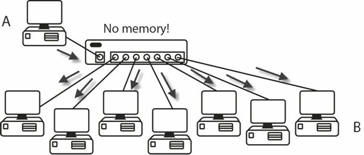

*图 2.9 -- 集线器在每个端口上都发送帧*

集线器是愚蠢(dumb)设备。它们没有 MAC 地址存储机制，所以在设备 A 每次往设备 B 发送一个帧时，它都会往每个端口发送。交换机就不一样，有一块叫做专用集成电路（application-specific integrated circuit, AISC）的存储芯片，该芯片会建立一个设备端口表（图 2.10）。这个表保存在内容可寻址存储器（Content Addressable Memory, CAM）中。

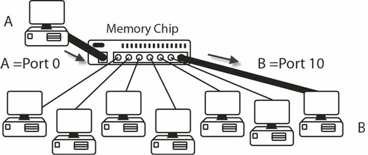

*图 2.10 -- 交换机建立起一张 MAC 地址表*

**在首次启动时，交换机并未在其 CAM 表（思科考试又此表称为 MAC 地址表）中存储任何地址**。一有帧开始传输，该表就建立起来。如果在指定时间过后没有帧从某个端口传送，这条记录就会过期。下面的输出表明，至今仍没有帧在交换机上通过。

```console
Switch#show mac-address-table
        Mac Address Table
-------------------------------------------
Vlan    Mac Address     Type        Ports
----    -----------     --------    -----
Switch#
```

交换机中没有记录，不过当你从一台路由器 `ping` 另一台时（两台都连接上交换机），表格条目建立起来。

```console
Router#ping 192.168.1.2
Type escape sequence to abort.
Sending 5, 100-byte ICMP Echos to 192.168.1.2, timeout is 2 seconds:
.!!!!
Success rate is 80 percent (4/5), round-trip min/avg/max = 62/62/63 ms
Switch#show mac-address-table
        Mac Address Table
-------------------------------------------
Vlan    Mac Address     Type        Ports
----    -----------     --------    -----
1       0001.c74a.0a01  DYNAMIC     Fa0/1
1       0060.5c55.da01  DYNAMIC     Fa0/2
```

该条目的意思是，任何目的地址为连接到交换机上 `FastEthernet` 端口 `0/1` 或 `0/2` 的 MAC 地址的帧，都会直接发送到对应的端口。对于任何其它帧，交换机都将执行一次广播查询，看看目的设备是否插入了交换机。从上面的五次 `ping` 中的第一个句点可以看出。在等待交换机广播查询及收到目的路由器回应时，第一次 `ping` 发生了超时（`80%` 的成功率）。

**`show mac-address-table` 命令是一个非常重要的命令**，务必要记住这个命令，考试和现实工作中都是需要的。
你已经注意到 MAC 地址是个什么东西了。MAC 地址指派给所有设备，以实现数据链路层的通信。在以太网卡、路由器的以太网接口及无线设备上，你都能看到各厂商分配的 MAC 地址。下面是我的笔记本的以太网卡的 MAC 地址。


各家厂商有各自的组织唯一识别号（Organizationally Unique Identifier, OUI）, 该号码构成了 MAC 地址的前半段。随后他们就可以根据其各自的编号系统来自由创建地址的后半段了。一个 MAC 地址是 `48` 位二进制数（后面我们会涉及二进制和十六进制的知识），所以上面我的地址构成为：

| OUI | 厂商编号 |
| -- | -- |
| 24 位二进制数 | 24 位二进制数 |
| 6 位十六进制数 | 6 位十六进制数 |
| 00 1E EC | 54 85 17 |


如交换机在某个接口上收到一个帧，它就将帧的源地址加入到表中。如它知道帧的目的地址，就将该转发出相应接口。如它不知道目的地址，它将把该帧广播到除了收到该的所有接口。如果交换机收到一个广播帧（也就是目的地址全 `F` 的帧），它也会将该帧广播到除接收到该帧的所有接口。后面我们会涉及十六进制编址。广播过程如图 2.11 所示。

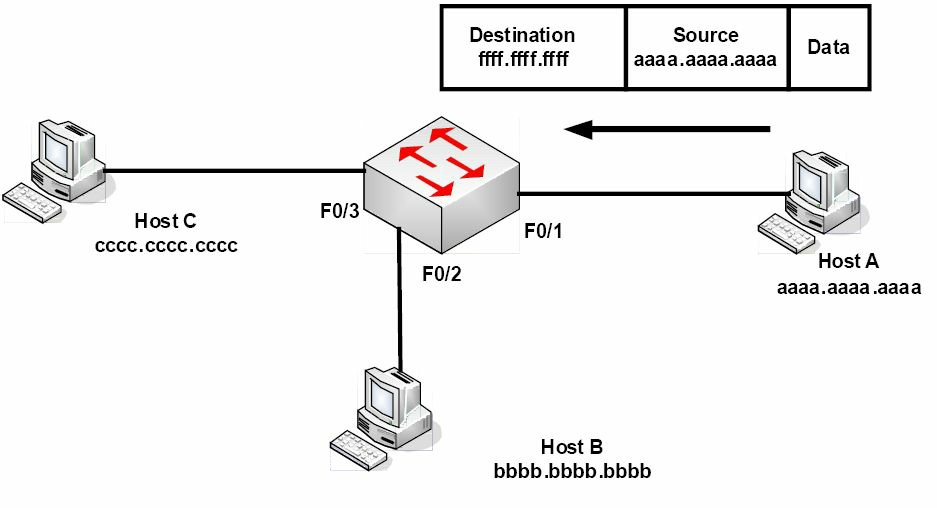

*图 2.11 -- 广播帧在所有接口上发出*

### 以太网帧

有四种不同类型的以太网帧：

- 以太网 `802.3` 帧
- 以太网 `II` 帧
- 以太网 `802.2 SAP` 帧
- 以太网 `802.2 SNAP` 帧

前两种以太网标准用于在网卡之间通信时的组帧方式。**它们不能识别上层协议，`802.2` 类型帧才具备此能力**。你**只需要注意 `802.3` 类帧**，此类型的帧构成如下。


*图 2.12 -- 以太网 `802.3` 帧结构*

IEEE 委员确定的 `IEEE 802.3` 以太网帧有以下特定字段。

- 前同步信号，`preamble` -- 为传入的数据对网卡进行信号同步及告知
- 帧开始界定符，`start-of-frame delimiter`, SFD -- 标志着帧的开始
- 目的地址 -- 目的 MAC 地址，可以是单播（Unicast）、广播或多播(Multicast)
- 源地址 -- 发送主机的 MAC 地址
- 长度 -- 定义帧中数据字段的长度
- 数据 -- 帧中的载荷（就是传输中的数据）
- 帧校验序列，frame-check sequence, FCS -- 给出了帧中所有数据的循环冗余校验（cyclic redundancy check, CRC）


### 交换机初始配置，Initial Switch Configuration

你需要先像连接全新的路由器那样，用通过控制台端口连接新的交换机。因为在你能够在通过 Telnet 或 SSH（稍后会更多地讲到）连上交换机之前，交换机上至少得已经有一两条配置才行。很多交换机的初始配置和路由器的初始配置都是一样的。

在首次连接交换机时，在任何设上都很有必要执行一下 `show version` 命令（其输出见下面）。考试中也要求你明白哪个 `show` 命令提供哪些信息。大多数情况下你不能从考试模拟器访问中得到答案，你就只有靠记忆来作答了。

`show version` 命令提供了很多有用信息，包括这些。

- 交换机运行时间，switch uptime
- 型号
- IOS 版本， IOS release
- 上次重启的原因
- 所有接口及其类型
- 所有安装的存储器
- 背板 MAC 地址，base MAC address

```console
Switch>en
Switch#show version
Cisco IOS Software, C2960 Software (C2960-LANBASE-M), Version 12.2(25)FX, RELEASE
SOFTWARE (fc1)
Copyright (c) 1986-2005 by Cisco Systems, Inc.
Compiled Wed 12-Oct-05 22:05 by pt_team
ROM: C2960 Boot Loader (C2960-HBOOT-M) Version 12.2(25r)FX, RELEASE SOFTWARE (fc4)
System returned to ROM by power-on
Cisco WS-C2960-24TT (RC32300) processor (revision C0) with 21039K bytes of memory.
24 FastEthernet/IEEE 802.3 interface(s)
2 GigabitEthernet/IEEE 802.3 interface(s)
63488K bytes of flash-simulated non-volatile configuration memory.
Base Ethernet MAC Address___________: 0090.2148.1456
Motherboard assembly number         : 73-9832-06
Power supply part number            : 341-0097-02
Motherboard serial number           : FOC103248MJ
Power supply serial number          : DCA102133JA
Model revision number               : B0
Motherboard revision number         : C0
Model number                        : WS-C2960-24TT
System serial number                : FOC1033Z1EY
Top Assembly Part Number            : 800-26671-02
Top Assembly Revision Number        : B0
Version ID                          : V02
CLEI Code Number                    : COM3K00BRA
Hardware Board Revision Number      : 0x01
Switch  Ports   Model           SW Version  SW Image
------  -----   -----           ----------  ---------------
*   1   26      WS-C2960-24TT   12.2        C2960-LANBASE-M
Configuration register is 0xF
```

我们还没有涉及 VLANs 的知识，但现在，你可以把 VLAN 看着是一个逻辑上的局域网，在 VLAN 上的设备物理上可以在不同地方，但在能它们所能关注到的细节下（as far as they are concerned），他们都是直接连接在一台交换机下的。在下列配置中，交换机所有端口都是默认在 VLAN 1 中。

```console
Switch#show vlan
VLAN    Name        Status      Ports
----    -------     ------      ------------------------------
1       default     active      Fa0/1, Fa0/2, Fa0/3, Fa0/4,
                                Fa0/5, Fa0/6, Fa0/7, Fa0/8,
                                Fa0/9, Fa0/10, Fa0/11, Fa0/12,
                                Fa0/13, Fa0/14, Fa0/15, Fa0/16,
                                Fa0/17, Fa0/18, Fa0/19, Fa0/20,
                                Fa0/21, Fa0/22, Fa0/23, Fa0/24,
```

如你打算给交换机添加一个 IP 地址（就是**管理地址**），以便通过网络连上该交换机，只需给某个 VLAN 配置 IP 地址即可；本例中就是 VLAN1。

```console
Switch#conf t
Enter configuration commands, one per line. End with CNTL/Z.
Switch(config)#interface vlan1
Switch(config-if)#ip add 192.168.1.3 255.255.255.0
Switch(config-if)#  ← hold down Ctrl+Z keys now
Switch#show interface vlan1
Vlan1 is administratively down, line protocol is down
    Hardware is CPU Interface, address is 0010.1127.2388 (bia 0010.1127.2388)
    Internet address is 192.168.1.3/24
```

而 **VLAN1 默认是关闭的**，你需要执行一个 `no shutdown` 命令来开启它。**还需告诉交换机往哪里发送所有 IP 流量，因为 2 层交换机没有建立路由表的能力**；该操作如下面的输出所示。

```console
Switch#conf t
Enter configuration commands, one per line. End with CNTL/Z.
Switch(config)#ip default-gateway 192.168.1.1
Switch(config)#
```

在网络上有多台交换机时，你会想着去修改交换机默的主机名，这样在远程连接它们时才更容易区分（见下面的配置命令行）。设想一下通过远程 Telnet 对五台同样叫做 “Switch” 的交换机进行故障排除时的情形吧。

```console
Switch(config)#hostname Switch1
```

如你要经由网络 Telnet (或 SSH) 到某台交换机，你还需开启该协议。交换机远程访问默认是关闭的。

```console
Switch1#conf t
Enter configuration commands, one per line.
Switch1(config)#line vty 0 15
Switch1(config-line)#password cisco
Switch1(config-line)#login
```

**请完成上述操作，然后从另一设备（同一子网）连上交换机来测试你的配置**。这是一道 CCNA 基础题目。

**VTYs（Virtual TeletYpe terminal） 是路由器或交换机用于对其进行 Telnet 或安全 Telnet ( SSH ) 访问的虚拟端口**。在你为其配置上一种认证方式之前，它们都是关闭的（最简单的方法是给它们加上一个口令，然后执行 `login` 命令）。你可以见到 0 到 4 端口、inclusive (包含)或 0 到 15 端口。要得知你有多少个可用的端口的一种方法是在编号 0 后面输入一个问号， 或者使用 `show line` 命令，如下面的输出所示。

```console
Router(config)#line vty 0 ?
<1-15>  Last Line number
Router#show line
    Tty Typ Tx/Rx       A Modem Roty    AccO    AccI    Uses    Noise   Overruns    Int
*   0   CTY             -   -   -       -       -       0       0       0/0
    1   AUX 9600/9600   -   -   -       -       -       0       0       0/0         *
    2   VTY             -   -   -       -       -       2       0       0/0
    3   VTY             -   -   -       -       -       0       0       0/0
    4   VTY             -   -   -       -       -       0       0       0/0
    5   VTY             -   -   -       -       -       0       0       0/0
    6   VTY             -   -   -       -       -       0       0       0/0
```
CTY 就是控制台线路，同时 VTY 线路用于 Telnet 连接，AUX 是指辅助端口。

为了获得更为安全的访问方式，你可以仅允许 SSH 连接进入交换机，这就是说流量会被加密。而要让 SSH 工作，你需要在交换机上允许安全性 IOS 镜像，如下面的输出那样。

```console
Switch1(config-line)#transport input ssh
```
现在，Telnet 流量就不再被允许传入到 VTY 端口了。

请在交换机上配置一下这所有的命令。仅仅阅读它们无助于你在考试当天记起它们。

## 虚拟局域网，Virtual Local Area Networks, VLANs

就如同你已经看到的那样，交换机打破冲突域。更进一步，路由器打破广播域，这就是说现在的网络看起来像下面这样。

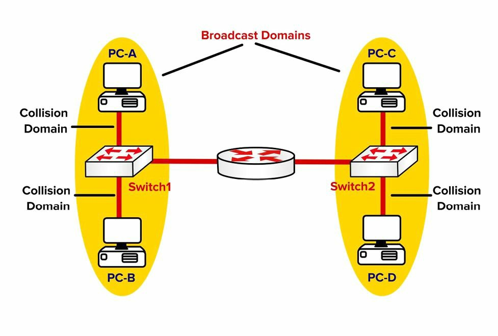

*图 2.13 -- 路由器隔离广播域*

在继续之前，让我们讨论一下局域网到底是什么。一个局域网本质上是一个广播域。图 2.13 中的网络上，如果 PC-A 发出一个广播包，PC-B 会接收到这个包，PC-C 和 PC-D 却不能。这是因为那台路由器打破了该广播域。现在你可以**使用虚拟局域网将交换机的那些端口放入不的广播域**，如下图所示。

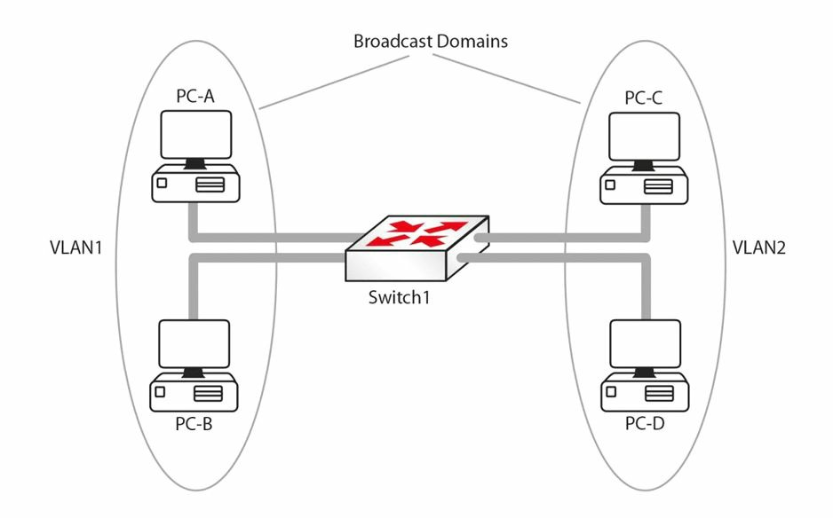

*图 2.14 -- VLAN 下的广播域*

图 2.14 中，该 2 层网络经由 VLANs 被划分为两个广播域。PC-A 发出的广播包为 PC-B 接收到，PC-C 和 PC-D 接收不到。如没有 VLANs，PC-C 和 PC-D 仍会收到 PC-A 发出的广播包。VLANs 的一些优点如下。

- 更小规模的设备组中的较少广播包令到网络更快

- 设备资源得以节省，因为它们只需处理少量的广播包

- 通过将设备保留在特定组别（或按特定功能分组）的一个广播域中，而提升安全性。这里的组别，可以是公司/机构的部门，或是某个安全级别等。比如开发部门或者测试室就应该与生产部门的设备分开。

- 带来在跨越任何尺度的地理位置上网络扩展的灵活性。比如，同一 VLAN 中某台 PC 在楼宇中的什么位置并不重要。它会以为自己与其它配置在同一 VLAN 中的机器在同样的网段上。图 2.15 中，VLAN 1 中的所有主机都能与其它主机通信，尽管它们不在同一楼层。对它们来说，VLAN 是透明的或不可见的。

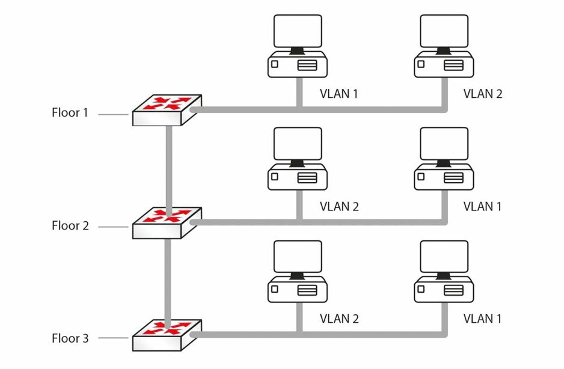

*图 2.15 -- VLANs 消除局域网的物理边界*

### VLAN 标记，VLAN Marking

虽然厂商在创建 VLANs 中采用其各自的方法，我们务必要小心处理一个涉及多厂商的 VLAN，以解决互操作性问题。比如思科开发的 **ISL 标准，是通过增加一个 26 字节的头部，以及一个新的 4 字节尾部（trailer）, 的方式来封装原始帧**。为解决兼容性问题，IEEE 开发了 802.1Q 标准，这是一个独立于厂商的方式，用以创建可互操作 VLANs。


*图 2.16 -- ISL 的标记方式*

`802.1Q` 通常被称为“帧标记（frame tagging）”, 因为它将一个叫做标签的 `32` 位头部（a 32-bit header, called a "tag"），插入到原始帧源地址后面，而不会对其它字段进行修改。紧邻源地址后两个字节，占据着一个注册以太网类型值 -- `0x8100`, 它表明该帧包含了一个 `802.1Q` 头部。接着的 `3` 位表示 `802.1P` 用户优先级（User Priority, UP）字段, 在服务质量（Quality of Service, QoS）技术中，用作服务类别（Class of Service, CoS）位。下一个字段是 `1` 位规范格式标识（Canonical Format Indicator, CFI），最后 `12` 位是 VLAN ID。所以在采行 802.1Q 标准时，我们总共能有 `4096` 个 VLANs。


*图 2.17 -- `802.1Q` 的标记方式*

传送来自多个 VLANs 数据的那个端口叫做干线（trunk）端口。trunk 端口可以使用 ISL 协议，也可以使用 `802.1Q` 协议。`802.1Q` 中的一个特别概念是"原生 VLAN（native VLAN）"。这是一种特别的 VLAN 类型，它上面的帧是没有打标签的。原生 VLAN 的目的是让交换机在某个接口上运行 `802.1Q` 中继（单一链上的多 VLANs），即便另一设备无法支持中继的情况下，原生 VLAN 上的流量仍能通过该链路。如交换机在一条中继链路上收到未打标签的流量，就会假定这些流量是属于原生 VLAN 上的。**思科将 `VLAN 1` 作为_默认_的原生 VLAN**。

### 加入虚拟局域网， VLAN Membership
 
有两种常用的将端口加入到 VLANs 的方式 -- 静态方式或动态方式。

通过静态 VLAN 指派或配置，交换机上的那些端口为管理员所配置在不同 VLANs 中，有关设备再连接到端口上。在某用需要搬往楼宇的其它部位时，就要求管理员改变交换机上的配置。默认情形下，所有交换机端口属于 `VLAN 1`。

动态指派方式令到设备可根据其 MAC 地址而加入到特定的 VLAN。该特性给予管理员在无需改变交换机配置的情况下，允许用户接入任何交换机或是在楼栋内搬动的灵活性。**通过运用一台虚拟局域网管理策略服务器（a VlAN Management Policy Server, VMPS）实现动态特性**。

> Farai 指出 “先是端口指派到 VLANs 中，随后设备插入到端口上”。

请注意，由于各个 VLAN 都是不同的广播域，这就带来以下问题。

* 默认情形下，一个 VLAN 中的主机是不能到达其它 VLAN 的
* VLAN 间通信需要一台三层设备（后面会讲到）
* 每个 VLAN 都需要它们自己的子网，比如， `VLAN 1` -- `192.168.1.0/24`, `VLAN 2` -- `192.168.2.0/24`
* 某 VLAN 中的所有主机应属于同一 VLAN

### VLAN 链路， VLAN Links
 
我们知道在一台交换机上可以有连接到多个 VLANs 的主机。那么在流量从一台主机前往另一主机时，发生了些什么呢？比如说，在图 2.15 中，当 `VLAN 1` 位于一楼的主机尝试与 `VLAN 1` 位于二楼的主机通信时，二层的那台主机是怎样知道该流量是属于哪个 VLAN 的呢？

我们知道交换机采用了一种叫做“帧标记（frame tagging）” 的方式，来将流量在不同 VLANs 上保持隔离。交换机把包含了 VLAN ID 的一个头部添加进帧中。在图 2.15 中，一楼交换机将会给来自 `VLAN 2` 的流量打上标记后，传给交换机 `2`, 交换机 `2` 将会看到这个标记，从而得知该流量需要呆在 `VLAN 2` 中。**这样的流量只能在叫做*中继链路*的链路上通过。`VLAN 1` 通常被指定为原生 VLAN（native VLAN），而_原生 VLAN 上的流量不被标记_**。关于原生 VLAN 的内容，后面会提到。

交换机端（在 CCNA 考试范围内）可一分为以下三种。

- 接入端口，或接入链路，access links or ports
- 中继端口，或中链路，trunk links or ports
- 动态端口（很快就会学到这个）

### 接入链路，Access Links
 
被定义了作为接入链路的交换机端口，只能是唯一 VLAN 的一个成员。连接该接入链路的设备并不知晓任何其它 VLANs 的存在。在来自主机的帧进入到一个接入链路时，交换机就将一个标签加入到该帧中，在前往主机的帧从交换机接入链路出去时，交换将该标记从帧中移除。接入链路用于连接主机，也可以用于连接路由器。

### 中继，Trunking

某个交换机端口通常既会连接网络上的某台主机，也会连接其它网络交换机、路由器或服务器。那么该链路就有可能需要传输多个 VLANs 上的流量。为实现这个目的，就需要区分每个帧都是来自于哪个 VLAN。这种区分方式就叫做 “帧标记（frame tagging）”, 在经中继链路传输前，出原生 VLAN 的帧外，所有帧都已打过标签。帧中的标记包含了 VLAN ID 信息。在帧到达目的主机所在的那台交换机后，该标记被移除。


*图 2.18 -- VLAN 标记法*

VLAN 中继用于传输多个 VLAN 的数据。为将属于某个 VLAN 的帧与其它 VLANs 的帧有所区别，在中继链路上传输的所有帧都经特别标记过，这样目的交换机就知道该帧属于那个 VLAN。ISL 和 802.1Q 是用于确保这些 VLANs 在穿过交换机中继链路后，仍能完全分辨出来的两种主要方式。

交换机间链路（Inter-Switch Link, ISL) 是思科专有的。尽管如此，CCNA 考试用用到的型号是 2960 交换机，它只能识别 802.1Q。我们在这里提到 ISL 只是为了知识体系的完整性，以防你不得不配置老旧型号的交换机的情形。

> Farai 指出 -- “所有新型号交换机默认都是采用 802.1Q， ISL 已被弃用。”

802.1Q 与 ISL 有很多的不同，最大区别是，802.1Q 可以支持最多 4096 个 VLANs, ISL 只能支持最多 1000 个。另一个大的区别是 802.1Q 中的原生 VLAN 概念。默认情形下，802.1Q 中来自所有 VLANs 的帧都被打上标签。此规则的唯一例外就是属于原生 VLAN 的帧，这些帧未被标记。

尽管如此，你要记住，**在某个特定中继链路上，可以通过将某 VLAN 设为原生 VLAN，来指定其上面的帧不打标签**。比如，在采用 802.1Q 时，为阻止对 VLAN 400 上的帧打标签，你需要将 VLAN 400 配置为某特定中继上的原生 VLAN。IEEE 802.1Q 原生 VLAN 配置在后面会详细介绍。

以下是有关 802.1Q 特性的小结。

- 支持最多 4096 个 VLANs
- 采用帧内标记机制，修改原始帧
- 是由 IEEE 开发的开发标准协议
- 不对原生 VLAN 上的帧打标签；除此之外的所有帧都被标记

下面是一台交换机上的简短示例配置。我将 `switchport` 命令包括了进去，该命令告诉交换机将其某个端口作为二层端口，而不是三层。

```console
Sw(config)#interface FastEthernet 0/1
Sw(config-if)#switchport
Sw(config-if)#switchport mode trunk
Sw(config-if)#switchport trunk encapsulation dot1q
Sw(config-if)#exit
```

当然，在 2960 系列交换机上，`encapsulation` 不被识别，因为它只有一种类型。**在将一台交换机与其它交换机连接时，你需要将其接口设置为中继接口，以令到 VLANs 都被标记上**。`switchport` 命令的作用同样如此。再次说明，我在这里提到这个，是因为在现实中，你可能要配置一台三层交换机，如我们死盯 2960 型号，你可能会感到迷惑，我们不要这个！

交换机上的某中继链路可以是下列五种模式之一。

- 开启（On）模式 -- 强制该端口进入永久中继模式。不管插入设备是否同意将它们之间的链路转换成中继链路，该端口都会成为一个中继端口。
- 关闭（Off）模式 -- 该链路不被作为中继链路使用，就算插入设备被设置成“中继”模式。
- 自动（Auto）模式 -- 该端口不情愿成为一条中继链路。在插入设备被设置为“开启”或“我要（desirable)”模式时，链路就成为中继链路。当两端都被设置为“自动”模式时，链路就绝不会变成中继链路了，因为没有一方有转换成中继的意愿。
- 我要（Desirable）模式 -- 该端口积极尝试转换成中继链路。如另一设备被设置为 “开启”、“自动” 或 “我要” 模式，链路就会成为中继链路
- 没商量（No-negotiate）模式 -- 阻止端口经由协商成为中继连接。配置上此模式后，端口会强制进入接入模式或中继模式。
 
### 配置 VLANs， Configuring VLANs
 
现在你已对 VLANs 和中继链路有了了解，就让我们来配置一下图 2.19 中的网络吧。你需要将交换机配置为两个分别在 `fa0/1` 端口上的主机位于 `VLAN 5` 中，以及端口 `fa0/15` 之间的链路为中继链路。

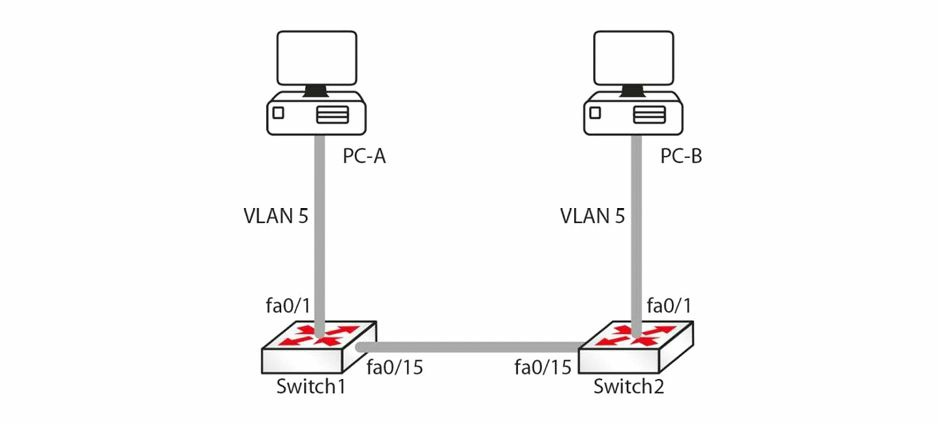

*图 2.19 -- 测试网络*

在将端口指派到 VLANs 之前，务必先要全局配置命令 `vlan <vlan#>` 创建出那个 VLAN。而此命令又会将你带入 VLAN 配置模式，在那里又可以为 VLANs 赋予一个描述性的名称。这里有一个示例。

```console
Switch1(config)#vlan 5
Switch1(config-vlan)#name RnD
Switch2(config)vlan 5
Switch2(config-vlan)#name RnD
```

使用命令 `show vlan` 命令来查看交换上存在着哪些 VLANs。其输出与下面的相似。

```console
Switch1#show vlan
VLAN    Name        Status      Ports
----    --------    -------     --------------------------------------------
1       default     active      Fa0/1, Fa0/2, Fa0/3, Fa0/4 Fa0/5, Fa0/6, Fa0/7, Fa0/8 Fa0/9,
                                Fa0/10, Fa0/11, Fa0/12, Fa0/13 Fa0/14, Fa/15, Fa0/16, Fa0/17, Fa0/18
...
[Truncated Output]
...
5       RnD         active
...
[Truncated Output]
```

我们在通过使用接口配置命令 `switchport access vlan [vlan#]`, 将端口 `fa0/1` 加入到 `VLAN 5` 中去。

```console
Switch1(config)#int fa0/1
Switch1(config-if)#switchport access vlan 5
Switch2(config)#int fa0/1
Switch2(config-if)#switchport access vlan 5
```

在形如 3560 这样的三层交换机上，在将某个端口加入到一个 VLAN 前，你务必要使用命令 `switchport mode access` 将端口手动设置为接入模式。现在我们来看看 `show vlan` 命令的输出。

```console
Switch1#show vlan
VLAN    Name        Status      Ports
----    ----        -----       --------------------------------------------
1       default     active      Fa0/2, Fa0/3, Fa0/4, Fa0/5, Fa0/6, Fa0/7,
                                Fa0/8, Fa0/9, Fa0/10, Fa0/11, Fa0/12, Fa0/13,
                                Fa0/14, Fa/15, Fa0/16, Fa0/17, Fa0/18
...
[Truncated Output]
...
5       RnD         active      Fa0/1
...
[Truncated Output]
```

注意 `fa0/1` 现在被指派给了 `VLAN 5`。让我们来将两台交换机的 `fa0/15` 接口配置为中继链路。这里要注意的是 `3550` 型号交换机端口的默认模式是我要模式（`desirable`， 3560 型号的是自动模式）。 动态中继协议（Dynamic Trunk Protocol, DTP）会导致两台交换机上的 `fa0/15` 接口成为 ISL 中继链路。下一节课会学 DTP 的内容，但这里会简要提到 DTP 的一些东西。这种情况可用 `show interface trunk` 命令看到。

```console
Switch1#show interface trunk
Port    Mode        Encapsulation   Status      Native vlan
Fa0/15  desirable   n-isl           trunking    1
```

请注意，其模式为我要（`desirable`）, 封装方式是 ISL （“n” 代表 negotiated, 协商出的）。以下输出演示了配置中继为 ISL 方式的做法。

```console
Switch1(config)#interface fa0/15
Switch1(config-if)#switchport trunk encapsulation isl
Switch1(config-if)#switchport mode trunk
Switch2(config)#interface fa0/15
Switch2(config-if)#switchport trunk encapsulation isl
Switch2(config-if)#switchport mode trunk
```

`switchport trunk encapsulation` 命令设置端口的中继协议，而命令 `switchport mode trunk` 命令则是将端口设置为中继工作方式。现在的 `show interface trunk` 命令输出会是下面这样。

```console
Switch2#show interface trunk
Port    Mode    Encapsulation   Status      Native vlan
Fa0/15  on      isl             trunking    1
```

取代 N-ISL 的是 ISL。这是因为此次的协议是在接口上配置的，而不是协商出的。

> **重要提示：** 在将交换机某端口设置为中继模式前，要先设置其中继封装方式。而这个规则又不适用于 2960 交换机（当前 CCNA 大纲中用到的型号），2960 交换机只使用 dot1q （802.1Q 的另一种叫法）封装。因此，2960 交换机上的 `switchport trunk encapsulation` 命令不工作。

与此类似，你可将交换机端口配置为 `802.1Q` 而不是 ISL，如下面的输出那样。

```console
Switch1(config)#interface fa0/15
Switch1(config-if)#switchport trunk encapsulation dot1q
Switch1(config-if)#switchport mode trunk
Switch2(config)#interface fa0/15
Switch2(config-if)#switchport trunk encapsulation dot1q
Switch2(config-if)#switchport mode trunk
```

命令 `show interface trunk` 命令的输出又成了这样。

```console
Switch2#show interface trunk
Port    Mode    Encapsulation   Status      Native vlan
Fa0/15  on      802.1q          trunking    1
```

请注意，原生 VLAN 是 `1`。这正是一个 `802.1Q` 中继上的默认原生 VLAN，同时可使用 `switchport trunk native vlan <vlan#>` 命令进行修改。**中继链路上的两个接口原生 VLAN 必须匹配**。这条命令是 CCNA 大纲的一部分，**也被作为一中安全手段**。

> **重要提示:** 交换机能存储所有 VLAN 的信息，在重启后也还在。如你打算交换机以空白配置启动，就需要在交换机上运行 `delete vlan.dat` 命令，如下面的输出所示。这只适用于真实交换机，在诸如 Packet Tracer 等交换机模拟器是做不到的。

```console
SwitchA#dir flash:
Directory of flash:/
    1   -rw-    3058048     <no date>   c2960-i6q4l2-mz.121-22.EA4.bin
    2   -rw-    676         <no date>   vlan.dat
64016384 bytes total (60957660 bytes free)
SwitchA#
SwitchA#delete vlan.dat
Delete filename [vlan.dat]?
Delete flash:/vlan.dat? [confirm]
SwitchA#dir flash:
Directory of flash:/
    1   -rw-    3058048         <no date>   c2960-i6q4l2-mz.121-22.EA4.bin
64016384 bytes total (60958336 bytes free)
SwitchA#
```

## 交换故障排除基础，Basic Switching Troubleshooting

理论上，一旦设备配置好并运行起来后，它就会一直运行下去，不过下面这些情况是常有的事，比如你要在某个不是你亲自配置的网络上做事，或者你会在轮班制工当中支持许多并不熟悉的网络，这些网络又在你不当班的时候被其他人改动过，这些状况都会导致出现多多少少的问题。我建议你在完成一些实验后，在回头看看这部分内容。

### 常见的交换机问题，Common Switch Issues

**无法远程登录到交换机，Can't Telnet to Switch**

首先要问的是 Telnet 曾正常运行过吗？如曾正常运行过，现在却不行了，那就是有人对交换机进行了改动、重启过交换机，从而导致配置丢失，或者是网络上的某台设备阻止了 Telnet 流量。

```console
Switch#telnet 192.168.1.1
Trying 192.168.1.1 ...Open
[Connection to 192.168.1.1 closed by foreign host]
```

要检查的头一件事就是交换机上的 Telnet 是否已被确实开启（见下面的输出）。网络的 `80%` 错误都是由于唐突或疏忽造成的，所以请不要信誓旦旦，要亲历亲为，别去相信其他人的言词。

一个简单的 `show running-config` 命令就可以将交换机的配置列出。在 `vty` 线路下，你将看到 Telnet 是否有被打开。注意你需要在 vty 线路下有 `login` 或者 `login local` (或者配置了 AAA， 而 AAA 配置超出了 CCNA 考试范围) 命令，以及 `password` 命令。如下面所示。

```console
line vty 0 4
password cisco
login
line vty 5 15
password cisco
login
```

`login local` 命令告诉交换机或路由器去查找配置在其上的用户名和口令，如下面输出的那样。

```console
Switch1#sh run
Building configuration...
Current configuration : 1091 bytes!
version 12.1
hostname Switch1
username david privilege 1 password 0 football
line vty 0 4
password cisco
login local
line vty 5 15
password cisco
login local
...
[Truncated Output]
```

**Ping 不通交换机， Can't Ping the Switch**

首先要弄清楚那人要 `ping` 交换机的原因。如你真要 `ping` 交换机，那么得要给交换机配置上一个 IP 地址；此外，交换机也要知道如何将流量送出（要有默认网关）。

**不能经由交换机 `ping` 通其它设备， Can't Ping through the Switch**

如出现经由交换机 `ping` 不通的情况，那就要确保那两台终端设备位于同一 VLAN 中。每个 VLAN 被看成一个网络，因此各个 VLAN 都要有与其它 VLAN 所不同的地址范围。必须要有一台路由器，以实现一个 VLAN 与其它 VLAN 之间连通。

**接口故障，Interface Issues**

默认情况下，所有路由器接口都是对流量关闭的，而交换机接口是开启的。如你发现交换机接口处于管理性关闭状态，可以通过执行接口级命令 `no shutdown` 来开启它。

```console
Switch1(config)#int FastEthernet0/3
Switch1(config-if)#no shut
```

**二层接口可被设置成三种模式：中继、接入，或动态模式**。**中继模式下，交换机可与其它交换机或服务器连接**。而接入模式用于连接终端设备，比如一台 PC 或笔记本计算机。动态模式令到交换机去探测采用何种设置。

在形如 `3550` 型号交换机平台上，默认设置通是动态我要模式（`dynamic desirable`），你需要在 [Cisco.com](http://cisco.com) 上去查看你的交换机型号的设置以及发行注记。**CCNA 考试中，你将被要求配置一台 `2960` 型号交换机**。此型号的交换机在除非你硬性设置接口为中继或接入模式的情况下，会动态选择工作模式。

```console
Switch1#show interfaces switchport
Name: Fa0/1
Switchport: Enabled
Administrative Mode: dynamic auto
```

默认设置可以方便地进行更改，如下面的输出这样。

```console
Switch1#conf t
Enter configuration commands, one per line. End with CNTL/Z.
Switch1(config)#int FastEthernet0/1
Switch1(config-if)#switchport mode ?
    access      Set trunking mode to ACCESS unconditionally
    dynamic     Set trunking mode to dynamically negotiate access or trunk mode
    trunk       Set trunking mode to TRUNK unconditionally

Switch1(config-if)#switchport mode trunk
%LINEPROTO-5-UPDOWN: Line protocol on Interface FastEthernet0/1, changed state to down

Switch1(config-if)#^Z
Switch1#
%SYS-5-CONFIG_I: Configured from console by console
Switch1#show interfaces switchport
Name: Fa0/1
Switchport: Enabled
Administrative Mode: trunk
Operational Mode: trunk
```

**更多有关接口的故障， More Interface Issues**

交换机端口的默认设置是双工自动侦测（`auto-detect duplex`）以及速率自动侦测（`auto-detect speed`）。如你将一台 10Mbps 的设备插入到以半双工方式运行的交换机（现在已经很难找到这样的交换机了）上，该端口就会探测到插入的设备并运作起来。然而并不是任何时候都这样的，所以一般建议将交换机端口的双工方式及速率硬性设置，如下面的输出那样。

```console
Switch1#show interfaces switchport
Name: Fa0/1
Switchport: Enabled
Administrative Mode: dynamic auto

Switch1#show interface FastEthernet0/2
FastEthernet0/2 is up, line protocol is up (connected)
    Hardware is Lance, address is 0030.f252.3402 (bia 0030.f252.3402)
BW 100000 Kbit, DLY 1000 usec,
        reliability 255/255, txload 1/255, rxload 1/255
    Encapsulation ARPA, loopback not set
    Keepalive set (10 sec)
    Full-duplex, 100Mb/s

Switch1(config)#int fast 0/2
Switch1(config-if)#duplex ?
    auto    Enable AUTO duplex configuration
    full    Force full-duplex operation
    half    Force half-duplex operation
Switch1(config-if)#speed ?
    10      Force 10Mbps operation
    100     Force 100Mbps operation
    auto    Enable AUTO speed configuration
```

双工模式不匹配的一些迹象（除开错误消息外）有接口上的输入错误以及 CRC 错误，如下面的输出所示。请同时看看 ICND1 章节的第 `15` 天的一层和二层故障排除部分。

```console
Switch#show interface f0/1
FastEthernet0/1 is down, line protocol is down (disabled)
    Hardware is Lance, address is 0030.a388.8401 (bia 0030.a388.8401)
BW 100000 Kbit, DLY 1000 usec,
        reliability 255/255, txload 1/255, rxload 1/255
    Encapsulation ARPA, loopback not set
    Keepalive set (10 sec)
    Half-duplex, 100Mb/s
    input flow-control is off, output flow-control is off
    ARP type: ARPA, ARP Timeout 04:00:00
    Last input 00:00:08, output 00:00:05, output hang never
    Last clearing of “show interface” counters never
    Input queue: 0/75/0/0 (size/max/drops/flushes); Total output drops: 0
    Queueing strategy: fifo
    Output queue :0/40 (size/max)
    5 minute input rate 0 bits/sec, 0 packets/sec
    5 minute output rate 0 bits/sec, 0 packets/sec
        956 packets input, 193351 bytes, 0 no buffer
        Received 956 broadcasts, 0 runts, 0 giants, 0 throttles
        755 input errors, 739 CRC, 0 frame, 0 overrun, 0 ignored, 0 abort
        0 watchdog, 0 multicast, 0 pause input
        0 input packets with dribble condition detected
        2357 packets output, 263570 bytes, 0 underruns
        0 output errors, 0 collisions, 10 interface resets
        0 babbles, 0 late collision, 0 deferred
        0 lost carrier, 0 no carrier
        0 output buffer failures, 0 output buffers swapped out
```

**硬件故障，Hardware Issues**

和其它电子设备一样，交换机端口也会出现失效或不能全时正常运行现象，而时而正常时而故障的情况是更难于处理的。工程师经常通过将一台已知正常的设备插入到交换机的另一端口，来测试故障的接口。你也可以跳转（bounce）某端口，就是在该端口是先用 `shutdown` 命令关闭，接着用 `no shutdown` 命令开启。更换网线也是一个常见的处理步骤。图 2.20 给出了一些其它的交换机故障和处理方法。

请查阅你的交换机的文档，因为根据系统和端口 LEDs 的不同，每个端口会有闪烁的或是常亮的红色、琥珀色或者绿色的指示灯，表示功能正常或是端口、系统故障。

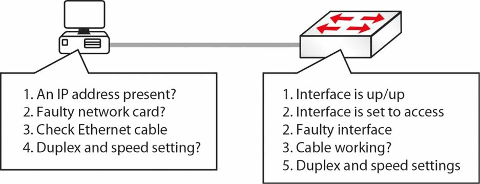

*图 2.20 -- 常见交换机故障及解决方法*

### VLAN 分配故障，VLAN Assignment Issues

小环境下的网络管理起来相对容易，因为只需部署少数特性，就能满足业务需求。但在企业环境中，你不会去使小型工作组交换机或是家庭办公设备的（small workgroup switches and SOHO device）。相反，你会用到高端设备，它们提供提供了诸多高级/复杂功能，具有流量优化能力。

此种环境下一种可能会配置到的特别特性，就是采用 VLANs 技术将不同网络区域进行逻辑隔离。在你遇到与某个 VLAN 有关的配置问题时，故障就会出现，这种故障可能会是难于处理的。一种处理方法就是去分析交换机的整个配置，并尝试找到问题所在。

VLAN 相关故障，通常是经由观察网络主机之间连通性（比如某用户不能 ping 通服务器）缺失发现的，就算一层运行无问题。**有关 VLAN 故障的一个重要特征就是不会对网络的性能造成影响**。如你配错了一个 VLAN，连接就直接不通，尤其是在考虑 VLANs 通常是用作隔离 IP 子网的情况下，只有处于同一 VLAN 的设备才能各自通信。

在排除 VLAN 故障时，首先要做的是查看设计阶段完成的网络文档和逻辑图表（网络拓扑图），如此你才能得知各个 VLAN 跨越的区域，以及相应设备和各交换机的端口情况。接着就要去检查每台交换机的配置，并通过将其与存档方案进行比较，以尝试找出问题。

你还要对 IP 地址分配方案进行查验。如你采用的是设备静态 IP 地址分配方式，你可能打算回去检查那台设备，确保其有正确的 IP 地址和子网掩码。如在 IP 分址方案上存在问题，像是将设备配置到错误的网络上，或是子网掩码错误/默认网关错误的话，即使交换机的 VLAN 配置无误，你也会遇到连通性问题。

还要确保交换机的中继配置正确。当存在多台交换机时，通常会有交换机间的上行链路，这些上行链路承载了网络上的 VLANs。这些交换机间链路常被配置为中继链路，以实现穿越多个 VLANs 的通信。如某 VLAN 中的数据需要从一台交换机发往另一交换机，那么它就必须是该中继链路组的成员，因此，你还要确保中继链路两端交换机配置正确。

最后，如你要将某设备迁往另一个 VLAN，你务必要同时更改交换机及客户端设备，因为在迁移后，客户端设备会有一个不同子网的不同 IP 地址。

如你有遵循这些 VLAN 故障排除方法，在你首次插入设备及 VLAN 间迁移时，肯定能得到预期的连通性。
 
## 第二天的问题

1. Switches contain a memory chip known as an `_______`, which builds a table listing which device is plugged into which port.
2. The `_______` `_______`-`_______`-`_______` command displays a list of which MAC addresses are connected to which ports.
3. Which two commands add an IP address to the VLAN?
4. Which commands will enable Telnet and add a password to the switch Telnet lines?
5. How do you permit only SSH traffic into your Telnet lines?
6. What is the most likely cause of Telnet to another switch not working?
7. Switches remember all VLAN info, even when reloaded. True or False?
8. A switch interface can be in which of three modes?
9. How do you set a switch to be in a specific mode?
10. Which commands will change the switch duplex mode and speed?


## 第二天问题答案

1. ASIC.
2. `show mac-address-table`
3. The `interface vlan x` command and the `ip address x.x.x.x`command.
4.
```console
Switch1(config)#line vty 0 15
Switch1(config-line)#password cisco
Switch1(config-line)#login
```
5. Use the `Switch1(config-line)#transport input ssh` command.
6. The authentication method is not defined on another switch.
7. True.
8. Trunk, access, or dynamic mode.
9. Apply the `switchport mode <mode>` command in Interface Configuration mode.
10. The `duplex` and `speed` commands.


## 第二天实验

### 交换机概念实验

请登入到一台思科交换机，并输入那些本单元课程中解释到的命令。包括：

- 在不同交换机端口上配置不同的端口速率/自动协商速率
- 使用 `show running-config` 和 `show interface` 命令，验证这些端口参数
- 执行一下 `show version` 命令，来查看硬件信息以及 IOS 版本
- 查看交换机 MAC 地址表
- 给 VTY 线路配置一个口令
- 定义出一些 VLANs 并为其指派名称
- 将一个 VLAN 指派到一个配置为接入模式的端口上
- 将某个端口配置为中继端口（ISL 以及 `802.1Q`），并将一些 VLANs 指派到该中继链路
- 使用 `show vlan` 命令验证 VLAN 配置
- 使用 `show interface switchport` 命令和 `show interface trunk` 命令，验证接口中继工作状态及 VLAN 配置
- 删除 `vlan.dat` 文件
