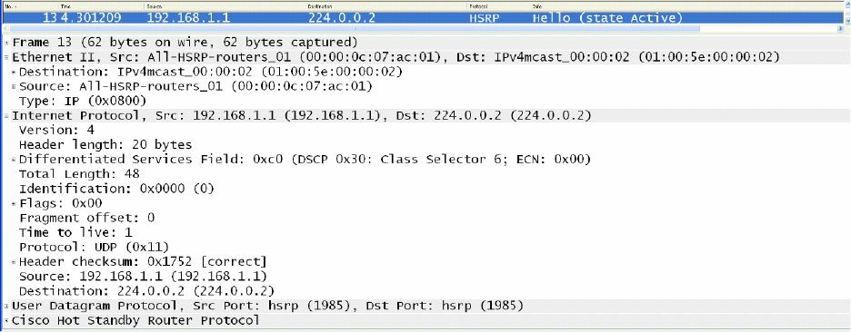

#第34天

**第一跳冗余协议**

**First Hop Redundancy Protocols**

##第34天任务

- 阅读今天的课文
- 回顾昨天的课文
- 完成今天的实验
- 阅读ICND2记诵指南
- 在[subnetting.org](subnetting.org)上花15分钟

在设计和部署交换网络时，**高可用性**（High Availability, HA）是一项不可或缺的考虑。作为思科IOS软件中所提供的一项技术，高可用性确保了网络层面的弹性与恢复能力，从而提升了IP网络的可用性。所有网段都必须具备弹性和恢复能力，以便网络能足够快地从故障中恢复过来，且此恢复过程要对用户及网络应用无感知及透明。这里的这些第一跳冗余协议（First Hop Redundancy Protocols, FHRPs），就提供了在不同的包交换局域网环境下的冗余。

今天将学习以下内容：

- 热备份路由器协议（Hot Standby Router Protocol）
- 虚拟路由器冗余协议（Virtual Router Redundancy Protocol）
- 网关负载均衡协议（Gateway Load Balancing Protocol）

这节课对应了一下ICND2考试大纲要求：

+ 认识高可用性（FHRP）
    - HSRP
    - VRRP
    - GLBP

## 热备份路由器协议

**Hot Standby Router Protocol**

热备份路由器协议是一项思科公司专有的第一跳冗余协议。HSRP令到两台配置在同样HSRP组中的物理网关，使用同样的虚拟网关地址。而位处这两台网关所在的子网中的网络主机，就以该虚拟网关IP地址，作为其默认网关地址。

当HSRP运作时，由主网关（the primary gateway）转发该HSRP组的那些以虚拟网关IP地址为目的地址的数据包。而加入主网关失效，则从网关（the secondary gateway）就接过主网关角色，并转发那些发送到虚拟网关IP地址的数据包。下面的图34.1演示了某网络中HSRP的运作：

*图 34.1 -- 热备份路由器协议的运作*

参阅图 34.1，HSRP是在三层（分发/分布层，the Layer 3, Distribution Layer）交换机之间的，给VLAN 10提供了网关的冗余性。分配给三层交换机Switch 1上的交换机虚拟借口（the Switch Virtual Interface, SVI）的IP地址是`10.10.10.2/24`, 同时分配给三层交换机Switch 2的交换机虚拟接口的IP地址是`10.10.10.3/24`。两台交换机都被配置为同一HSRP组的组成部分，并共用了该虚拟网关`10.10.10.1`。

Switch 1 已被配置了优先级值`105`，而Switch 2使用的是默认优先级值`100`。因为三层交换机Switch 1有着更高的优先级值，其就被选作主交换机，同时三层交换机Switch 2被选作从交换机。在VLAN 10上的所有主机，都配置了默认网关地址`10.10.10.1`。因此，假如Switch 1失效，Switch 2就将接过网关的职责。此过程对这些网络主机完全透明无感知。

> **真实世界应用**
> **Real-World Implementation**

> 在生产网络中配置各种FHRPs，确保子网的活动（主）网关同时也是该特定VLAN的生成树根桥，被认为是一种好的做法。比如参阅图34.1中的图例，Switch 1在作为VLAN 10的HSRP主网关的同时，也应被配置为该VLAN的根桥。

如此做法带来的是一个确切的网络（a deterministic network），从而避免在二层或三层上的次优转发。比如假设VLAN 10的根桥是Switch 2，而VLAN 10的主网关又是Switch 1，那么从网络主机发送到默认网关IP地址的数据包就将如下图34.2那样被转发了：

*图 34.2 -- STP拓扑与HSRP拓扑的同步，Synchronising the STP Topology with HSRP*

在上面的网络中，从Host 1到`10.10.10.1`的数据包将被如下这样转发：

1. 接入层交换机收到一个来自Host 1、以虚拟网关IP地址之MAC地址为目标的数据帧。此数据帧实在VLAN 10中收到的，同时该接入交换机经由其根端口，已学习到了虚拟网关的MAC地址。

2. 因为VLAN 10的根桥是Switch 2，那么到Switch 1（也就是HSRP的主路由器）的上行线路也被置于阻塞状态。此时该接入交换机就将该数据帧经由到Switch 2的上行链路予以转发。

3. Switch 2又经由连接到Switch 1的指定端口，转发该数据帧。对于来自Host 2的数据帧，会使用上述的相同次优路径。

思科IOS软件当前支持两个版本的HSRP：版本1及版本2。后续章节将对它们的相似点和不同点进行说明。

###HSRP版本1

默认情况下，当在思科IOS软件中开启热备份路由器协议是，是开启的版本1。HSRP版本1将可配置的HSRP分组限制在最多255个。HSRP版本1的那些路由器之间的通信，是通过往多播组地址（Multicast group address）`224.0.0.2`上，使用UDP端口`1985`发送报文进行的。下面的图34.3显示了HSRP版本1的报文：

*图 34.3 -- HSRP版本1多播组地址*

