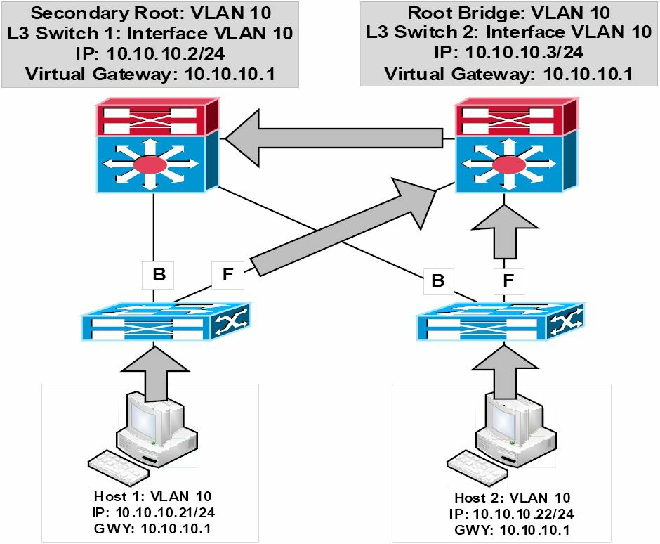
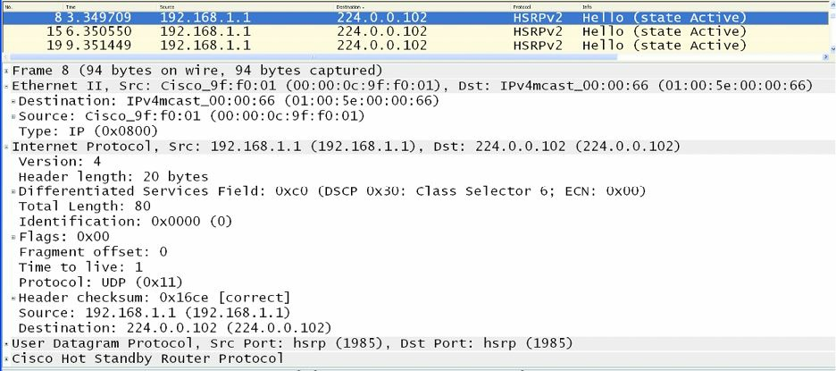
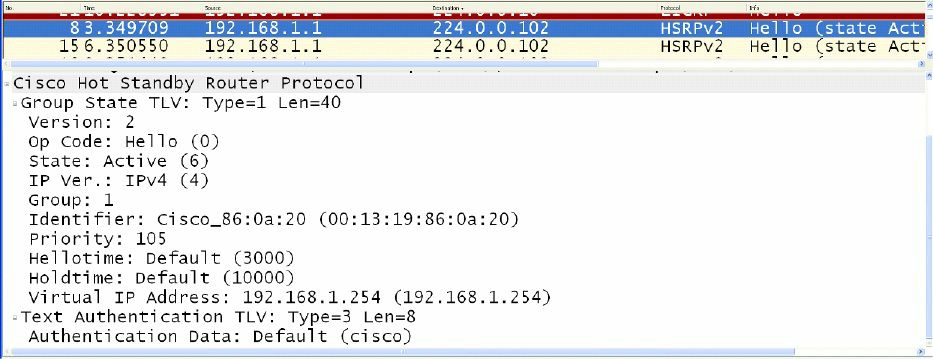
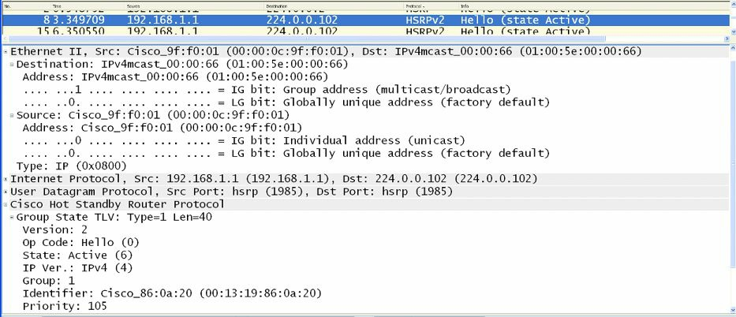
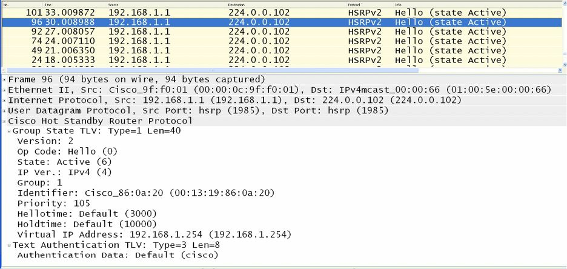
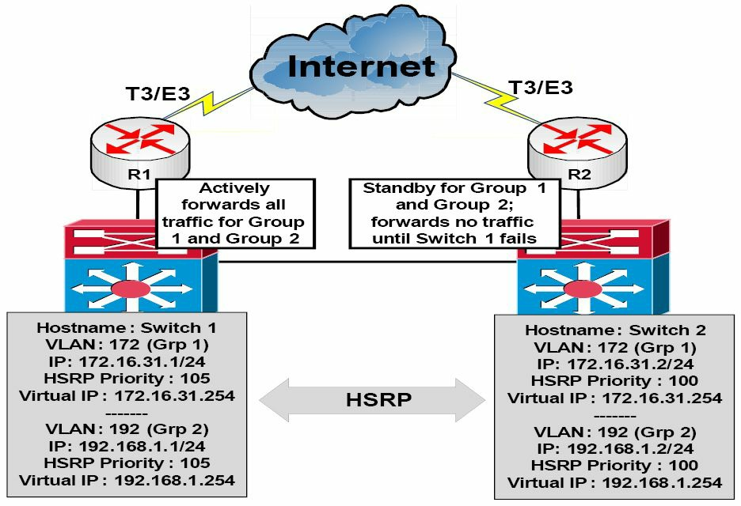

#第34天

**第一跳冗余协议**

**First Hop Redundancy Protocols**

##第34天任务

- 阅读今天的课文
- 回顾昨天的课文
- 完成今天的实验
- 阅读ICND2记诵指南
- 在[subnetting.org](subnetting.org)上花15分钟

在设计和部署交换网络时，**高可用性**（High Availability, HA）是一项不可或缺的考虑。作为思科IOS软件中所提供的一项技术，高可用性确保了网络层面的弹性与恢复能力，从而提升了IP网络的可用性。所有网段都必须具备弹性和恢复能力，以便网络能足够快地从故障中恢复过来，且此恢复过程要对用户及网络应用无感知及透明。这里的这些第一跳冗余协议（First Hop Redundancy Protocols, FHRPs），就提供了在不同的包交换局域网环境下的冗余。

今天将学习以下内容：

- 热备份路由器协议（Hot Standby Router Protocol）
- 虚拟路由器冗余协议（Virtual Router Redundancy Protocol）
- 网关负载均衡协议（Gateway Load Balancing Protocol）

这节课对应了一下ICND2考试大纲要求：

+ 认识高可用性（FHRP）
    - HSRP
    - VRRP
    - GLBP

## 热备份路由器协议

**Hot Standby Router Protocol**

热备份路由器协议是一项思科公司专有的第一跳冗余协议。HSRP令到两台配置在同样HSRP组中的物理网关，使用同样的虚拟网关地址。而位处这两台网关所在的子网中的网络主机，就以该虚拟网关IP地址，作为其默认网关地址。

当HSRP运作时，由主网关（the primary gateway）转发该HSRP组的那些以虚拟网关IP地址为目的地址的数据包。而加入主网关失效，则从网关（the secondary gateway）就接过主网关角色，并转发那些发送到虚拟网关IP地址的数据包。下面的图34.1演示了某网络中HSRP的运作：


*图 34.1 -- 热备份路由器协议的运作*

参阅图 34.1，HSRP是在三层（分发/分布层，the Layer 3, Distribution Layer）交换机之间的，给VLAN 10提供了网关的冗余性。分配给三层交换机Switch 1上的交换机虚拟借口（the Switch Virtual Interface, SVI）的IP地址是`10.10.10.2/24`, 同时分配给三层交换机Switch 2的交换机虚拟接口的IP地址是`10.10.10.3/24`。两台交换机都被配置为同一HSRP组的组成部分，并共用了该虚拟网关`10.10.10.1`。

Switch 1 已被配置了优先级值`105`，而Switch 2使用的是默认优先级值`100`。因为三层交换机Switch 1有着更高的优先级值，其就被选作主交换机，同时三层交换机Switch 2被选作从交换机。在VLAN 10上的所有主机，都配置了默认网关地址`10.10.10.1`。因此，假如Switch 1失效，Switch 2就将接过网关的职责。此过程对这些网络主机完全透明无感知。

> **真实世界应用**
> **Real-World Implementation**

> 在生产网络中配置各种FHRPs，确保子网的活动（主）网关同时也是该特定VLAN的生成树根桥，被认为是一种好的做法。比如参阅图34.1中的图例，Switch 1在作为VLAN 10的HSRP主网关的同时，也应被配置为该VLAN的根桥。

如此做法带来的是一个确切的网络（a deterministic network），从而避免在二层或三层上的次优转发。比如假设VLAN 10的根桥是Switch 2，而VLAN 10的主网关又是Switch 1，那么从网络主机发送到默认网关IP地址的数据包就将如下图34.2那样被转发了：


*图 34.2 -- STP拓扑与HSRP拓扑的同步，Synchronising the STP Topology with HSRP*

在上面的网络中，从Host 1到`10.10.10.1`的数据包将被如下这样转发：

1. 接入层交换机收到一个来自Host 1、以虚拟网关IP地址之MAC地址为目标的数据帧。此数据帧实在VLAN 10中收到的，同时该接入交换机经由其根端口，已学习到了虚拟网关的MAC地址。

2. 因为VLAN 10的根桥是Switch 2，那么到Switch 1（也就是HSRP的主路由器）的上行线路也被置于阻塞状态。此时该接入交换机就将该数据帧经由到Switch 2的上行链路予以转发。

3. Switch 2又经由连接到Switch 1的指定端口，转发该数据帧。对于来自Host 2的数据帧，会使用上述的相同次优路径。

思科IOS软件当前支持两个版本的HSRP：版本1及版本2。后续章节将对它们的相似点和不同点进行说明。

###HSRP版本1

默认情况下，当在思科IOS软件中开启热备份路由器协议是，是开启的版本1。HSRP版本1将可配置的HSRP分组限制在最多255个。HSRP版本1的那些路由器之间的通信，是通过往多播组地址（Multicast group address）`224.0.0.2`上，使用UDP端口`1985`发送报文进行的。下面的图34.3显示了HSRP版本1的报文：


*图 34.3 -- HSRP版本1多播组地址*

对HSRP数据包格式的深入探讨，是超出CCNA考试要求的范围的，下图34.4仍然给出了HSRP版本1数据包的信息：


*图 34.4 -- HSRP版本1数据包的字段*

在图34.4中，要注意版本字段显示的是数值0。这是在版本1开启时该字段的默认值；不过仍然要知道这里使用的是HSRP版本1。

###HSRP版本2

HSRP版本2使用了新的多播地址`224.0.0.102`，而不是版本1的多播地址`224.0.0.2`, 来发送Hello数据包。不过其所用到的UDP端口号仍然一样（`1985`）。同时此新地址在IP数据包及以太网数据帧中都得以编码，如下图34.5所示：


*图 34.5 -- HSRP版本2多播组地址*

对HSRP版本2数据包格式的深入探讨，也是超出CCNA考试要求范围的，但要记住HSRP版本2并未使用与版本1相同的数据包格式。

版本2数据包使用了一直类型/长度/值的格式（a Type/Length/Value format, TLV format）。被HSRP版本1的路由器接收到的版本2数据包，会将类型字段映射到HSRP版本1的版本字段，而被忽略掉。下图34.6给出了HSRP版本2数据包中所包含的信息：


*图 34.6 -- HSRP版本2的数据包字段*

###HSRP版本1与版本2的比较

HSRP 版本2包括了一些对版本1的增强。本小节将对这些增强及与版本1的不同进行说明。

尽管HSRP版本1通告了计时器数值，但这些数值都是整秒的，因为版本1无法通告或学习到毫秒的计时器数值。而版本2就既可以通告也可以学习毫秒的计时器数值了。下面的图34.7与图34.8分别着重表示了HSRP版本1与版本2在计时器字段上的不同：


*图 34.7 -- HSRP版本1的计时器字段*


*图 34.8 -- HSRP版本2的计时器字段*

HSRP版本1的分组编号是限制在0到255的，而版本2的分组编号则已拓展到0到4095了。本课程模块后面的HSRP配置示例中，将就此差异进行演示。

版本2通过包含一个由物理路由器接口的MAC地址生成、用于对HSRP活动Hello报文来源的唯一性识别的6字节识别符字段（a 6-byte Identifier field），提供了改进的管理与故障排除功能。在版本1中，这些Hello报文所包含的源MAC地址，都是虚拟MAC地址，那就是说无法找出是哪台HSRP路由器发送的HSRP Hello报文。下图34.9给出了HSRP版本2，而非版本1数据包中出现的识别符字段：


*图 34.9 -- HSRP版本2中的识别符字段*

在HSRP版本1中，虚拟IP地址所使用的二层地址将是一个由`0000.0C07.ACxx`构成的虚拟MAC地址，这里的`xx`就是HSRP分组编号的十六进制值，同时是基于相应接口的。而在HSRP版本2中，虚拟网关IP地址则是使用了新的MAC地址范围`0000.0C9F.F000`到`0000.0C9F.FFFF`。下图34.10给出了这些不同，该图现实了HSRP `Group 1`的版本1的虚拟MAC地址，同时在图34.11中显示了版本2的虚拟MAC地址，也是HSRP `Group 1`的：


*图 34.10 -- HSRP版本1的虚拟MAC地址格式*


*图 34.11 -- HSRP版本版本2的虚拟MAC地址格式*

###HSRP的主网关选举

可通过将默认HSRP优先级值100, 修改为1到255之间的任何值，对HSRP主网关的选举施加影响。有着最高优先级的路由器将被选举为该HSRP分组的主网关。

而在两个网关都使用默认优先级值时，或两个网关上的优先级值被手工配置为相等是，那么有着最高IP地址的路由器将被选举为主网关。在HSRP数据帧中，HSRP优先级值与该路由器的当前状态（比如是主路由器还是备份路由器），都有进行传送。下图34.12演示了一台配置了非默认优先级值`105`, 此优先级令到该路由器被选举为此HSRP组的活动网关，的网关的优先级和状态字段：


*图 34.12 -- HSRP的优先级与状态字段*

###HSRP报文

HSRP路由器之间就下列三种类型的报文进行交换：

- Hello报文
- Coup报文
- Resign报文

Hello报文是经由多播进行交换的，这些报文告诉另一网关本地路由器的HSRP状态和优先级数值。Hello报文还包含了组ID（the Group ID）、各种HSRP计时器数值、HSRP版本，以及认证信息。前面给出的所有报文，都是HSRP的Hello报文。

HSRP Coup报文实在当前备份路由器打算接过该HSRP组的活动网关角色时发出的。这与现实生活中的一次篡位（a coup d’état）类似。

而HSRP的Resign报文，则是在活动路由器即将关闭，以及在一台有着更高优先级的网关发出一个Hello报文或Coup报文时发出的。也就是说，在活动网关交出其作为主网关角色时，发出此报文。

###HSRP的抢占

**HSRP Preemption**

在已有一台网关被选举为活动网关的情况下，作为HSRP组一部分的另一网关被重新配置了一个更高的HSRP优先级数值时，当前活动网关会保留主转发角色。这是HSRP的默认行为。

而为了在某HSRP组中已有一个主网关的情形下，令到具有更高优先级的网关接过活动网关功能，就必须要将该路由器配置上抢占功能。这样做就允许该网关发起一次抢占，并接过该HSRP组的活动网关角色。HSRP抢占在接着的配置示例中有演示。

> 注意：抢占并不意味着生成树拓扑也会发生改变（译者注：这将导致次优路径）。

###HSRP的各种状态

与开放最短路径有限（Open Shortest Path First, OSPF）的方式类似，当在某个接口上开启了HSRP时，该网关接口会经历以下一系列状态的改变：

1. 关闭（Disabled）

2. 初始化（Init）

3. 侦听（Listen）

4. Speak

5. 备份（Standby）

6. 活动（Active）

> 注意：这些接口状态过度并无设置时间数值（There are no set time values for these interface transitions）。

在关闭及初始化状态中，该网关处于尚未准备妥当或是无法参与到HSRP组情形，可能的原因在于相关接口没有开启。

而侦听状态是适用于备份网关的。仅有备份网关才会监听来自活动网关的Hello报文。假如备份网关在10秒内未能收到Hello报文，其就假定活动网关已经宕机，并接过活动网关角色。如有在统一网段上存在其它网关，这些网关也会侦听Hello报文，且如果它们有着下一最高优先级值或IP地址，那么它们就会被选举为该分组的活动网关。

在Speak阶段，备份网关与活动网关进行报文交换。在此阶段完成后，主网关就过渡到活动状态，同时备份网关过渡到备份状态。备份状态表明该网关已准备好在主网关阵亡时接过活动网关角色，同时活动状态表明该网关已准备好进行数据包的转发。

以下输出给出了在一台刚开启HSRP的网关上，`debug standby`命令中显示的状态变化：

```
R2#debug standby
HSRP debugging is on
R2#
R2#conf t
Configuring from terminal, memory, or network [terminal]?
Enter configuration commands, one per line.
End with CNTL/Z.
R2(config)#logging con
R2(config)#int f0/0
R2(config-if)#stand 1 ip 192.168.1.254
R2(config-if)#
*Mar 1 01:21:55.471: HSRP: Fa0/0 API 192.168.1.254 is not an HSRP address
*Mar 1 01:21:55.471: HSRP: Fa0/0 Grp 1 Disabled -> Init
*Mar 1 01:21:55.471: HSRP: Fa0/0 Grp 1 Redundancy “hsrp-Fa0/0-1” state Disabled -> Init
*Mar 1 01:22:05.475: HSRP: Fa0/0 Interface up
...
[Truncated Output]
...
*Mar 1 01:22:06.477: HSRP: Fa0/0 Interface min delay expired
*Mar 1 01:22:06.477: HSRP: Fa0/0 Grp 1 Init: a/HSRP enabled
*Mar 1 01:22:06.477: HSRP: Fa0/0 Grp 1 Init -> Listen
*Mar 1 01:22:06.477: HSRP: Fa0/0 Redirect adv out, Passive, active 0 passive 1
...
[Truncated Output]
...
*Mar 1 01:22:16.477: HSRP: Fa0/0 Grp 1 Listen: d/Standby timer expired (unknown)
*Mar 1 01:22:16.477: HSRP: Fa0/0 Grp 1 Listen -> Speak
...
[Truncated Output]
...
*Mar 1 01:22:26.478: HSRP: Fa0/0 Grp 1 Standby router is local
*Mar 1 01:22:26.478: HSRP: Fa0/0 Grp 1 Speak -> Standby
*Mar 1 01:22:26.478: %HSRP-5-STATECHANGE: FastEthernet0/0 Grp 1 state Speak -> Standby
*Mar 1 01:22:26.478: HSRP: Fa0/0 Grp 1 Redundancy “hsrp-Fa0/0-1” state Speak -> Standby
```

###HSRP地址分配

**HSRP Addressing**

在本课程模块的早期，已了解到HSRP版本1中，用于虚拟IP地址的二层地址将是一个由`000.0C07.ACxx`构成的虚拟MAC地址，其中的`xx`就是该HSRP组的编号，且是基于相应接口的。而在HSRP版本2中，使用了一个新的MAC地址范围，从`0000.0C9F.F000`到`0000.0C9F.FFFF`, 作为虚拟网关IP地址的虚拟MAC地址。

而在某些情况下，我们并不期望使用这些默认的地址范围。比如在连接到一个配置了端口安全的交换机端口的某个路由器接口上，配置了好几个HSRP组时。在此情况下，该路由器就应对不同HSRP组使用不同的MAC地址，那么结果就是这些MAC地址都需要满足（accommodate）交换机端口的安全配置。该项配置在每次将HSRP组加入到路由器接口时都必须进行修改；否则就会触发端口安全冲突（otherwise, a port security violation would occur）。

为解决此问题，思科IOS软件允许管理员将HSRP配置为使用其所配置上的物理接口的实际MAC地址。那么结果就是一个单独的MAC地址为所有HSRP组所使用（也就是活动网关所使用的MAC地址），且在每次往连接到这些交换机上的路由器添加HSRP组的时候，无需对端口安全配置进行修改。此操作是通过使用接口配置命令`standby use-bia`命令完成的。下面的输出演示了命令`show standby`，该命令给出了一个配置了两个不同HSRP组的网关接口的信息：

<pre>
Gateway-1#show standby
FastEthernet0/0 - Group 1
    State is Active
        8 state changes, last state change 00:13:07
    Virtual IP address is 192.168.1.254
    <b>Active virtual MAC address is 0000.0c07.ac01
        Local virtual MAC address is 0000.0c07.ac01 (v1 default)</b>
    Hello time 3 sec, hold time 10 sec
        Next hello sent in 2.002 secs
    Preemption disabled
    Active router is local
    Standby router is 192.168.1.2, priority 100 (expires in 9.019 sec)
    Priority 105 (configured 105)
    IP redundancy name is “hsrp-Fa0/0-1” (default)
FastEthernet0/0 - Group 2
    State is Active
        2 state changes, last state change 00:09:45
    Virtual IP address is 172.16.1.254
    <b>Active virtual MAC address is 0000.0c07.ac02
        Local virtual MAC address is 0000.0c07.ac02 (v1 default)</b>
    Hello time 3 sec, hold time 10 sec
        Next hello sent in 2.423 secs
    Preemption disabled
    Active router is local
</pre>

在上面的输出中，由于是默认的HSRP版本，那么HSRP `Group 1`的虚拟MAC地址就是`0000.0c07.ac01`，同时HSRP组2的就是`0000.0c07.ac02`。这就意味着连接此网关的交换机端口要学习三个不同地址：物理接口`Fastethernet0/0`的实际或出厂地址、HSRP `Group 1`的虚拟MAC地址，以及HSRP组2的虚拟MAC地址。

下面的输出，演示了如何将HSRP配置为使用该网关接口的实际MAC地址，作为不同HSRP分组的虚拟MAC地址：

```
Gateway-1#conf
Configuring from terminal, memory, or network [terminal]?
Enter configuration commands, one per line. End with CNTL/Z.
Gateway-1(config)#int f0/0
Gateway-1(config-if)#standby use-bia
Gateway-1(config-if)#exit
```

基于上面的输出中的配置，命令`show standby`会反应出HSRP组的新MAC地址，如下面的输出所示:

<pre>
Gateway-1#show standby
FastEthernet0/0 - Group 1
    State is Active
        8 state changes, last state change 00:13:07
    Virtual IP address is 192.168.1.254
    <b>Active virtual MAC address is 0013.1986.0a20
        Local virtual MAC address is 0013.1986.0a20 (bia)</b>
    Hello time 3 sec, hold time 10 sec
        Next hello sent in 2.756 secs
    Preemption disabled
    Active router is local
    Standby router is 192.168.1.2, priority 100 (expires in 9.019 sec)
    Priority 105 (configured 105)
    IP redundancy name is “hsrp-Fa0/0-1” (default)
FastEthernet0/0 - Group 2
    State is Active
        2 state changes, last state change 00:09:45
    Virtual IP address is 172.16.1.254
    <b>Active virtual MAC address is 0013.1986.0a20
        Local virtual MAC address is 0013.1986.0a20 (bia)</b>
    Hello time 3 sec, hold time 10 sec
        Next hello sent in 0.188 secs
    Preemption disabled
    Active router is local
    Standby router is unknown
    Priority 105 (configured 105)
    IP redundancy name is "hsrp-Fa0/0-2" (default)
</pre>

那么这里两个HSRP组所用的MAC地址，都是`0013.1986.0a20`，就是分配给物理网关接口的MAC地址了。这在下面的输出中有证实：

<pre>
Gateway-1#show interface FastEthernet0/0
FastEthernet0/0 is up, line protocol is up
    Hardware is AmdFE, address is <b>0013.1986.0a20 (bia 0013.1986.0a20)</b>
    Internet address is 192.168.1.1/24
    MTU 1500 bytes, BW 100000 Kbit/sec, DLY 100 usec,
        reliability 255/255, txload 1/255, rxload 1/255
    Encapsulation ARPA, loopback not set
...
[Truncated Output]
</pre>

> **注意**：除了将HSRP配置为使用出厂地址（the burnt-in address, BIA）, 管理员亦可经由接口配置命令`standby [number] mac-address [mac]`，静态指定虚拟网关要使用的MAC地址。但一般不会这样做，因为这可能会导致交换网络中的重复MAC地址，这就会引起严重的网络故障，甚至造成网络中断。

###HSRP的明文认证

**HSRP Plain Text Authentication**

HSRP报文默认以明文密钥字串(the plain text key string)`cisco`发送，以此作为一种对HSRP成员（HSRP peers）进行认证的简单方式。如报文中的密钥字串与HSRP成员路由器上所配置的密钥匹配，报文就被接受。否则，HSRP就忽略那些未认证的报文。

明文密钥提供了最低的安全性，因为使用诸如Wireshark或Ethereal这样的简单抓包软件，它们就可被抓包捕获。下图34.13显示了HSRP报文中所使用的默认命令认证密钥：


*图 34.13 -- 查看HSRP默认明文密钥*

因为明文认证提供很低的安全性，那么下面介绍的消息摘要5（message digest 5, MD5）, 就是推荐的HSRP认证方式了。

###HSRP MD5 认证

这并非CCNA题目，放在这里是为了完整性及那些要实际从事网络方面工作的人的考虑。

消息摘要5认证通过生成一个多播HSRP协议数据包的HSRP部分的摘要，提供了HSRP比起明文认证更强的安全性。在采行了MD5认证后，就允许各个HSRP组成员使用一个密钥，来生成一个加密了的MD5散列值，并作为发出数据包的一部分。而接收到的HSRP数据包也会产生一个加密的散列值，如果接收到的数据包的加密散列值与MD5生成值不匹配，接收路由器就会忽略此数据包。

既可以通过在配置使用一个密钥字串直接提供MD5散列值的密钥，也可以通过密钥链（a key chain）来提供到。本课程模块稍后会对这两种方式进行讲解。在应用了明文或是MD5认证时，在出现以下情形之一后，网关都会拒绝那些HSRP数据包：

- 路由器与收到的数据包认证方案不一致时
- 路由器与收到的数据包的MD5摘要不同时
- 路由器与收到的数据包的明文认证字串不一致时

###HSRP接口跟踪

**HSRP Interface Tracking**

HSRP允许管理员对当前活动网关上的接口状态进行追踪，所以在有接口失效时，网关就会将其优先级降低一个特定数值，默认为10, 这样就可以让其它网关接过HSRP组的活动网关角色。此概念在下图34.14中进行了演示：


*图 34.14 -- HSRP 接口追踪*

参考图34.14, 对于VLAN 150, 已在Switch 1及Switch 2上开启了HSRP。而基于当前的优先级配置，Switch 1有着优先级数值105, 已被选举为该VLAN的主交换机。Switch 1与Switch 2都通过其各自的`Gigabitethernet5/1`接口，分别连接到两台路由器。这里假定这两台与其它外部网络相连，比如互联网。

在没有HSRP接口跟踪功能时，如果Switch 1与R1之间的`Gigabitethernet5/1`接口失效，那么Switch 1仍将保持其主网关状态。此时就必须将所有接收到的、比如前往互联网的数据包，使用Switch 1本身与Switch 2之间的连接，转发到Switch 2上。这些数据包将会通过R2转发到它们本来的目的地。这就造成了网络中的次优流量路径。

HSRP接口跟踪功能令到管理员可将HSRP配置为追踪某个接口的状态，并据此将活动网关的优先级降低一个默认10的值，亦可指定该降低值。同样参考图34.14, 如果在Switch 1上采用默认值配置了HSRP接口跟踪，那么就令到该交换机对接口`Gigabitethernet5/1`的状态进行跟踪，在那个接口失效后，Switch 1就会将其该HSRP组的优先级降低10, 得到一个95的优先级。

又假设Switch 2上配置了抢占（preempt），在此情形下是强制性要配置的，那么它就会注意到自己有着更高的优先级（100比95）, 就会执行一次篡位，结果该HSRP组的活动网关角色。

> **真实场景应用**
> 在生产网络中，思科Catalyst交换机还支持增强对象跟踪（Enhanced Object Tracking, EOT）功能，可用于所有FHRP（也就是HSRP、VRRP及GLBP）上。增强对象跟踪功能令到管理员可以将交换机配置为对以下参数进行跟踪：

> - 某个接口的IP路由状态，The IP routing state of an interface
> - IP路由的可达性，IP route reachablity
> - IP路由度量值阈值，The threshold of IP route metrics
> - IP SLA 的运作，IP SLA operations([Service-Level Agreements](http://www.cisco.com/c/en/us/tech/ip/ip-service-level-agreements-ip-slas/index.html), 服务等级协议)

> 对于这些FHRPs，比如HSRP，可被配置为对这些增强对象进行跟踪，以令到在部署FHRP失效情形时具有更大的灵活性。比如，在采用EOT时，可将活动HSRP路由器配置为在网络或主机路由不可达时（也就是出现在路由表中），降低其优先级某个数值。EOT功能是超出了CCNA考试要求的，在配置示例中不会涉及。

###HSRP的负载均衡

HSRP允许管理员在一些物理接口上配置多个HSRP组，以实现负载均衡。默认情况下，在两台网关之间配置HSRP时，在任何时期都只有一台网关对那个组的流量进行转发。这样就导致了备份网关链路上带宽的浪费。这在下图34.15中进行了演示：


*图 34.15 -- 不具备HSRP负载均衡的一个网络*

在图34.15中，在Switch 1和Switch 2上配置了两个HSRP组。Switch 1已被配置为两个组的活动（主）网关--这是基于其有着较高的优先级值。Switch 1与Switch 2都相应的连接到了路由器R1和R2上。这两台路由器都通过各自的T3/E3线路，连接到互联网。因为Switch 1是两个HSRP组的活动网关，它就会转发两个组的流量，直到其失效后，Switch 2才会结果活动（主）网关的角色。

尽管这样做满足了网络的冗余需求，但也造成R2上昂贵的T3/E3线路的空闲，除非在Switch 2成为活动网关并开始经由它来转发流量。自然，这就出现了一定数量带宽的浪费。

而通过配置多个HSRP组，每个组使用不同的活动网关，管理员就可以有效的防止不必要的资源浪费，并在Switch 1与Switch 2之间实现负载均衡。这在下图34.16中进行了演示：


*图 34.16 -- 一个采用HSRP实现负载均衡的网络*

这里通过将Switch 1配置为HSRP `Group 1`的活动网关，将Switch 2配置为HSRP组2的活动网关，管理员就令到来自两个不同组的流量，在Switch 1与Switch 2之间实现了负载均衡，并最终通过这两条专用T3/E3广域网连接。同时每台交换机又互为对方HSRP组的备份。比如在Switch 2失效时，Switch 1就将接过HSRP组2活动网关的角色，相反亦然。

> **真实世界的部署**

> 在生产网络中，需要记住多个HSRP组的建立，会造成网关上CPU使用率的上升，以及有HSRP报文交换所造成的网络带宽占用的增加。诸如Catalyst 4500及6500系列的思科Catalyst交换机，提供了对HSRP客户组（HSRP client groups）的支持。

> 在前面的小节中，了解到HSRP允许在单个的网关接口上配置多个HSRP组。而在网关接口上允许许多不同HSRP组的主要问题，就是这样做会导致网关上CPU使用率的上升，并也因为HSRP每隔3秒的Hello数据包，而潜在可能增加网络流量。

> 为解决这个潜在的问题，HSRP就还允许客户或从组的配置（the configuration of client or slave groups）。这些组是一些简单的HSRP组，它们跟随某个主HSRP组（a master HSRP group），而不参与HSRP选举。这些客户或从组跟随主组的允许与状态，因此它们本身无需周期性地交换Hello数据包。这样在运用多个HSRP组时，降低CPU与网络的使用。

> 但是，为了刷新那些交换机的虚拟MAC地址，这些客户组仍然要发送周期性的报文。不过与主组的协议选举报文相比，这些刷新报文是以低得多的频率发送的。尽管HSRP客户组的配置是超出CCNA考试要求的，下面的输出还是演示两个客户组的配置，这两个客户组被配置为跟随主组HSRP `Group 1`, 该主组又被命名为`SWITCH-HSRP`组：

```
Gateway-1(config)#interface vlan100
Gateway-1(config-if)#ip address 192.168.1.1 255.255.255.0
Gateway-1(config-if)#ip address 172.16.31.1 255.255.255.0 secondary
Gateway-1(config-if)#ip address 10.100.10.1 255.255.255.0 secondary
Gateway-1(config-if)#standby 1 ip 192.168.1.254
Gateway-1(config-if)#standby 1 name SWITCH-HSRP
Gateway-1(config-if)#standby 2 ip 172.16.31.254
Gateway-1(config-if)#standby 2 follow SWITCH-HSRP
Gateway-1(config-if)#standby 3 ip 10.100.10.254
Gateway-1(config-if)#standby 3 follow SWITCH-HSRP
Gateway-1(config-if)#exit
```

> 在上面的输出配置中，`Group 1` 被配置为了主HSRP组， 同时`Group 2`与`Group 3`被配置为了客户组或叫做从组。

###网关上HSRP的配置

在网关上配置HSRP，需要完成以下步骤：


