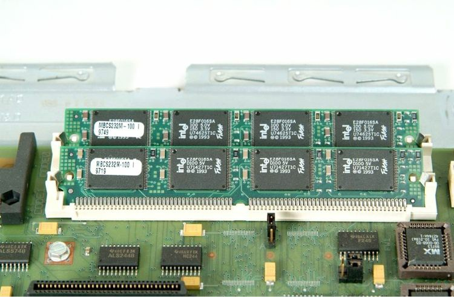

#第35天

**系统引导与IOS**

##第35天任务

- 阅读以下今天的课文
- 复习昨天的课文
- 完成后面的实验
- 阅读ICND2记诵指南

架构（architecture）指的是制造路由器所用的部件，以及在路由器启动过程中它们的用法。这些知识全是一名思科CCNA工程师所要掌握的基础知识，思科CCNA工程师需要知道路由器中的各种存储器完成什么功能，以及怎样使用IOS命令来对各种存储器进行备份或对其存储内容进行操作。

今天将学习以下内容：

- 路由器存储器及各种文件
- 管理IOS

本课程对应了以下ICND2大纲要求：

- 对思科IOS路由器的启动过程进行描述
- 加电自检过程，Power-On Self-Test, POST
- 路由器的启动过程，Router bootup process
- 管理思科IOS的各种文件
- 各种启动选项，Boot preferences
- 各种思科IOS镜像，Cisco IOS images(15)
- 软件许可，licensing
- 展示/修改许可证，show/change license

##路由器存储与各种文件

下图35.1对路由器内部的主要存储器部件进行了演示。每种存储器都扮演了不同角色，且包含了不同的文件：


*图 35.1 -- 路由器的各种存储器部件*

在将路由器盖子打开后，在其内部常能见到不同的存储器插槽。还能发现一些闪存卡插在路由器插槽中。


*图35.2 -- 在某台路由器主板上的DRAM单列直插内存模组（Dynamic Random Access Mememory Single In-line Mememory Module on a Router Motherboard）*

以下是每种内存及文件类型的作用：

引导ROM（boot ROM）-- 是电可擦可编程只读存储器（Electrically Erasable Programmable Read-Only Mememory, EEPROM,, 一种掉电后数据不丢失的存储芯片），用于启动图/Rommon（startup diagram/Rommon）的存储及IOS的装入。在路由器启动是，如缺少IOS文件，那么就会启动要一种叫做Rommon的紧急模式（an emergency mode），此模式下允许输入一些有限的几个命令，以对路由器进行恢复及装入其它IOS。此模式又叫做启动模式（bootstrap mode），在以下两种路由器提示符下，就可以明白是在此模式：

```
>
Rommon>
```

非易失性随机访问存储器（Non-Volatile Random Access Mememory, NVRAM) -- 用于启动配置与配置寄存器的存储。启动配置是用于存储已保存的路由器配置的文件。其在路由器重启是不被擦除。

闪存/PCMCIA（Personal Computer Mememory Card International Association）卡 -- 包含了IOS及一些配置文件。闪存存储器还被当作EEPROM， 同时思科IOS就以某种压缩形式存放在这里。在闪存容量充足时，甚至可以在闪存存储器上保存多个版本的思科IOS。

DRAM（内存）-- 也就是RAM，其存储完整的IOS、运行中的配置，及路由表。其为运行内存，在路由器重启后数据被擦除。

ROM监测程序（ROM Monitor）-- 用于系统诊断及启动。ROM监测程序中有着名为启动器或启动帮助器的一套甚为小型的代码，用于对安装的各种存储器及接口进行检查（The ROM Monitor has a very small code called bootstrap or boothelper in it to check for attached mememory and interfaces）。

RxBoot程序 -- 小型的IOS（Mini-IOS）, 在此程序模式下允许上传一个完整的IOS。其又被称为启动装载器（the boot loader），可用于完成一些路由器维护操作（参见[这里](http://www.cisco.com/image/gif/paws/10252/13.pdf)）。

路由器配置 -- 尽管严格来说这并非一类路由器组件，其是存储在NVRAM
