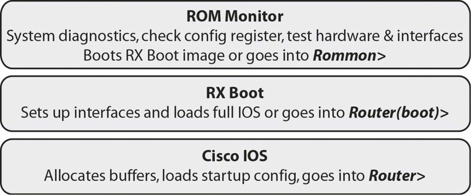

#第35天

**系统引导与IOS**

##第35天任务

- 阅读以下今天的课文
- 复习昨天的课文
- 完成后面的实验
- 阅读ICND2记诵指南

架构（architecture）指的是制造路由器所用的部件，以及在路由器启动过程中它们的用法。这些知识全是一名思科CCNA工程师所要掌握的基础知识，思科CCNA工程师需要知道路由器中的各种存储器完成什么功能，以及怎样使用IOS命令来对各种存储器进行备份或对其存储内容进行操作。

今天将学习以下内容：

- 路由器存储器及各种文件
- 管理IOS

本课程对应了以下ICND2大纲要求：

- 对思科IOS路由器的启动过程进行描述
- 加电自检过程，Power-On Self-Test, POST
- 路由器的启动过程，Router bootup process
- 管理思科IOS的各种文件
- 各种启动选项，Boot preferences
- 各种思科IOS镜像，Cisco IOS images(15)
- 软件许可，licensing
- 展示/修改许可证，show/change license

##路由器存储与各种文件

下图35.1对路由器内部的主要存储器部件进行了演示。每种存储器都扮演了不同角色，且包含了不同的文件：


*图 35.1 -- 路由器的各种存储器部件*

在将路由器盖子打开后，在其内部常能见到不同的存储器插槽。还能发现一些闪存卡插在路由器插槽中。


*图35.2 -- 在某台路由器主板上的DRAM单列直插内存模组（Dynamic Random Access Mememory Single In-line Mememory Module on a Router Motherboard）*

以下是每种内存及文件类型的作用：

引导ROM（boot ROM）-- 是电可擦可编程只读存储器（Electrically Erasable Programmable Read-Only Mememory, EEPROM,, 一种掉电后数据不丢失的存储芯片），用于启动图/Rommon（startup diagram/Rommon）的存储及IOS的装入。在路由器启动是，如缺少IOS文件，那么就会启动要一种叫做Rommon的紧急模式（an emergency mode），此模式下允许输入一些有限的几个命令，以对路由器进行恢复及装入其它IOS。此模式又叫做启动模式（bootstrap mode），在以下两种路由器提示符下，就可以明白是在此模式：

```
>
Rommon>
```

非易失性随机访问存储器（Non-Volatile Random Access Mememory, NVRAM) -- 用于启动配置与配置寄存器的存储。启动配置是用于存储已保存的路由器配置的文件。其在路由器重启是不被擦除。

闪存/PCMCIA（Personal Computer Mememory Card International Association）卡 -- 包含了IOS及一些配置文件。闪存存储器还被当作EEPROM， 同时思科IOS就以某种压缩形式存放在这里。在闪存容量充足时，甚至可以在闪存存储器上保存多个版本的思科IOS。

DRAM（内存）-- 也就是RAM，其存储完整的IOS、运行中的配置，及路由表。其为运行内存，在路由器重启后数据被擦除。

ROM监测程序（ROM Monitor）-- 用于系统诊断及启动。ROM监测程序中有着名为启动器或启动帮助器的一套甚为小型的代码，用于对安装的各种存储器及接口进行检查（The ROM Monitor has a very small code called bootstrap or boothelper in it to check for attached mememory and interfaces）。

RxBoot程序 -- 小型的IOS（Mini-IOS）, 在此程序模式下允许上传一个完整的IOS。其又被称为启动装载器（the boot loader），可用于完成一些路由器维护操作（参见[这里](http://www.cisco.com/image/gif/paws/10252/13.pdf)）。

路由器配置 -- 尽管严格来说这并非一类路由器组件，其存储在NVRAM中，在启动是拉入到DRAM中。可将DRAM中的配置，经由命令`copy run start`，放入到NVRAM，同时也可以使用命令`copy start run`，将NVRAM中的配置文件放到内存中。

配置寄存器（the Configuration Register）-- 设置启动中的一些指令（sets instructions for booting）。因为在实验中要对用到的路由器上的配置寄存器进行修改（比如无配置的干净启动），或是要完成一次口令恢复，所以对配置寄存器的掌握是非常重要的。虽然在某些模型上有所不同，但下面是两个最常见的设置：

- 配置寄存器值`0x2142` -- 启动并忽略启动配置
- 配置寄存器值`0x2102` -- 正常启动

通过命令`show version`，就可以查看到当前的配置寄存器设置：

<pre>
Router#show version
Cisco Internetwork Operating System Software
IOS (tm) 2500 Software (C2500-JS-L), Version 12.1(17), RELEASE SOFTWARE (fc1) Copyright (c) 1986-2002 by Cisco Systems, Inc.
Compiled Wed 04-Sep-02 03:08 by kellythw Image text-base: 0x03073F40, data-base: 0x00001000
ROM: System Bootstrap, Version 11.0(10c)XB2, PLATFORM SPECIFIC RELEASE SOFTWARE (fc1) BOOTLDR: 3000 Bootstrap Software (IGS-BOOT-R), Version 11.0(10c)XB2, PLATFORM SPECIFIC RELEASE SOFTWARE (fc1)

Router uptime is 12 minutes
System returned to ROM by reload
System image file is “flash:c2500-js-l.121-17.bin”

Cisco 2500 (68030) processor (revision L) with 14336K/2048K bytes of memory.
Processor board ID 01760497, with hardware revision 00000000 Bridging software.
X.25 software, Version 3.0.0.
SuperLAT software (copyright 1990 by Meridian Technology Corp).
TN3270 Emulation software.
2 Ethernet/IEEE 802.3 interface(s)
2 Serial network interface(s)
32K bytes of non-volatile configuration memory.
16384K bytes of processor board System flash (Read ONLY)

<b>Configuration register is 0x2102</b>
</pre>

命令还现实了该路由器已在线多长时间及上次重启的原因--在对启动问题进行故障排除时，这些信息是有用的。

```
Router uptime is 12 minutes
System returned to ROM by reload
```

同时改命令将显示处路由器上不同类型的存储器：

<pre>
Router#show version
Cisco Internetwork Operating System Software
IOS (tm) 2500 Software (C2500-IS-L), Version 12.2(4)T1, RELEASE SOFTWARE Copyright (c) 1986-2001 by Cisco Systems, Inc.

ROM: System Bootstrap, Version 11.0(10c), SOFTWARE<b>← ROM code</b>
BOOTLDR: 3000 Bootstrap Software (IGS-BOOT-R), Version 11.0(10c)
System image file is “flash:c2500-is-l_122-4_T1.bin”<b>← Flash image</b>
Cisco 2522 (68030) processor CPU<b>← CPU</b>
with 14336K/2048K bytes of memory. <b>← DRAM</b>
Processor board ID 18086064, with hardware revision 00000003
32K bytes of non-volatile configuration memory.<b>← NVRAM</b>
16384K bytes of processor System flash (Read ONLY) <b>← EEPROM/FLASH</b>
</pre>

下面是路由器启动过程的一个图形化再现：


*图 35.3 -- 路由器的启动过程*

##管理IOS

做好一些简单的路由器及交换机日常工作，就可避免许多的网络灾难（many network disasters could have been avoided with simple router and switch housekeeping）。如路由器配置文件对于你及你的业务比较重要，那么就应对其进行备份。

如觉得路由器的当前的运行配置，可作为工作版本，就可以使用命令`copy run start`，将其拷贝到NVRAM中。

而为了将该路由器配置保存起来，就需要在网络上保有一台运行着TFTP服务器软件的PC及或服务器。可从诸如SolarWinds这类公司下载到免费版的TFTP服务器软件。升级闪存镜像也需要有TFTP服务器。

路由器配置可在路由器或网络上的PC机或服务器之间移动。路由器上的运行配置保存在DRAM中。对配置做出的任何修改，都将保存在DRAM中，此时由于任何的原因而导致的重启，这些运行配置都会丢失。

你可以将运行配置拷贝到一台运行了TFTP服务器软件的PC机或服务器上：

<pre>
Router#copy startup-config tftp:<b>← You need to include the colon</b>
</pre>

还可以将IOS镜像复制到某台TFTP服务器上。如要将服务器IOS更新到另一较新版本，就必须要这么做，以防新版本可能带来的问题（管理员经常将一个路由器现有闪存装不下的IOS镜像放上去）。

```
Router#copy flash tftp:
```

路由器将提示输入TFTP服务器的IP地址，建议服务器与路由器位处同一子网。而如打算从TFTP服务器下载IOS镜像，就只需简单地逆转一下命令即可：

```
Router#copy tftp flash:
```

这些命令的问题在于大多数工程师一年也就用两三次，或者只在出现网络灾难时才用到。通常，你会发现在你的网络宕机时，互联网接入也没有了，所以必须要将路由器存储器中将它们备份出来！

作者强烈建议在家庭网络上对配置完成一些备份及恢复的联系。此外，还建议观看一下作者在Youtube上的恢复实验：

[www.youtube.com/user/paulwbrowning](http://www.youtube.com/user/paulwbrowning)

通过`show version`或`show flash`命令, 或者经由`dir flash:`进入到flash目录，进入到flash目录将显示出闪存中所有的文件，就可以查看到闪存的文件名。

<pre>
RouterA#show flash
System flash directory:
File    Length      Name/status
1       14692012    <b>c2500-js-l.121-17.bin</b>
[14692076 bytes used, 2085140 available, 16777216 total]
16384K bytes of processor board System flash (Read ONLY)
</pre>

作者本打算对此方面进行深入，但你应着重于CCNA考试本身及日常工作。不过灾难恢复应在深入研究及实验的目标清单当中。

##各种启动选项

**Booting Options**

在路由器启动时，有着许多可选选项。通常在闪存中都只有一个IOS镜像，因此路由器将使用那个镜像进行启动。在有着多个镜像，或者路由器闪存对于镜像太小而无法放下镜像时，就可能需要路由器从网络上的某台保存了IOS镜像的TFTP服务器启动了。

取决于所要配置的启动选项，命令可能有些许不同。所以要在一台开启的路由器上对所有选项都进行尝试。

```
RouterA(config)#boot system ?
WORD           TFTP filename or URL
flash          Boot from flash memory
mop            Boot from a Decnet MOP server
ftp            Boot from server via ftp
rcp            Boot from server via rcp
tftp           Boot from tftp server
```

对于闪存来说：

```
RouterA(config)#boot system flash ? WORD System image filename <cr>
```

而对于TFTP：

```
Enter configuration commands, one per line. End with CNTL/Z.
RouterB(config)#boot system tftp: c2500-js-l.121-17.bin ? Hostname or A.B.C.D Address from which to download the file <cr>
RouterA(config)#boot system tftp:
```

##启动过程及加电自检

**Booting Process and POST**

一次标准的路由器启动顺序，看起来像下面这样：

1. 设备开机并将首先执行加电自检（Power on Self Test）动作。加电自检对硬件进行测试，以确保所有组件都不缺少且是正常的（包括各种接口、存储器、CPU、专用集成电路(ASICs)等等）。加电自检程序是存储在ROM中，并自ROM运行的。

2. 启动引导程序（the bootstrap）查找并装入思科IOS软件。启动引导程序是ROM中的一个程序，用于执行一些其它程序，并负责查找各个IOS软件所处位置，接着就装入IOS镜像文件。启动引导程序找到思科IOS软件并将其装入到RAM中。思科IOS文件可在这三个地方找到：闪存、某台TFTP服务器，或在启动配置文件中所指定的另一位置。在所有思科路由器中，IOS软件默认都是从闪存装入的。要从其它位置进行装入，就必须对配置设置进行修改。

3. IOS软件在NVRAM中查找一个可用的配置文件（也就是启动配置文件(the startup-config file)）。

4. 如在NVRAM中确实有着一个启动配置文件，路由器就会装入此文件，此时路由器就将成为可运作的了。而如果在NVRAM中没有启动配置文件，路由器将启动设置模式的配置（the setup-mode configuration）。

在运行路由器上所作的任何修改，就将保存在RAM中，这里就需要手动执行命令`copy running-config startup-config`，令到当前配置作为在每次启动路由器时的启动配置。

##IOS许可

**IOS Licensing**

自思科为其第一台路由器构建首个互联网络操作系统（the first Internetwork Operating System, IOS）以来，其都遵循了以下方式：每种型号的路由器都有着其自己的版本与软件发布构建。大的版本都赋予了12.0的编号系统。对这些版本的改动，就被编号作12.1、12.2等等。这些小的版本是一些漏洞修复，或对一些模块的支持及引入其它特性，比如12.1(1a)。

不幸的是，随着支持的加入以及漏洞的修复，这些发布就被拆分成了路线，以致每个型号有其自己的IOS，这样就导致许多不同版本与发布（unfortunately, as support was added and bugs fixed, the releases were split into trains so each model had it's own IOS, which led to various versions and releases）。假如需要一个安全或是语音镜像，那么就必须购买对于手头路由器正确版本的特定镜像，同时有着正确的特性支持与漏洞修复。

思科公司最终发布了完整的训练工具与演示，这样就可以搞清楚IOS软件的命名约定、发布级别及支持的模块（the naming conventions, release levels, and supported modules）。而根据软件的测试及成熟情况，其还有着不同的名字，比如ED表示处于早期部署阶段(Early Deployment，ED)，而GD则表示处于一般部署阶段（General Deployment, GD）！这些对于消费者来讲都是非常迷惑的。下面是一张从思科官方文档中摘取的对IOS发布进行解释的图片：


*图 35.4 -- IOS软件的特别发布，IOS Special Releases(Image Copyright Cisco Systems Inc.)*

作者在思科技术支持中心（Technical Assistant Center, TAC）就解决了数不清的那些买了一台路由器及一套IOS软件，却发现到手的产品无法支持其对网络设施所要求的那些特性，而迷惑的或是愤怒的客户。还要记住对于大型、企业网络，必须要提前数月来安排IOS升级，把IOS升级放到一个很小的维护窗口。

##一个新的型号

**A New Model**

思科公司现在已经改变了其IOS型号，且从IOS发布12跳到了15（Cisco have now changed their IOS model and jumped from IOS release 12 to 15）。当前，对于每个型号的路由器，有着一个通用镜像。此镜像有着你需要的所有特性，但为了获取到那些真正所需的高级特性的使用，就需要购买适当的许可证，并在具体设备上对许可证加以验证。这样做的目的是为了思科公司及其客户的便利，以及阻止对思科软件的窃取与未授权共享，可以想象，这些思科软件是花了可观成本去开发的。

购买自思科（零售商）的所有新型号路由器，都带有安装好的基础镜像，以及启用了的许可证。而如果客户想要开启高级安全或是语音特性，那么就需要开启这些特性。这通常是经由使用一个名为思科许可证管理器（Cisco License Manager, CLM）的免费思科应用完成的。在[Cisco.com](http://www.cisco.com/)网站可轻易搜寻到此应用：


*图 35.5 -- 思科许可证管理器的下载页面*
