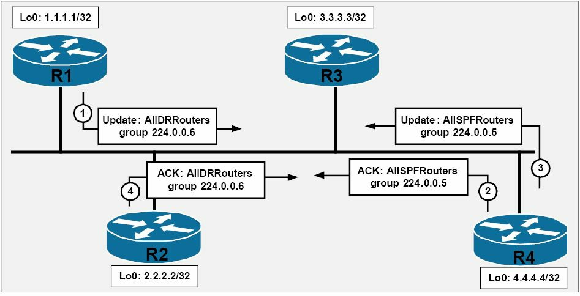

# 第39天

**开放最短路径优先协议**

**OSPF**

## 第39天任务

- 阅读今天的课文（以下）
- 复习昨天的课文
- 完成今天的实验
- 阅读ICND2记诵指南
- 在网站[subnetting.org](http://subnetting.org/)上学习15分钟

与EIGRP一样，对OSPF的讨论也可以花上几天时间，但这里需要针对那些考试要用到的知识点，进行着重学习。CCNA级别的OSPF知识，尚不足以在大多数网络上涉及与部署该路由技术。

今日将学习以下内容：

- OSPF原理
- DR与BDR
- OSPF的配置
- OSPF故障排除

这一课对应了以下CCNA大纲的要求：

- OSPF的配置与验证（单区，single area）
- 邻居临接（Neighbour adjacencies, 或者叫邻居关系的形成）
- OSPF的各种状态
- 对多区的讨论（discuss multi-area）
- OSPFv2的配置
- 路由器ID
- LSA（链路状态算法）的类型


## 指定与后备指定路由器（Designated and Backup Designated Routers）

如同第12天模块中所指出的，OSPF会在广播与非广播网络类型上选举出指定路由器（DR）与/或非后备指定路由器（BDR）。对后备指定路由器并非这些网络类型上的强制性组件这一点的掌握，是重要的。事实上，仅选出指定路由器，而没有后备指定路由器时，OSPF同样能工作；只是在指定路由器失效时，没有冗余而已，同时网络中的OSPF路由器需要再度进行一遍选举流程，以选出新的指定路由器。

在网段上（广播或非广播网络类型），所有非指定/后备指定路由器，都将与指定路由器与选出的后备指定路由器（若有选出后备指定路由器）建立临接关系，而不会与网段上的其它非指定/后备指定路由器形成临接关系。这些非指定/后备指定路由器，将往全指定路由器多播组地址（the AllDRRouters Multicast group address）`224.0.0.6`发出报文与更新。只有指定路由器与后备指定路由器才会收听发到此组地址的多播报文。随后指定路由器将通告报文给全SPF路由器多播组地址（the AllSPFRouters Multicast group address）`224.0.0.5`。这就令到网段上的所有其它OSPF路由器接收到更新。

对于已选出指定路由器与/或后备指定路由器时报文交换顺序的掌握尤为重要。下面作为一个示例，请设想一个有着4台路由器，分别为`R1`、`R2`、`R3`与`R4`，的广播网络。假定`R4`被选作指定路由器，`R3`被选作后备指定路由器。那么`R1`与`R2`就既不是指定也不是后备指定路由器了，因此在思科OSPF命名法中就被成为`DROther`路由器。此时`R1`上有一个配置改变，随后`R1`就发出一个更新报文到`AllDRRouters`多播组地址`226.0.0.6`。指定路由器`R4`接收到该更新，并发出一个确认报文（acknowledgement），回送到`AllSPFRouters`多播组地址`224.0.0.5`上，`R4`随后使用`AllSPFRouters`多播组地址，将该更新发送给所有其它非指定/后备指定路由器。该更新被其它的`DROther`路由器，也就是`R2`接收到，同时`R2`发出一个确认报文到`AllDRRouters`多播组地址`224.0.0.6`。该过程在下图39.1中进行了演示：



*图39.1 -- OSPF的指定与后备指定通告*

> **注意：** 后备指定路由器仅简单地收听发送到`224.0.0.5`（`AllSPFRouters` 多播组地址）与`224.0.0.6`（`AllDRRouters`多播组地址）两个多播组地址的数据包


某台路由器要成为网段的指定路由器或后备指定路由器，其就必须被选中。选举基于以下两点：

- 有着最高的路由器优先级值（the highest router priority value）
- 有着最高的路由器ID（the highest router ID）

默认下所有路由器都有着默认的优先级值`1`。可使用接口配置命令`ip ospf priority <0-255>`对该值进行调整。路由器的优先级值越高，那么其就越有可能被选为该网段的指定路由器。有着第二高优先级的路由器，则将被选为后备指定路由器。如配置了优先级值`0`，则该路由器将不参加到DR/BDR的选举过程。最高路由器优先级与路由器ID原则，仅在参与指定/后备指定路由器选举过程的所有路由器同时加载OSPF进程时才起作用。如这些路由器没有同时加载OSPF进程，则最先完成OSPF进程加载的路由器，将成为网段上的指定路由器。

在确定OSPF路由器ID时，思科IOS将选取已配置的环回接口的最高IP地址。在没有配置环回接口时，IOS软件将使用所有已配置的物理接口的最高IP地址，作为OSPF路由器ID。思科IOS软件还允许管理员使用路由器配置命令`router-id [address]`，来手动指定路由器ID。

重要的是记住在OSPF下，一旦指定路由器与后备指定路由器被选出，那么在进行另一次选举之前，它们都将始终作为指定/后备指定路由器。比如，在某个多路访问网络上已存在一台指定路由器与一台后备指定路由器的情况下，一台有着更高优先级或IP地址的路由器被加入到该同一网段时，既有的指定与后备指定路由器将不会变化。在指定路由器失效时，接过指定路由器的角色的是后备指定路由器，而不是新加入的有着更高优先级或IP地址的路由器。此外，一次新的选举将举行，而那台路由器极有可能被选举为后备指定路由器（Instead, a new election will be held and that router will most likely be elected BDR）。而为了让那台路由器成为指定路由器，就必须将后备路由器移除，或使用`clear ip ospf`命令对OSPF进程进行重置，以强制进行一次新的指定/后备指定路由器选举。一旦完成选举，OSPF像下面这样来使用指定与后备指定路由器：

- 用于减少网段上所要求的临接关系（To reduce the number of adjacencies required on the segment）
- 用于对多路访问网段上的路由器进行通告（To advertise the routers on the Multi-Access segment）
- 用于确保所有更新送达网段上的所有路由器


为了更好地掌握这些基础概念，这里参考下图39.2中的基本OSPF网络拓扑：


*图 39.2 -- OSPF 指定与后备指定路由器基础*

在图39.2中，网段上的各台路由器与指定及后备指定路由器之间建立临接关系，但相互之间并不建立临接关系（Referencing Figure 39.2, each router on the segment establishes an adjacency with the DR and the BDR but not with each other）。也就是说，非指定/后备指定路由器之间不会建立临接关系。这一特性阻止网段上的路由器形成相互之间的`N(N-1)`个临接关系，从而降低过多的OSPF数据包在网段上泛滥。

比如在没有网段上的指定/后备指定路由器概念时，各台路由器都需要与网段上的其它路由器建立临接关系。对于图39.2的情形，这将导致网段上的`4(4-1)`，也就是`12`个临接关系。但有了指定/后备指定路由器后，每台路由器只需与这两台路由器，而无需与其它非指定与后备指定路由器，建立临接关系。指定路由器与后备指定路由器之间也会建立临接关系。此特性降低了网段及各台路由器上的临接关系数目，进而降低各台路由器上资源消耗（比如内存与处理器使用）。

对于第二点，OSPF将一条链路，视为两台路由器或两个节点之间的连接。在多路访问网络，比如以太网中，多台路由器可处于同一网段上，就如同图39.2中所演示的那样。在这样的网络中，OSPF使用网络链路状态通告（Network Link State Advertisement, Type 2 LSA, 类型2的链路状态通告），来对多路访问网段上的路由器进行通告。这种链路状态通告是由指定路由器生成，并仅在该区域传播。因为其它非指定/后备指定路由器并不在各自之间建立临接关系，所以此类链路状态通告就令到那些路由器知悉在该多路访问网段上的其它路由器了。

为进一步说明这一点，这里参考图39.2, 假定该网段上的所有路由器都具有默认的OSPF优先级`1`（并同时加载OSPF进程），因为`R4`有着最高的路由器ID而被选为指定路由器。`R3`因为有着第二高的路由器ID而被选为后备指定路由器。因为`R2`与`R1`既不是指定也不是后备指定路由器，因此它们为称为思科命名法中的`DROther`路由器。可在所有路由器上使用`show ip ospf neighbour`命令对此进行验证，如下所示：

```sh
R1#show ip ospf neighbor
Neighbor ID     Pri     State           Dead Time   Address         Interface
2.2.2.2           1     2WAY/DROTHER    00:00:38    192.168.1.2     Ethernet0/0
3.3.3.3           1     FULL/BDR        00:00:39    192.168.1.3     Ethernet0/0
4.4.4.4           1     FULL/DR         00:00:38    192.168.1.4     Ethernet0/0

R2#show ip ospf neighbor
Neighbor ID     Pri     State           Dead Time   Address         Interface
1.1.1.1           1     2WAY/DROTHER    00:00:32    192.168.1.1     FastEthernet0/0
3.3.3.3           1     FULL/BDR        00:00:33    192.168.1.3     FastEthernet0/0
4.4.4.4           1     FULL/DR         00:00:32    192.168.1.4     FastEthernet0/0
R3#show ip ospf neighbor
Neighbor ID     Pri     State           Dead Time   Address         Interface
1.1.1.1           1     FULL/DROTHER    00:00:36    192.168.1.1     FastEthernet0/0
2.2.2.2           1     FULL/DROTHER    00:00:36    192.168.1.2     FastEthernet0/0
4.4.4.4           1     FULL/DR         00:00:35    192.168.1.4     FastEthernet0/0

R4#show ip ospf neighbor
Neighbor ID     Pri     State           Dead Time   Address         Interface
1.1.1.1           1     FULL/DROTHER    00:00:39    192.168.1.1     FastEthernet0/0
2.2.2.2           1     FULL/DROTHER    00:00:39    192.168.1.2     FastEthernet0/0
3.3.3.3           1     FULL/BDR        00:00:30    192.168.1.3     FastEthernet0/0
```

>  **注意：** 那些`DROther`路由器之所以处于`2WAY/DROTHER`状态，是因为它们仅与指定及后备指定路由器交换它们的数据库。那么就因为`DROther`路由器之间没有完整的数据库交换，所以它们绝不会达到OSPF完整临接状态（The DROther routers remain in the `2WAY/DROTHER` state because they exchange their databases only with the DR and BDR routers. Therefore, because there is no full database exchange between the DROther routers, they will never reach the OSPF FULL adjacency state）。


