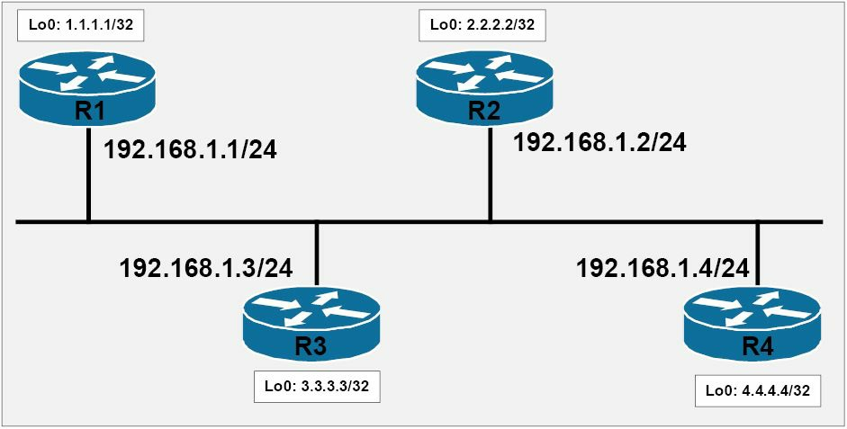
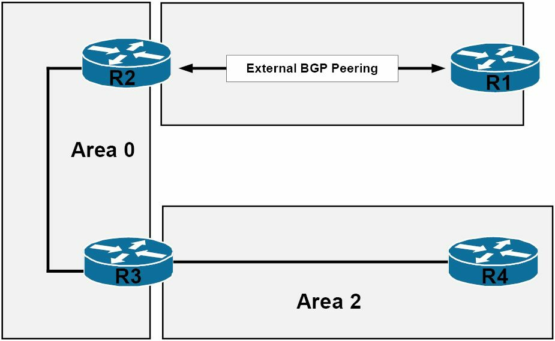
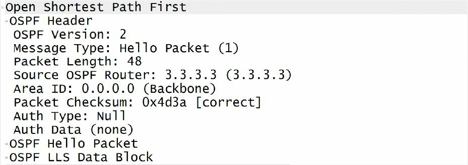
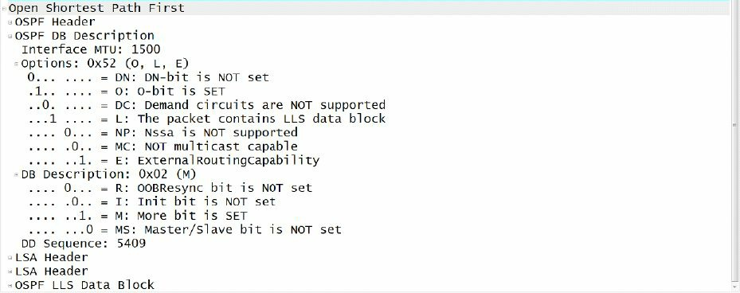
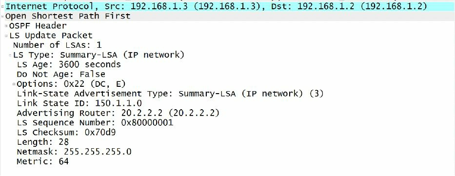
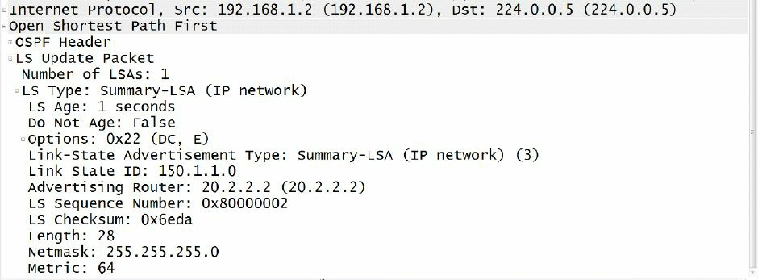

# 第39天

**开放最短路径优先协议**

**OSPF**

## 第39天任务

- 阅读今天的课文（以下）
- 复习昨天的课文
- 完成今天的实验
- 阅读ICND2记诵指南
- 在网站[subnetting.org](http://subnetting.org/)上学习15分钟

与EIGRP一样，对OSPF的讨论也可以花上几天时间，但这里需要针对那些考试要用到的知识点，进行着重学习。CCNA级别的OSPF知识，尚不足以在大多数网络上涉及与部署该路由技术。

今日将学习以下内容：

- OSPF原理
- DR与BDR
- OSPF的配置
- OSPF故障排除

这一课对应了以下CCNA大纲的要求：

- OSPF的配置与验证（单区，single area）
- 邻居临接（Neighbour adjacencies, 或者叫邻居关系的形成）
- OSPF的各种状态
- 对多区的讨论（discuss multi-area）
- OSPFv2的配置
- 路由器ID
- LSA（链路状态通告）的类型


## 指定与后备指定路由器（Designated and Backup Designated Routers）

如同第12天模块中所指出的，OSPF会在广播与非广播网络类型上选举出指定路由器（DR）与/或非后备指定路由器（BDR）。对后备指定路由器并非这些网络类型上的强制性组件这一点的掌握，是重要的。事实上，仅选出指定路由器，而没有后备指定路由器时，OSPF同样能工作；只是在指定路由器失效时，没有冗余而已，同时网络中的OSPF路由器需要再度进行一遍选举流程，以选出新的指定路由器。

在网段上（广播或非广播网络类型），所有非指定/后备指定路由器，都将与指定路由器与选出的后备指定路由器（若有选出后备指定路由器）建立临接关系，而不会与网段上的其它非指定/后备指定路由器形成临接关系。这些非指定/后备指定路由器，将往全指定路由器多播组地址（the AllDRRouters Multicast group address）`224.0.0.6`发出报文与更新。只有指定路由器与后备指定路由器才会收听发到此组地址的多播报文。随后指定路由器将通告报文给全SPF路由器多播组地址（the AllSPFRouters Multicast group address）`224.0.0.5`。这就令到网段上的所有其它OSPF路由器接收到更新。

对于已选出指定路由器与/或后备指定路由器时报文交换顺序的掌握尤为重要。下面作为一个示例，请设想一个有着4台路由器，分别为`R1`、`R2`、`R3`与`R4`，的广播网络。假定`R4`被选作指定路由器，`R3`被选作后备指定路由器。那么`R1`与`R2`就既不是指定也不是后备指定路由器了，因此在思科OSPF命名法中就被成为`DROther`路由器。此时`R1`上有一个配置改变，随后`R1`就发出一个更新报文到`AllDRRouters`多播组地址`226.0.0.6`。指定路由器`R4`接收到该更新，并发出一个确认报文（acknowledgement），回送到`AllSPFRouters`多播组地址`224.0.0.5`上，`R4`随后使用`AllSPFRouters`多播组地址，将该更新发送给所有其它非指定/后备指定路由器。该更新被其它的`DROther`路由器，也就是`R2`接收到，同时`R2`发出一个确认报文到`AllDRRouters`多播组地址`224.0.0.6`。该过程在下图39.1中进行了演示：


*图39.1 -- OSPF的指定与后备指定通告*

> **注意：** 后备指定路由器仅简单地收听发送到`224.0.0.5`（`AllSPFRouters` 多播组地址）与`224.0.0.6`（`AllDRRouters`多播组地址）两个多播组地址的数据包


某台路由器要成为网段的指定路由器或后备指定路由器，其就必须被选中。选举基于以下两点：

- 有着最高的路由器优先级值（the highest router priority value）
- 有着最高的路由器ID（the highest router ID）

默认下所有路由器都有着默认的优先级值`1`。可使用接口配置命令`ip ospf priority <0-255>`对该值进行调整。路由器的优先级值越高，那么其就越有可能被选为该网段的指定路由器。有着第二高优先级的路由器，则将被选为后备指定路由器。如配置了优先级值`0`，则该路由器将不参加到DR/BDR的选举过程。最高路由器优先级与路由器ID原则，仅在参与指定/后备指定路由器选举过程的所有路由器同时加载OSPF进程时才起作用。如这些路由器没有同时加载OSPF进程，则最先完成OSPF进程加载的路由器，将成为网段上的指定路由器。

在确定OSPF路由器ID时，思科IOS将选取已配置的环回接口的最高IP地址。在没有配置环回接口时，IOS软件将使用所有已配置的物理接口的最高IP地址，作为OSPF路由器ID。思科IOS软件还允许管理员使用路由器配置命令`router-id [address]`，来手动指定路由器ID。

重要的是记住在OSPF下，一旦指定路由器与后备指定路由器被选出，那么在进行另一次选举之前，它们都将始终作为指定/后备指定路由器。比如，在某个多路访问网络上已存在一台指定路由器与一台后备指定路由器的情况下，一台有着更高优先级或IP地址的路由器被加入到该同一网段时，既有的指定与后备指定路由器将不会变化。在指定路由器失效时，接过指定路由器的角色的是后备指定路由器，而不是新加入的有着更高优先级或IP地址的路由器。此外，一次新的选举将举行，而那台路由器极有可能被选举为后备指定路由器（Instead, a new election will be held and that router will most likely be elected BDR）。而为了让那台路由器成为指定路由器，就必须将后备路由器移除，或使用`clear ip ospf`命令对OSPF进程进行重置，以强制进行一次新的指定/后备指定路由器选举。一旦完成选举，OSPF像下面这样来使用指定与后备指定路由器：

- 用于减少网段上所要求的临接关系（To reduce the number of adjacencies required on the segment）
- 用于对多路访问网段上的路由器进行通告（To advertise the routers on the Multi-Access segment）
- 用于确保所有更新送达网段上的所有路由器


为了更好地掌握这些基础概念，这里参考下图39.2中的基本OSPF网络拓扑：



*图 39.2 -- OSPF 指定与后备指定路由器基础*

在图39.2中，网段上的各台路由器与指定及后备指定路由器之间建立临接关系，但相互之间并不建立临接关系（Referencing Figure 39.2, each router on the segment establishes an adjacency with the DR and the BDR but not with each other）。也就是说，非指定/后备指定路由器之间不会建立临接关系。这一特性阻止网段上的路由器形成相互之间的`N(N-1)`个临接关系，从而降低过多的OSPF数据包在网段上泛滥。

比如在没有网段上的指定/后备指定路由器概念时，各台路由器都需要与网段上的其它路由器建立临接关系。对于图39.2的情形，这将导致网段上的`4(4-1)`，也就是`12`个临接关系。但有了指定/后备指定路由器后，每台路由器只需与这两台路由器，而无需与其它非指定与后备指定路由器，建立临接关系。指定路由器与后备指定路由器之间也会建立临接关系。此特性降低了网段及各台路由器上的临接关系数目，进而降低各台路由器上资源消耗（比如内存与处理器使用）。

对于第二点，OSPF将一条链路，视为两台路由器或两个节点之间的连接。在多路访问网络，比如以太网中，多台路由器可处于同一网段上，就如同图39.2中所演示的那样。在这样的网络中，OSPF使用网络链路状态通告（Network Link State Advertisement, Type 2 LSA, 类型2的链路状态通告），来对多路访问网段上的路由器进行通告。这种链路状态通告是由指定路由器生成，并仅在该区域传播。因为其它非指定/后备指定路由器并不在各自之间建立临接关系，所以此类链路状态通告就令到那些路由器知悉在该多路访问网段上的其它路由器了。

为进一步说明这一点，这里参考图39.2, 假定该网段上的所有路由器都具有默认的OSPF优先级`1`（并同时加载OSPF进程），因为`R4`有着最高的路由器ID而被选为指定路由器。`R3`因为有着第二高的路由器ID而被选为后备指定路由器。因为`R2`与`R1`既不是指定也不是后备指定路由器，因此它们为称为思科命名法中的`DROther`路由器。可在所有路由器上使用`show ip ospf neighbour`命令对此进行验证，如下所示：

```sh
R1#show ip ospf neighbor
Neighbor ID     Pri     State           Dead Time   Address         Interface
2.2.2.2           1     2WAY/DROTHER    00:00:38    192.168.1.2     Ethernet0/0
3.3.3.3           1     FULL/BDR        00:00:39    192.168.1.3     Ethernet0/0
4.4.4.4           1     FULL/DR         00:00:38    192.168.1.4     Ethernet0/0

R2#show ip ospf neighbor
Neighbor ID     Pri     State           Dead Time   Address         Interface
1.1.1.1           1     2WAY/DROTHER    00:00:32    192.168.1.1     FastEthernet0/0
3.3.3.3           1     FULL/BDR        00:00:33    192.168.1.3     FastEthernet0/0
4.4.4.4           1     FULL/DR         00:00:32    192.168.1.4     FastEthernet0/0
R3#show ip ospf neighbor
Neighbor ID     Pri     State           Dead Time   Address         Interface
1.1.1.1           1     FULL/DROTHER    00:00:36    192.168.1.1     FastEthernet0/0
2.2.2.2           1     FULL/DROTHER    00:00:36    192.168.1.2     FastEthernet0/0
4.4.4.4           1     FULL/DR         00:00:35    192.168.1.4     FastEthernet0/0

R4#show ip ospf neighbor
Neighbor ID     Pri     State           Dead Time   Address         Interface
1.1.1.1           1     FULL/DROTHER    00:00:39    192.168.1.1     FastEthernet0/0
2.2.2.2           1     FULL/DROTHER    00:00:39    192.168.1.2     FastEthernet0/0
3.3.3.3           1     FULL/BDR        00:00:30    192.168.1.3     FastEthernet0/0
```

>  **注意：** 那些`DROther`路由器之所以处于`2WAY/DROTHER`状态，是因为它们仅与指定及后备指定路由器交换它们的数据库。那么就因为`DROther`路由器之间没有完整的数据库交换，所以它们绝不会达到OSPF完整临接状态（The DROther routers remain in the `2WAY/DROTHER` state because they exchange their databases only with the DR and BDR routers. Therefore, because there is no full database exchange between the DROther routers, they will never reach the OSPF FULL adjacency state）。

因为`R4`已被选为指定路由器，它就生成网络链路状态通告（the Network LSA），这类链路状态通告，是就该多路访问网段上的其它路由器进行通告的。可在网段上的任意路由器上，使用`show ip ospf database network [link state ID]`命令，或在指定路由器上使用`show ip ospf database network self-originate`命令，对此加以验证。下面演示了在指定路由器（`R4`）上命令`show ip ospf database network self-originate`命名的输出：

```sh
R4#show ip ospf database network self-originate
            OSPF Router with ID (4.4.4.4) (Process ID 4)
                Net Link States (Area 0)
  Routing Bit Set on this LSA
  LS age: 429
  Options: (No TOS-capability, DC)
  LS Type: Network Links
  Link State ID: 192.168.1.4 (address of Designated Router)
  Advertising Router: 4.4.4.4
  LS Seq Number: 80000006
  Checksum: 0x7E08
  Length: 40
  Network Mask: /24
        Attached Router: 4.4.4.4
        Attached Router: 1.1.1.1
        Attached Router: 2.2.2.2
        Attached Router: 3.3.3.3
```

参考上面的输出，指定路由器（`R4`）发起了表示`192.168.1.0/24`子网的类型2（网络）链路状态通告（the Type 2(Network) LSA）。因为该子网上存在多台路由器，所以该`192.168.1.0/24`子网被称作OSPF命名法中的一条传输链路（a transit link in OSPF terminology）。输出中的通告路由器字段（the Advertising Router field）显示了生成此链路状态通告的那台路由器（`4.4.4.4`, `R4`）。网络掩码字段（the Network Mask field）则显示了该传输网络的子网掩码，也就是24位，或`255.255.255.0`。

> 注：OSPF中链路类型（link type）有4种：P2P、Stub、Transit与Virtual link; 网络类型（network type）有两种：传输网络（Transit network）与末梢网络（Stub network）；链路状态通告有六种：Router LSA（一类）、Network LSA（二类）、Network summary LSA（三类）、ASBR summary LSA（四类）、AS external LSA（五类） 与 NSSA LSA（七类）。[参考链接](http://blog.51cto.com/xiaojiejt/1941362)。

所连接路由器字段（the Attached Router field）列出了在该网络网段上所有路由器的路由器ID。这样就令到该网段上的所有路由器，知悉有哪些其它路由器也同样位处该网段上。下面的输出，演示了在`R1`、`R2`与`R3`上的`show ip ospf database network [link state ID]`命令的输出，反映出同样的信息：

```sh
R2#show ip ospf database network
            OSPF Router with ID (2.2.2.2) (Process ID 2)
                Net Link States (Area 0)
  Routing Bit Set on this LSA
  LS age: 923
  Options: (No TOS-capability, DC)
  LS Type: Network Links
  Link State ID: 192.168.1.4 (address of Designated Router)
  Advertising Router: 4.4.4.4
  LS Seq Number: 80000006
  Checksum: 0x7E08
  Length: 40
  Network Mask: /24
        Attached Router: 4.4.4.4
        Attached Router: 1.1.1.1
        Attached Router: 2.2.2.2
        Attached Router: 3.3.3.3


R1#show ip ospf database network
            OSPF Router with ID (1.1.1.1) (Process ID 1)
                Net Link States (Area 0)
  Routing Bit Set on this LSA
  LS age: 951
  Options: (No TOS-capability, DC)
  LS Type: Network Links
  Link State ID: 192.168.1.4 (address of Designated Router)
  Advertising Router: 4.4.4.4
  LS Seq Number: 80000006
  Checksum: 0x7E08
  Length: 40
  Network Mask: /24
        Attached Router: 4.4.4.4
        Attached Router: 1.1.1.1
        Attached Router: 2.2.2.2
        Attached Router: 3.3.3.3
            OSPF Router with ID (4.4.4.4) (Process ID 4)


R3#show ip ospf database network
            OSPF Router with ID (3.3.3.3) (Process ID 3)
                Net Link States (Area 0)
  Routing Bit Set on this LSA
  LS age: 988
  Options: (No TOS-capability, DC)
  LS Type: Network Links
  Link State ID: 192.168.1.4 (address of Designated Router)
  Advertising Router: 4.4.4.4
  LS Seq Number: 80000006
  Checksum: 0x7E08
  Length: 40
  Network Mask: /24
        Attached Router: 4.4.4.4
        Attached Router: 1.1.1.1
        Attached Router: 2.2.2.2
        Attached Router: 3.3.3.3
```

网络链路状态通告的功能及其与其它类型的链路状态通告，特别是与路由器链路通告（类型一，the Router LSA(Type 1)）的关系，将在本模块稍后进行详细介绍。本小节的重点，应放在对指定路由器就多路访问网段上的网络链路状态通告的生成与通告，从而完成对位处该同一网段上的其它路由器的通告，这一过程的理解上。这是因为网段上的路由器仅与指定及后备指定路由器建立临接关系，而相互之间并不建立临接关系。在没有相互之间的临接关系下，路由器就绝不会知道该多路访问网段上的其它非指定/后备指定路由器。

最后，有关指定/后备指定路由器上的第三点，指定/后备指定路由器确保了网段上的所有路由器都有着完整的数据库。非指定/后备指定路由器将更新发送到多播组地址`224.0.0.6`（`AllDRRouter`）。那么指定路由器就通过将该更新发送到多播组地址`224.0.0.5`（`AllSPFRouters`），将这些更新通告给其它非指定/后备指定路由器。下图39.3演示了从`R1`（一台`DROther`）发往指定路由器组地址，涉及图39.2中的那些路由器的一个更新：


*图 39.3 -- 发到指定/后备指定路由器组地址的一个`DROther`更新*

`R4`（指定路由器）收到该更新，并接着将相同更新发送到多播组地址`224.0.0.5`（`AllSPFRouters`）。该组地址是由所有OSPF路由器使用的，以确保网段上的所有其它路由器都收到此更新。下图39.4对发自`R4`（指定路由器）的该更新进行了演示：


*图 39.4 -- 到OSPF组地址的指定路由器更新*

> **注意**：可以看出这就是来自`R1`的更新，因为图39.3与图39.4中的通告路由器字段（the Advertising Router field）都包含了`R1`的路由器ID（the router ID, RID）, 也就是`1.1.1.1`。


> **注意**：OSPF使用到的其它LSA类型，将在本模块的后面详细介绍。

## 额外的路由器类型（Additional Router Types）

除了多路访问网段上的指定与后备指定路由器外，对OSPF路由器的描述方式，还包括根据它们的位置与在OSPF网络中的作用。在OSPF网络中，通常会发现以下额外的路由器类型：

- 区域边界路由器（Area Border Routers）
- 自治系统边界路由器（Autonomous System Boundary Routers）
- 内部路由器（Internal Routers）
- 骨干路由器（Backbone Routers）


下图39.5演示了一个后两个区域--一个OSPF骨干区域（the OSPF backbone area(`Area 0`)）与一个额外的一般OSPF区域（a additional normal OSPF area(`Area 2`)）, 构成的基本OSPF网络。`R2`有着一个与`R1`的外部边界网关协议邻居关系（an external BGP neighbour relationship）。该图例将用于描述此网络中不同的OSPF路由器类型。



*图 39.5 -- 额外的OSPF路由器类型*

区域边界路由器（An Area Border Router, ABR），是一台将一个或多个OSPF区域，连接到OSPF骨干的OSPF路由器。这就意味着其必须有一个接口在`Area 0`中，同时有其它接口在某个不同的OSPF区域中。区域边界路由器是所有其归属区域的成员，且它们保有着每个其所归属区域的一个单独链路状态数据库（ABRs are members of all areas to which they belong, and they keep a seperate Link State Database for every area to which they belong）。参考图39.5, `R3`就应被认为是一台区域边界路由器，因为它将`Area 2`连接到了OSPF骨干`Area 0`。

而传统意义上的自治系统边界路由器，则是位处路由域的边沿，且定义了内部与外部网络的边界（An Autonomous System Boundary Router(ASBR), in the traditional sense, resides at the edge of the routing domain and defines the boundary between the internal and the external networks）。参考图39.5, `R2`将被认为是一台自治系统边界路由器。除了注入来自其它协议（比如BGP）的路由信息外，在某台路由器将静态路由或是所连接的子网，注入到OSPF网络时，也可将其划分为自治系统边界路由器。

内部路由器的所有运作接口，都保持在单个的OSPF区域中。基于图39.5中演示的网络拓扑，`R4`将被视为一台内部路由器，因为其仅有的接口，出于单个的OSPF区域中。

骨干路由器是那些有一个接口在OSPF骨干中的路由器。骨干路由器可以包括那些有着仅在OSPF骨干区域的接口的路由器，或者有一个接口在OSPF骨干区域，也有接口在其它区域的路由器（也就是区域边界路由器）。基于图39.5中演示的拓扑，路由器`R2`与`R3`都可被视为骨干路由器。

> **注意**：OSPF的路由器可有多个角色。比如上面的`R2`就同时是一台自治系统边界路由器及骨干路由器，`R3`又同时是一台骨干路由器与区域边界路由器。贯穿本模块，将详细审视这些类型的路由器与其在OSPF域中的角色与功能。

## OSPF数据包类型

OSPF路由器发出的不同类型数据包，包含在这些数据包共有的、24字节的OSPF头部（The different types of packets sent by OSPF routers are contained in the common 24-byte OSPF header）。尽管对该OSPF头部细节的深入，超出了CCNA考试要求的范围，但对该头部中所包含的各个字段，以及它们各自用途的基本掌握，仍然重要。下图39.6对此各种数据包共有的24个八位OSPF头部，进行了演示：


*图 39.6 - OSPF协议数据包头部*

其中的8位版本字段，指出了OSPF的版本。该字段的默认值是`2`。但在开启了OSPFv3时，该字段就被设置为`3`。在第13天时，对OSPFv3进行了详细介绍。

接着的8位类型字段，用于指明该OSPF数据包的类型。五种主要的OSPF数据包类型，将在本课程模块接下来进行介绍，它们是：

- 类型1 = `Hello`数据包
- 类型2 = 数据库描述数据包（Database Description packet）
- 类型3 = 链路状态请求数据包（Link State Request packet）
- 类型4 = 链路状态更新数据包（Link State Update packet）
- 类型5 = 链路状态确认数据包（Link State Acknowledgement packet）

随后的16位数据包长度字段，是用于指明该协议数据包的长度。此长度包括了标准的OSPF头部。

下面的32位路由器ID自动，用于指明发出数据包的路由器的IP地址。在思科IOS设备上，该字段将包含运行OSPF的设备上配置的所有物理接口的最高的IP地址。如在设备上配置了环回接口（Loopback interfaces），那么该字段将包含所有配置的环回接口的最高IP地址。或者在显式地有管理员配置或指定了路由器ID时，该字段也可包含那个手动配置的路由器ID。

>  **注意**: 除非重启了路由器，或者获取IP地址的那个接口被关闭或移除，抑或在路由器上使用了提权的`EXEC`命令`clear ip ospf process`命令重置了OSPF进程，否则在路由器ID被选出后，该路由器ID都不会发生改变。

接下来的32位区域ID（Area ID），用于区分该数据包的OSPF区域（the OSPF area）。数据包只能属于单个OSPF区域。在数据包是通过虚拟链路（a virtual link）接收到的时，那么区域ID就会是OSPF的骨干区域，也就是`Area 0`。本课程模块后面后对虚拟链路进行介绍。

校验和字段是16位长的，它指出了该数据包完整内容，从OSPF头部开始，但排除了64位的认证数据字段的标准IP校验和。如该数据包的长度不是正数个的16位字（16-bit words）长时，则会在进行检验和检查钱，以全`0`字节加以补充。

其后的16位认证类型字段（The 16-bit Authentication(Auth) Type field）指出所使用的认证的类型。该字段仅对OSPFv2有效，且可能包含以下3个代码之一：

- `Code 0` - 意思是空（`0`）认证，也就是没有认证；这是默认选项
- `Code 1` - 表明认证类型是普通文本（the authentication type is plain text）
- `Code 2` - 意思是认证类型为消息摘要算法（MD5, Message Digest Algorithm）

OSPF头部最后的64位认证数据字段，则是在开启了认证时，用于具体的认证信息或数据。重要的是记住 **该字段仅对OSPFv2有效**。在使用的是普通文本认证时，该自动包含了认证密钥（the authentication key）。但在使用的是MD5认证时，该自动就被重新定义为几个其它字段，不过这超出了CCNA考试要求范围。下图39.7显示了线路上捕获到的OSPF数据包的不同字段：



*图 39.7 - OSPF数据包头部的线上捕获*

在OSPF数据包头部里头，8位的类型字段用于指明OSPF数据包的类型。这里再度说明一下，如下所示的5种OSPF数据包类型：

- 类型1 = `Hello`数据包
- 类型2 = 数据库描述数据包（Database Description packet）
- 类型3 = 链路状态请求数据包（Link State Request packet）
- 类型4 = 链路状态更新数据包（Link State Update packet）
- 类型5 = 链路状态确认数据包（Link State Acknowledgement packet）


### OSPF `Hello` 数据包

`Hello`数据包用于发现其它直接相连的OSPF路由器，以及在OSPF路由器之间建立OSPF临接关系（OSPF adjacencies between OSPF routers）。对于广播及点对点网络，OSPF使用多播来发送`Hello`数据包。这些数据包被投送到`AllSPFRouters`多播组地址`224.0.0.5`。对于非广播链路（比如帧中继），OSPF使用单播（Unicast）来将`Hello`数据包直接发送给那些静态配置的邻居。

> **注意**：默认情况下，所有OSPF数据包（也就是包括多播与单播），都是以IP存活时间（TTL, Time To Live）`1`发送的。这就将这些数据包限制到本地链路。也就是说，无法与距离远于一挑的另一台路由器建立OSPF临接关系。这一点也适用于EIGRP。

OSPF的`Hello`数据包，还在广播链路上用于指定路由器与后备指定路由器的选举。指定路由器仅侦听多播地址`224.0.0.6`（`AllDRRouters`）。本课程模块前面已经介绍了指定与后备指定路由器。下图39.8演示了OSPF`Hello`数据包中所包含的字段：


*图 39.8 - OSPF的`Hello`数据包*

其中 **4字节的网络掩码字段**包含了通告OSPF接口的子网掩码（ **The 4-byte Network Mask field** contains the subnet mask of the advertising OSPF interface）。只有在广播介质上，才会检查子网掩码。对于本模块后面会介绍的未编号的点对点接口及虚拟链路，该字段将被设置为`0.0.0.0`。

后面两字节的`Hello`字段，显示`Hello`时间间隔，也就是两个`Hello`数据包之间的秒数，通告路由器要求此字段。其取值范围为`1`到`255`。在广播与点对点介质上的默认值为`10`，在所有其它介质上的默认值为`30`。

随后1字节的选项字段（The 1-byte Options field）是由本地路由器用于通告可选功能（optional capatibilities）。选项字段中的每一位，都表示了不同的功能。深入了解这些位所对应的功能，超出了CCNA考试要求范围。

后面的1字节路由器优先级字段（The 1-byte Router Priority field）包含了本地路由器的优先级。默认该字段的值为`1`。该值用于指定与后备指定路由器的选举。可能的取值范围为`0`到`255`。优先级越高，那么该本地路由器就越有机会成为指定路由器。优先级值`0`就意味着该本地路由器不会参与指定或后备指定路由器的选举。

接下来的4字节指定路由器字段，列出指定路由器的IP地址。在比如某个点对点链路上，或当某台路由器已被显式地配置为不参与此选举时，于尚无指定路由器选出时，就使用值`0.0.0.0`。

其后的4字节后备指定路由器字段，标识出后备路由器，并列出当前后备指定路由器的接口地址。在没有选出后备指定路由器时，就使用值`0.0.0.0`。

最后的（活动）邻居字段（the (Active) Neighbour field）是一个可变长度的字段，显示网段上的所有已接收到`Hello`数据包的OSPF路由器。

### 数据库描述数据包（Database Description Packets）

在各台OSPF路由器对其本地数据库信息进行通告时，于数据库交换期间，就要用到数据库描述数据包。这些数据包通常被称作DBD数据包或DD数据包。第一个DBD数据包用于数据库交换过程的主从选举。DBD数据包还包含了由主路由器选定的初始序列编号（The first DBD packet is used for the Master and Slave election for database exchange. The DBD packet also contains the initial sequence number selected by the Master）。有着较高路由器ID的路由器，成为主路由器并发起数据库同步过程。只有主路由器才能增加DBD数据包中的序列编号。主路由器开启数据库交换，并对从路由器进行信息轮询。数据库交换中的主从选举，是在邻居对的基础上进行的。

明白主从选举过程不同于指定与后备指定路由器的选举过程，尤为重要。通常后错误地假定它们一致（This is commonly incorrectly assumed）。主从选举过程只基于有着最高IP地址的路由器（两台邻居路由器之间）一条原则；但指定与后备指定路由器选举过程，则由IP地址或优先级值两个因素决定。

比如这里假设，两台名为`R1`与`R2`的路由器开始了临接关系建立过程。`R1`有着路由器ID`1.1.1.1`，同时`R2`有着路由器ID`2.2.2.2`。网络管理员将`R1`的OSPF优先级值配置为`255`以确保该路由器被选举为指定路由器。在主从关系确定过程中，`R2`因为有着较高的路由器ID优势，而将被选举为主路由器。但在`R1`上配置的优先级值，导致`R1`被选举为指定路由器。而实际上，在主从选举过程中，作为指定路由器的`R1`就可作为从路由器。

在选出了主从路由器后，本地路由器就通过往对方路由器发送LSA头部，而使用DBD数据包对本地数据库进行概括（After the Master and Slave have been elected, DBD packets are used to summarise the local database by sending LSA headers to the remote router. LSA，Link-State Advertisement, 链路状态通告）。远端路由器分析这些头部，以判断在其自己的LSDB拷贝中是否缺少什么信息。下图39.9中对数据库描述数据包进行了演示：



*图 39.9 - OSPF的数据库描述数据包*

在DBD数据包中，两字节的接口MTU字段包含了发出接口的8位二进制的MTU值（the 2-byte Interface MTU field contains the MTU value, in octets, of the outgoing interface）。也就是说，该字段包含了通过相关接口所能发送的最大数据大小（以字节计）。当在虚拟链路上使用接口时，该字段就被设置为值`0x0000`。有了成功建立OSPF的邻居临接关系，所有路由器上的MTU必须一致。如在一台路由器上修改了这个值，就必须在相同子网的所有其它路由器上配置同样的值（或使用`ip ospf mtu-ignore`命令）。

> **注意**：对于EIGRP来说，不必为了成功建立EIGRP的邻居关系，而要求接口MTU一致。

随后的1字节选项字段，包含的是与OSPF`Hello`数据包相同的选项。为简明起见，不再对这些选项进行描述。

其后的数据库描述或标志字段，是一个1字节的、在临接关系形成过程中，提供某台OSPF路由器可否就多个DBD数据包，与邻居进行交换的能力的字段（The Database Description or Flags field is a 1-byte field that provides an OSPF router with the capability to exchange multiple DBD packets with a neighbour during an adjacency formation）。

接着的4字节DBD序列号字段（The 4-byte Sequence Number field），通过使用一个序列号，而用于确保所有DBD数据包在同步过程中，得以接收与处理。主路由器在第一个DBD数据包中，将该字段初始化为一个独特值，其后的每个数据包的序列号都增加`1`。序列号的增加，仅由主路由器进行。

最后的可变长度LSA头部字段（the variable length LSA Header），运送的是描述本地路由器信息的多个LSA头部。每个头部长度为20个8位二进制数，并对数据库中的各个LSA进行唯一地区别。每个DBD数据包可包含多个LSA头部。


### 链路状态请求数据包（Link State Request Packets）

链路状态请求数据包，是由OSPF路由器发送的，用以请求缺失的或过期的数据库信息。这些数据包包含了对所请求的链路状态通告进行独特描述的标识符。单个的链路状态请求数据包可能包含了请求多条链路状态通告的单个的标识符集或多个的标识符集。链路状态请求数据包还用于在数据库交换之后的，对数据库交换期间本地路由器不曾有的那些链路状态通告的请求。下图39.10对OSPF的链路状态请求数据包格式的演示：


*图 39.10 - OSPF链路状态请求数据包*

其中的4字节链路状态通告类型字段（The 4-byte Link State Advertisement Type field）包含了所请求的链路状态通告类型。其可包含下列字段之一：

- 类型1 = 路由器链路状态通告
- 类型2 = 网络链路状态通告
- 类型3 = 网络汇总链路状态通告
- 类型4 = 自治系统边界路由器链路状态通告
- 类型5 = 自治系统外部链路状态通告
- 类型6 = 多播链路状态通告
- 类型7 = 次末梢区域外部链路状态通告（Not-So-Stubby Area, NSSA）
- 类型8 = 外部属性链路状态通告（External Attributes Link State Advertisement）
- 类型9 = 本地链路的不透明链路状态通告（Opaque LSA - Link Local, *目前主要用于MPLS多协议标签交换协议）
- 类型10 = 区域的不透明链路状态通告（Opaque LSA - Area, *目前主要用于MPLS多协议标签交换协议）
- 类型11 = 自治系统的不透明链路状态通过（Opaque LSA - Autonomous System, *目前主要用于MPLS多协议标签交换协议）

> **注意**：一些上面列出的链路状态通告将在后面的小节进行讲解。

4字节的链路状态ID字段，编码了特定于LSA的信息。包含在该字段的信息根据LSA的种类而有所不同。最后的4字节通告路由器字段，包含的是最先发起LSA的路由器的路由器ID。

### 链路状态更新数据包（Link State Update Packets）

链路状态更新（LSU）数据包是由路由器用于对链路状态通告进行通告的数据包（advertise Link State Advertisements）。链路状态更新数据包可以是到OSPF邻居的单播，作为从邻居处接收到链路状态请求的回应。然而最为常见的是，它们被可靠地在整个网络中泛洪到`AllSPFRouters`多播组地址`224.0.0.5`，直到所有路由器都有一份数据库的拷贝位置。所泛洪的更新，于随后在链路状态通告的确认数据包中加以确认。如链路状态通告未被确认，就会默认每隔5秒加以重传。下图39.11展示了一个发送给某个邻居的、作为LSR响应的链路状态更新数据包：



*图 39.11 - 单播的LSU数据包*

下图 39.12 演示了一个可靠地泛洪到多播组地址`224.0.0.5`的LSU：



*图 39.12 - 多播LSU数据包*

链路状态更新数据包由两部分构成。第一部分是4字节的链路状态通告数目字段（the 4-byte Number of LSAs field）。该字段显式了LSU数据包中所运送的LSA条数。第二部分则是一条或多条的链路状态通告。此可变长度字段包含了完整的LSA。每种类型的LSA都有共同的头部格式，与其各自特定的用来描述各自信息的数据字段。一个LSU数据包可包含单一的LSA或多条的LSA。

### 链路状态确认数据包（Link State Acknowledgement Packets）

链路状态确认数据包（LSAck）用于对各条LSA进行确认及作为对LSU数据包的响应。通过显式地使用链路状态确认数据包来对泛洪的数据包加以确认，OSPF所使用的泛洪机制被认为是可靠的。

链路状态确认数据包包含了一般的OSPF头部，以及随后的一个LSA头部清单。此可变长度字段允许本地路由器以单个数据包对多条LSA进行确认。链路状态确认数据包是以多播发送的。在多路访问网络上，如果发送LSAck的是指定或后备指定路由器，那么这些LSAck就被发送到多播组地址`224.0.0.5`（`AllSPFRouters`）。而如果发送LSAck的不是指定或后备指定路由器，那么这些LSAck数据包就被发送到多播组地址`224.0.0.6`（`AllDRRouters`）。下图39.13对LSAck的格式进行了演示：


*图 39.13 - 链路状态确认数据包*

总之，重要的是记住不同的OSPF数据包类型及它们所包含的信息。这将不仅有助于考试，也可在将OSPF作为一个协议的整个运作进行掌握的过程中有所裨益。

在思科IOS软件中，可使用`show ip ospf traffic`命令来查看OSPF数据包的统计信息。该命令展示了发送及接收道德OSPF数据包的总数，并将这些OSPF数据包细分到单独的OSPF进程，最终又细分到具体进程下开启了OSPF进程的各个接口上。该命令也可用于对OSPF临接关系建立的故障排除，其作为调试用途时，不是处理器占用密集的方式。下面的输出中演示了该命令所打印的信息：

```sh
R4#show ip ospf traffic
OSPF statistics:
  Rcvd: 702 total, 0 checksum errors
        682 hello, 3 database desc, 0 link state req
        12 link state updates, 5 link state acks
  Sent: 1378 total
        1364 hello, 2 database desc, 1 link state req
        5 link state updates, 6 link state acks

            OSPF Router with ID (4.4.4.4) (Process ID 4)
OSPF queue statistics for process ID 4:
                   InputQ     UpdateQ    OutputQ
  Limit            0          200        0
  Drops            0          0          0
  Max delay [msec] 4          0          0
  Max size         2          2          2
    Invalid        0          0          0
    Hello          0          0          1
    DB des         2          2          1
    LS req         0          0          0
    LS upd         0          0          0
    LS ack         0          0          0
  Current size     0          0          0
    Invalid        0          0          0
    Hello          0          0          0
    DB des         0          0          0
    LS req         0          0          0
    LS upd         0          0          0
    LS ack         0          0          0

Interface statistics:
    Interface Serial0/0
OSPF packets received/sent
    Invalid  Hellos   DB-des    LS-req  LS-upd   LS-ack   Total
Rx: 0        683      3         0       12       5        703
Tx: 0        684      2         1       5        6        698
OSPF header errors
  Length 0, Auth Type 0, Checksum 0, Version 0,
  Bad Source 0, No Virtual Link 0, Area Mismatch 0,
  No Sham Link 0, Self Originated 0, Duplicate ID 0,
  Hello 0, MTU Mismatch 0, Nbr Ignored 0,
  LLS 0, Unknown Neighbor 0, Authentication 0,
  TTL Check Fail 0,
OSPF LSA errors
  Type 0, Length 0, Data 0, Checksum 0,

  Interface FastEthernet0/0
OSPF packets received/sent
    Invalid  Hellos   DB-des    LS-req  LS-upd   LS-ack   Total
Rx: 0        0        0         0       0        0        0
Tx: 0        682      0         0       0        0        682
OSPF header errors
  Length 0, Auth Type 0, Checksum 0, Version 0,
  Bad Source 0, No Virtual Link 0, Area Mismatch 0,
  No Sham Link 0, Self Originated 0, Duplicate ID 0,
  Hello 0, MTU Mismatch 0, Nbr Ignored 0,
  LLS 0, Unknown Neighbor 0, Authentication 0,
  TTL Check Fail 0,
OSPF LSA errors
  Type 0, Length 0, Data 0, Checksum 0,

Summary traffic statistics for process ID 4:
  Rcvd: 703 total, 0 errors
        683 hello, 3 database desc, 0 link state req
        12 link state upds, 5 link state acks, 0 invalid
  Sent: 1380 total
        1366 hello, 2 database desc, 1 link state req
        5 link state upds, 6 link state acks, 0 invalid
```

## 临接关系的建立（Establishing Adjacencies）

运行OSPF的路由器在建立临接关系之前，会经历几种状态。在这些状态期间，路由器要交换不同类型的数据包。这些报文交换令到所有路由器建立起临接关系，以具备网络的持久视图。随后对当前网络的变更，就增量更新发送出去。这些状态分别是：`Down`、`Attempt`、`Init`、`2-way`、`Exstart`、`Exchange`、`Loading`以及`Full states`，如下所示：

- `Down`状态就是所有OSPF路由器的开始状态。然而，即便在所指定的路由器死亡间隔，那个接口尚未接收到`Hello`数据包，本地路由器仍可在此状态中显示出一个邻居（However, the local router may also show a neighbour in this state when no Hello packets have been recieved within the specified router dead interval for that interface）。
- `Attempt`状态仅对那些非广播多路访问网络上的OSPF邻居有效。在该状态中，已发出了一个`Hello`数据包，但尚未在死亡间隔中接收到来自静态配置的邻居的信息；但会尽力与该邻居建立临接关系。
- 在OSPF路由器接收到来自邻居的`Hello`数据包，而本地路由器ID并未在接收到的邻居字段（the received Neighbor field）中列出时，就到了`Init`状态。如OSPF`Hello`数据包的参数不匹配，比如各种计时器值等，那么OSPF路由器就再也不会进到此状态之后的状态了。
- `2-way`状态表明OSPF邻居之间的双向通信（各台路由器已看到其它路由器的`Hello`数据包）。在该状态中，本地路由器已接收到一个在邻居字段中有着其自己的路由器ID的`Hello`数据包，同时两台路由器上的`Hello`数据包参数也是一致的。在此状态时，路由器就确定是否与这个邻居成为临接。在多路访问网络上，指定与后备指定路由器在此阶段得以选举出来。
- `Exstart`状态用于数据库同步过程的初始化。本地路由器与其邻居在这个阶段确立何者负责数据库同步过程。在该状态中主从路由器被选举出来，同时在该阶段DBD交换的首个顺序编号有主路由器确定下来。
- `Exchange`状态就是路由器使用DBD数据包对它们的数据库内容进行描述的地方。各个DBD序列被显式的确认，同时一次只允许一个突出的DBD。在此期间，LSR数据包已被发出，以请求LSA的一个新的实例（Each DBD sequence is explicitly acknowledged, and only one outstanding DBD is allowed at a time. During this phase, LSR packets are also sent to request a new instance of the LSA）。在此阶段，`M`（更多）位被用于请求缺失的信息（The `M`(More) bit is used to request missing information during this stage）。在两台路由器都完成了其完整数据库的交换后，它们将把该`M`位设置为`0`。
- 在`Loading`状态，OSPF构造出一个LSR与链路状态重传清单。LSR数据包被发出，以请求某个LSA的较近期的、尚未在`Exchange`过程中接收到的实例。在此阶段，发出的更新被置于链路状态重传清单之上，直到本地路由器接收到确认为止。如本地路由器在阶段又接收到LSR，那么它将以包含了所请求信息的链路状态更新予以响应。
- `Full`状态表明OSPF的邻居们已经完成了它们整个数据库的交换，且都达成一致（也就是它们有着网络的同样视图）。处于该状态的两台路由器就将该临接关系加入到它们的本地数据库，并就此关系在链路状态更新数据包中加以通告。到这里，路由表被计算出来，或在临接关系被重置后被重新计算出来。`Full`正是一台OSPF路由器的正常状态。如果某台路由器被卡在了另一状态，那么就表明临接关系的形成中存在故障。对此的唯一例外就是`2-way`状态，该状态对于其中路由器仅到达指定或后备指定的`Full`状态的广播与非广播多路访问网络，就是所谓的正常状态。其它邻居总是将各自视为`2-way`的。

为了成功建立临接关系，两台路由器上的一些参数必须匹配。包括以下这些参数：

- 接口的MTU值（可被配置为忽略）
- `Hello`与死亡计时器
- 区域ID
- 认证类型与口令
- 末梢区域标志（The Stub Area flag）
- 兼容的网络类型（Compatible network types）

本课程模块将陆续对这些参数进行介绍。如这些参数不匹配，那么OSPF的临接关系将绝不会完整建立。

> **注意**：处理不匹配的参数，还要记住在多路访问网络上，如两台路由器都配置了优先级值`0`，那么临接关系也不会建立。在这类网络上，必须要有指定路由器（The DR must be present on such network types）。

## OSPF的链路状态通告与链路状态数据库

**OSPF LSAs and the Link State Database(LSDB)**

如同前面的小节中指出的，OSPF用到好几种类型的链路状态通告。每种链路状态通告都以标准的20字节链路状态通告头部开始。该标准LSA头部包括下面这些字段：

- 链路状态的老化时间（Link State Age）
- 选项（Options）
- 链路状态的类型
- 链路状态的ID
- 通告的路由器
- 链路状态的顺序编号
- 链路状态的校验和
- 长度

两字节的链路状态老化时间字段，指出自该LSA生成开始所历经的时间（以秒计）。LSA的最大老化时间是3600秒（1小时），这就意味着LSA的老化时间达到3600秒时，其就被移除数据库。为避免被移除，每隔1800秒对LSA进行更新。

一字节的选项字段包含了与OSPF`Hello`数据包同样的选项。

一字节的链路状态类型字段，表示LSA的类型。LSA数据包不同的类型，在后面的小节中介绍。

四字节的链路状态ID字段，标识出由该LSA所描述的网络的一部分。该字段的内容，取决于通告的链路状态类型。

四字节的通告路由器字段，表示了产生该LSA的路由器的路由器ID。

四字节的链路状态顺序编号字段，对旧的或重复的链路状态通告进行探测。第一个顺序编号`0x80000000`是保留的；因此实际的第一个顺序编号总是`0x80000001`。该值随着数据包的不断发出而增加。最大的顺序编号为`0x7FFFFFFF`。

> **注意**：这里使用了补码表示有正负的整数，因此`0x80000000`就是整数`0`，`0x80000001`就是整数`1`。

两字节的链路状态校验和字段，对LSA的包括LSA头部的全部内容，执行弗莱彻校验和运算（the Fletcher checksum, 参见[wikipedia:Fletcher's checksum](https://en.wikipedia.org/wiki/Fletcher%27s_checksum)）。链路状态老化时间字段未包含在校验和中。进行校验和计算的原因，是因为在LSA存储于内存中期间，可能由于路由器软件或硬件问题，或在LSA泛洪期间，由于物理层错误等原因，而造成LSA的失准。

> **注意**： 在LSA被生成或接收到时，就会进行校验和的计算。此外，每个`CheckAge`间隔，也就是10分钟，也会进行校验和计算。如该字段的值为`0`，那就是说没有进行校验和计算。

两字节的长度字段，是头部最后的字段，包含了该LSA的长度值（以字节计）。长度值包含了20字节的LSA头部。下图39.13对LSA头部进行了演示：


*图 39.13 - 链路状态通告的头部*

尽管OSPF支持11中不同类型的链路状态通告，但仅有LSA类型`1`、`2`与`3`用于计算内部路由，而LSA类型`4`、`5`及`7`，则是用于计算外部路由，从而超出了CCNA考试要求范围。因为出于CCNA考试目的没有必要深入其它类型LSA的细节，所以这些LSA不会在本手册中进行介绍。但可在[in60days.com](http://www.in60days.com)上找到有关它们的一个简要提纲与可打印手册。

在思科IOS软件中，要查看链路状态数据库的内容，就使用`show ip ospf database`命令。在不带关键字使用此命令时，将打印出路由器连接的所有区域的LSA汇总。该命令支持几个有着更高的粒度的关键字，从而允许管理员将输出限制到仅特定类型LSA、仅由本地路由器通告的LSA，甚至OSPF中其它路由器通告的LSA。

尽管对每个关键字用法的输出进行演示是不现实的，但下面的小节仍对不同类型的LSA，以及与`show ip ospf database`命令结合使用从而查看到这些LSA的详细信息的一些常见关键字，进行了介绍。该命令所支持的关键字，在下面的输出中进行了演示：

```sh
R3#show ip ospf database ?
  adv-router        Advertising Router link states
  asbr-summary      ASBR Summary link states
  database-summary  Summary of database
  external          External link states
  network           Network link states
  nssa-external     NSSA External link states
  opaque-area       Opaque Area link states
  opaque-as         Opaque AS link states
  opaque-link       Opaque Link-Local link states
  router            Router link states
  self-originate    Self-originated link states
  summary           Network Summary link states
  |                 Output modifiers
<cr>
```

### 路由器链路状态通告（类型1）

**Router Links State Advertisements(Type 1)**

类型1的LSA，是由各台路由器为其所属的各个区域所生成的。路由器LSA列出了始发路由器的路由器ID（The router LSA lists the originating router's router ID）。每台单个的路由器都将为其所处的区域，生成一条类型1的LSA。路由器LSA是`show ip ospf database`命令输出中最先打印出的LSA类型。

### 网络链路状态通告（类型2）

**Network Link State Advertisements(Type 2)**

OSPF使用网络链路状态通告（类型2的LSA），来在多路访问网段上对路由器进行通告（OSPF uses the Network Link State Advertisement(Type 2 LSA) to advertise the routers on the Multi-Access segment）。此类LSA是由指定路由器生成的，且仅在区域中传播（flooded）。因为其它非指定/后备指定路由器并不在相互之间建立临接关系，所以网络LSA就令到这些路由器对该多路访问网络上的其它路由器有所知悉。

### 网络汇总链路状态通告（类型3）

**Network Summary Link State Advertisement(Type 3)**

网络汇总LSA是一条本地区域之外，但仍出于OSPF域中的目的（网络）的汇总。也就是说，此类LSA同时对区域间及区域内的路由信息进行通告（The Network Summary(Type 3) LSA is a summary of destinations outside of the local area but within the OSPF domain. In other words, this LSA advetises both inter-area and intra-area routing information）。网络汇总LSA没有携带任何的拓扑信息。而是在该类型的LSA中唯一包含的信息，就是一个IP前缀（an IP prefix）。类型3的LSA是由区域边界路由器生成的，并被泛洪到所有临接区域（adjacent areas）。默认情况下，每条类型3的LSA都与一条单独的路由器或网络LSA，以一一对应的形式相匹配（By default, each Type 3 LSA matches a single Router or Network LSA on a one-for-one basis）。也就是说，对于每条单独的类型1及类型2的LSA，都存在着一条类型3的LSA。特别要留意这些LSA是如何在与OSPF骨干（区域）的联系下被传播的。此种传播或泛洪，按照下面这样进行（Special attention must be paid to how these LSAs are propagated in relation to the OSPF backbone. This propagation or flooding is performed as follows）：

- 对于区域内的路由（也就是对于类型1及类型2的LSAs），网络汇总（类型3）的LSA自非骨干区域被通告至OSPF骨干（区域，Network Summary(Type 3) LSAs are advertised from a non-backbone area to the OSPF backbone for intra-area routes(i.e., for Type 1 and Type 2 LSAs)）
- 对于区域内（也就是区域`0`的类型1与类型2 LSAs）及区域间路由（也就是由其它区域边界路由器泛洪到骨干区域的类型3 LSAs）的网络汇总（类型3）LSAs，被同时从OSPF骨干区域，通告到其它非骨干区域。

后面的三种链路状态通告，类型4、类型5与类型7, 用于外部路由器计算。类型4与类型5将在接着的小节介绍，类型7将在本课程模块后面，于对不同的OSPF区域进行讨论时介绍。

### 自治系统边界汇总链路状态通告（类型4）

**ASBR Summary Link State Advertisements(Type 4)**

类型4的LSA对有关自治系统边界路由器的信息进行描述（The Type 4 LSA describes information regarding the Autonomous System Boundry Router(ASBR)）。此类LSA包含了与类型3 LSA的相同数据包格式，并以一些显著的差异，完成同样的基本功能。与类型3的LSA类似，类型4的LSA是由区域边界路由器生成的。两种LSAs的通告路由器字段（the Advertising Router field）都包含着生成该汇总LSA的区域边界路由器的路由器ID。但是，类型4的LSA使用区域边界路由器，为仅有某条路由器LSA可达的各台自治系统边界路由器所创建的。随后该区域边界路由器将该类型4的LSA注入到相应区域。此类LSA提供到有关该自治系统边界路由器本身的可靠性信息。你应熟知的类型3与类型4 LSAs的关键不同，在下表39.2中有列出：

*表 39.2 - 关于类型3与类型4汇总LSAs*

| 类型3的汇总LSA | 类型4的汇总LSA |
| --- | --- |
| 提供有关网络链路的信息。 | 提供有关自治系统边界路由器的信息。 |
| 网络掩码字段（The Network Mask field）包含了该网络的子网掩码。 | 网络掩码字段将总是包含值`0.0.0.0`或简单的就是`0`。 |
| 链路状态ID字段（The Link State ID field）包含了真实的网络编号。 | 链路状态ID字段包含了自治系统边界路由器的路由器ID。 |


### 自治系统外部链路状态通告（类型5）

**AS External Link State Advertisements(Type 5)**

外部链路状态通过用于对那些该自治系统的外部目的网络进行描述（The External Link State Advertisement is used to describe destinations that are external to the autonomous system）。也就是说，类型5的LSAs提供了要抵达外部网络的必要信息。除了外部路由外，某个OSPF路由域（an OSPF routing domain）的默认路由，也可作为类型5的链路状态通告，而加以注入。

## 关于OSPF的各种区域（OSPF Areas）

除了在本课程模块之前的小节中描述并用到的骨干区域（`Area 0`）及其它非骨干区域外，OSPF规格还定义了记住“特殊”类型的区域。这些区域的配置，主要是为了通过阻止不同类型的LSAs（主要是类型5的LSAs）诸如到确切区域，而减小出于这些区域中的路由器上的链路状态数据库的大小，这些其它区域包括：

- 次末梢区域（Not-So-Stubby Areas, NSSAs）
- 完全的次末梢区域（Totally Not-So-Stubby Areas, TNSSAs）
- 末梢区域（Stub Areas, SAs）
- 完全末梢区域（Totally Stubby Areas, TSAs）

### 关于次末梢区域（Not-So-Stubby Areas, NSSAs）

次末梢区域是OSPF末梢区域的一种，其允许自治系统边界路由器使用NSSA外部LSA（类型7），注入外部路由信息。如同在前面的小节中所指出的，类型4、类型5与类型7的LSAs是用于外部路由的计算。这里不会就类型7的LSAs的细节，或它们在NSSAs中的使用方式，进行检视。

### 关于完全次末梢区域（Totally Not-So-Stubby Areas, TNSSAs）

完全次末梢区域是次末梢区域的一个扩展。与次末梢区域类似，类型5的LSAs不被允许进入TNSSAs；与NSSAs不同的是，汇总LSAs也不允许进入到TNSSAs中。此外，在配置了某个TNSSA时，默认路由就作为类型7的LSA注入到该区域。TNSSAs有着以下特性：

- 类型7的LSAs在该NSSA的区域边界路由器处被转换为类型5的LSAs
- 它们不允许网络汇总LSAs（They do not allow Network Summary LSAs）
- 它们不允许外部LSAs
- 默认路由是以一条汇总LSA被注入的

### 关于末梢区域（Stub Areas）

末梢区域与NSSAs有些类似，主要的例外就是不允许外部路由（类型5或类型7）进入到末梢区域（Stub areas are somewhat similar to NSSAs, with the major exception being that external routes(Type 5 or Type 7) are not allowed into Stub Areas）。重要的是对末梢在OSPF何EIGRP中的功能是完全不同的。在OSPF中，某个区域作为末梢区域的配置，通过阻止外部LSAs被通告到这些区域，在无需额外配置下，就可减小这些区域中路由器的路由表及OSPF数据库的大小。末梢区域有着以下特性：

- 默认路由是通过区域边界路由器，以一条类型3的LSA注入到末梢区域的
- 来自其它区域的类型3的LSAs允许进入到这些区域
- 外部路由的LSAs（也就是类型4及类型5的LSAs）不被允许

### 关于完全末梢区域（Totally Stubby Areas）

完全末梢区域是末梢区域的一个扩展。但与末梢区域不同的是，完全末梢区域通过限制外部LSAs外，还限制了类型3的LSAs，从而进一步地减小了完全末梢区域中路由器上的链路状态数据库（Link State Database, LSDB）的大小。通常将TSAs配置在那些有着到网络，比如在传统的分支网络，的单个入口及出口点的路由器上（TSAs are typically configured on routers that have a single ingress and egress point into the network, for example in a traditional hub-and-spoke network）。该区域的路由器将所有外部流量转发到区域边界路由器。同时该区域边界路由器也是所有骨干区域及区域间流量到完全末梢区域的出口点（The ABR is also the exit point for all backbone and inter-area traffice to the TSA），其有着以下特性：

- 默认路由是作为类型3的网络汇总LSA注入到末梢区域的
- 自其它区域的类型3、类型4及类型5 LSAs不被允许进入到这些区域

## 路由度量值与最优路由选取

**Route Metrics and Best Route Selection**

在以下小节中，将学到有关OSPF度量值及其运算的知识。

### OSPF度量值的计算（Calculating the OSPF Metric）

OSPF度量值通常被成为开销（The OSPF metric is commonly referred to as the cost）。开销是从链路的带宽，使用公式`10^8 / 带宽`（其中“带宽”以`bps`计）得到的。这就意味着依据不同链路的带宽，而赋予了它们不同的开销值。使用此公式，一个`10Mbps`的以太网接口的OSPF开销，将像下面这样计算出来：

- 开销 = `10^8 / 带宽（bps）`
- 开销 = `100 000 000 / 10 000 000`
- 开销 = `10`

使用同样的公式，一条`T1`链路的OSPF开销，将像下面这样计算出来：

- 开销 = `10^8 / 带宽（bps）`
- 开销 = `100 000 000 / 1 544 000`
- 开销 = `64.77`

> **注意**：在计算OSPF的度量值时，不会用到小数。因此这样的小数总是会向下取整到最接近的整数。那么对于上一示例，一条`T1`链路的实际开销将向下取整到`64`。

如先前所演示的那样，可使用`show ip ospf interface [name]`来查看到某个接口的OSPF开销。在度量值计算中用到的默认参考带宽，可在`show ip protocols`命令的输出中查看到，如下面的输出中所演示的那样：

```sh
R4#show ip protocols
Routing Protocol is “ospf 4”
  Outgoing update filter list for all interfaces is not set
  Incoming update filter list for all interfaces is not set
  Router ID 4.4.4.4
  Number of areas in this router is 1. 1 normal 0 stub 0 nssa
  Maximum path: 4
  Routing for Networks:
    0.0.0.0 255.255.255.255 Area 2
Reference bandwidth unit is 100 mbps
  Routing Information Sources:
    Gateway         Distance      Last Update
    3.3.3.3         110           00:00:03
  Distance: (default is 110)
```

而在OSPF中使用的默认参考带宽，则可使用路由器配置命令`auto-cost reference-bandwidth <1-4294967>`，并指定出以`Mbps`计的参考带宽值，而进行调整。这样做在那些有着具有超过`100Mbps`带宽值的链路，比如`GigabitEthernet`链路的网络中尤为重要。在这些网络中，赋予给`GigabitEthernet`的默认开销值将与`FastEthernet`链路的开销值一样。大多数情况下，这样的结果当然是不可取的，尤其是在OSPF尝试在这些链路上进行负载均衡时。

要阻止这种开销值计算偏差，就应在路由器上执行该路由器配置命令`auto-cost reference-bandwidth 1000`命令。这会引发使用新的参考带宽值，对路由器上的个开销值的重新计算。比如，依据该配置，某条`T1`链路的开具将如下进行重新计算：

- 开销 = `10^9 / 带宽（bps）`
- 开销 = `1 000 000 000 / 1 544 000`
- 开销 = `647.7`

> **注意**：再次，因为OSPF度量值不支持小数，该值将被向下取整到简单的`647`的度量值，如下面的输出所示：


```sh
R4#show ip ospf interface Serial0/0
Serial0/0 is up, line protocol is up
  Internet Address 10.0.2.4/24, Area 2
  Process ID 4, Router ID 4.4.4.4, Network Type POINT_TO_POINT, Cost: 647
  Transmit Delay is 1 sec, State POINT_TO_POINT
  Timer intervals configured, Hello 10, Dead 60, Wait 60, Retransmit 5
    oob-resync timeout 60
    Hello due in 00:00:01
  Supports Link-local Signaling (LLS)
  Index 2/2, flood queue length 0
  Next 0x0(0)/0x0(0)
  Last flood scan length is 1, maximum is 1
  Last flood scan time is 0 msec, maximum is 0 msec
  Neighbor Count is 0, Adjacent neighbor count is 0
  Suppress Hello for 0 neighbor(s)
```

在执行了路由器配置命令`auto-cost reference-bandwidth 1000`后，思科IOS软件就打印出下面的消息，表明应将此同样的值，应用该OSPF域中的所有路由器上。这在下面的输出中进行了演示：

```sh
R4(config)#router ospf 4
R4(config-router)#auto-cost reference-bandwidth 1000
% OSPF: Reference bandwidth is changed.
        Please ensure reference bandwidth is consistent across all routers.
```

尽管这一点可能看起来像一条重要的警告消息，但请记住该命令的使用，仅影响到本地路由器。在所有路由器上配置这条命令并不是强制性的；但为考试目的，应确保在所有路由器上应用了一个一致的配置。

### 对OSPF的度量值计算施加影响（Influencing OSPF Metric Calculation）

可通过执行下面的操作，来对OSPF度量值的计算，施加直接的影响：

- 使用`bandwidth`命令，对接口带宽进行调整
- 使用`ip ospf cost`命令，手动指定开销

在对EIGRP的度量值计算进行讨论时的先前课程模块中，对`bandwidth`命令的使用进行了介绍。如先前指出的那样，默认OSPF的开销，是通过以参考带宽`10^8`，也就是`100Mbps`除以链路带宽计算出来的。那么不论是提升还是降低链路带宽，都直接影响到该特定链路的OSPF开销。这是一种典型的用于确保某条路径优先于另一路径而被选用的 **路径控制机制**（a path control mechanism）。

但是，如同在先前的课程模块中所描述的那样，`bandwidth`命令的影响，不仅限于路由协议。正是由于这个原因，作为第二种办法的手动指定开销值，就是推荐的对OSPF度量值计算施加影响的做法。

接口配置命令`ip ospf cost <1-65535>`，被用于手动指定某条链路的开销。链路的开销值越低，其就比到相同目的网络的、有着更高开销值的其它链路，越有可能被优先选用。下面的示例演示了如何为某条串行（`T1`）链路配置上一个OSPF开销`5`：

```sh
R1(config)#interface Serial0/0
R1(config-if)#ip ospf cost 5
R1(config-if)#exit
```

可使用`show ip ospf interface [name]`命令对此配置进行验证，如下面的输出所示：

```sh
R1#show ip ospf interface Serial0/0
Serial0/0 is up, line protocol is up
  Internet Address 10.0.0.1/24, Area 0
  Process ID 1, Router ID 1.1.1.1, Network Type POINT_TO_POINT, Cost: 5
  Transmit Delay is 1 sec, State POINT_TO_POINT,
  Timer intervals configured, Hello 10, Dead 40, Wait 40, Retransmit 5
    oob-resync timeout 40
    Hello due in 00:00:04
  Index 2/2, flood queue length 0
  Next 0x0(0)/0x0(0)
  Last flood scan length is 1, maximum is 4
  Last flood scan time is 0 msec, maximum is 0 msec
  Neighbor Count is 1, Adjacent neighbor count is 1
    Adjacent with neighbor 2.2.2.2
  Suppress Hello for 0 neighbor(s)
```

## 关于OSPF的默认路由（OSPF Default Routing）

与EIGRP支持好几种生成与通告默认路由的方式不同，OSPF仅使用路由器配置命令`default-information originate [always] [metric <value>] [metric-type <1|2>] [route-map <name>]`，来动态地通告默认路由。

其所使用的`default-information originate`命令，将把该路由器配置为仅在路由表中已出现一条默认路由的情况下，通告一条默认路由（The `default-information originate` command used by itself will configure the router to advertise a default route only if a default route is already present in the routing table）。但可将`[always]`关键字追加到该命令，从而强制该路由器在路由表中尚不存在默认路由的情况下，生成一条默认路由。应小心使用这个关键字，因为它可能导致OSPF域中的流量黑洞，或者导致将所有位置目的地的数据包，转发到所配置的路由器。

关键字`[metric <value>]`用于指定所生成的默认路由的路由度量值。而关键字`[metric-type <1|2>]`可用于修改默认路由的度量值类型（the metric type for the default route）。最后，`[route-map <name>]`关键字将路由器配置为仅在该命名的路由器地图中所指定的条件满足时，生成一条默认路由。

下面的配置示例，演示了如何将一台开启OSPF的路由器，配置为在路由表中存在一条默认路由时，生成一条默认路由并对其进行通告。既有的默认路由可以是一条静态路由，甚至为在该路由器上配置了多种路由协议时，从另一种路由协议产生的一条默认路由。下面的输出演示的是基于一条配置的静态默认路由的此种配置：

```sh
R4(config)#ip route 0.0.0.0 0.0.0.0 FastEthernet0/0 172.16.4.254
R4(config)#router ospf 4
R4(config-router)#network 172.16.4.0 0.0.0.255 Area 2
R4(config-router)#default-information originate
R4(config-router)#exit
```

默认情况下，默认路由是作为类型5的LSA进行通告的。

## OSPF的配置（Configuring OSPF）

以一行配置，就可以在路由器上开启基本的OSPF，并于随后通过添加 **网络语句**，来指明希望在哪些接口上运行OSPF，对于那些不打算通告的网络，则不予添加（Basic OSPF can be enabled on the router with one line of configuration, and then by adding the network statement that specifies on which interfaces you want to run OSPF, not necessarily networks you wish to advertise）:

1. `router ospf 9`，其中 `9` 是本地有意义的编号
2. `network 10.0.0.0 0.255.255.255 area 0`

在至少一个接口处于`up/up`状态之前，OSPF都不会成为活动状态，并请记住要至少有一个区域必须为`Area 0`。下图39.14演示了一个示例性的OSPF网络：


*图 39.14 - 一个示例性OSPF网络*

其中路由器A的配置为：

```sh
router ospf 20
network 4.4.4.4 0.0.0.0 area 0
network 192.168.1.0 0.0.0.255 area 0
router-id 4.4.4.4
```

路由器B的配置为：

```sh
router ospf 22
network 172.16.1.0 0.0.0.255 area 0
network 192.168.1.0 0.0.0.255 area 0
router-id 192.168.1.2
```

路由器C的配置为：

```sh
router ospf 44
network 1.1.1.1 0.0.0.0 area 1
network 172.16.1.0 0.0.0.255 area 0
router-id 1.1.1.1
router-id 1.1.1.1
RouterC#show ip route
Gateway of last resort is not set
     1.0.0.0/32 is subnetted, 1 subnets
C       1.1.1.1 is directly connected, Loopback0
     4.0.0.0/32 is subnetted, 1 subnets
O       4.4.4.4 [110/129] via 172.16.1.1, 00:10:39, Serial0/0/0
     172.16.0.0/24 is subnetted, 1 subnets
C       172.16.1.0 is directly connected, Serial0/0/0
O     192.168.1.0/24 [110/128] via 172.16.1.1, 00:10:39, Serial0/0/0
```

## OSPF的故障排除（Troubleshooting OSPF）

这里再度说明一下，开放路径优先协议，是一种就其链路状态进行通告的，开放标准的链路状态路由协议。在一台链路状态路由器于某条网络链路上开始运作时，那个逻辑网络的相关信息，就被添加到该路由器的本地的链路状态数据库中。随后该本地路由器就在其可用的那些链路上，发送`Hello`报文，来判断是否其它链路状态路由器也在接口上运行。OSPF使用IP编号`89`，直接允许在互联网协议上。

尽管要深入到所有潜在的OSPF故障场景是不可能的，不过接下来的小节，仍就在将OSPF部署为IGP的选择（the IGP of choice, [Interior Gateway Protocol](https://zh.wikipedia.org/wiki/%E5%86%85%E9%83%A8%E7%BD%91%E5%85%B3%E5%8D%8F%E8%AE%AE)）时，一些最为常见的故障场景进行了讨论。

### 邻居关系的故障排除

**Troubleshooting Neighbour Relationships**

运行OSPF的路由器在建立临接关系前，会度过好几种状态。这些不同状态分别是`Down`、`Attempt`、`Init`、`2-way`、`Exstart`、`Exchange`、`Loading`以及`Full` 状态。OSPF临接关系的首选状态是`Full`状态。该状态表明邻居已经完成了各自完整数据库的交换，并有着对网络的相同视图。但尽管`Full`状态是首选的临接状态，在临接关系建立的过程中，邻居们可能会“卡在”其它的某种状态中。由于这个原因，那么为了排除故障，就有必要掌握需要查找什么。

### 邻居表为空的情况（The Neighbour Table Is Empty）

对于邻居表可能为空的原因（也就是为何`show ip ospf neighbor`命令可能不产生任何输出），有好几种。常见的原因如下所示：

- 基础的OSPF错误配置（misconfigurations）
- 1层与2层故障
- 访问控制清单过滤掉了（ACL filtering）
- 接口的错误配置


