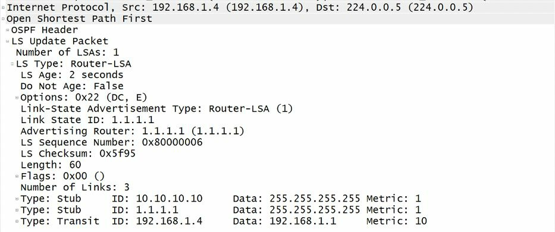
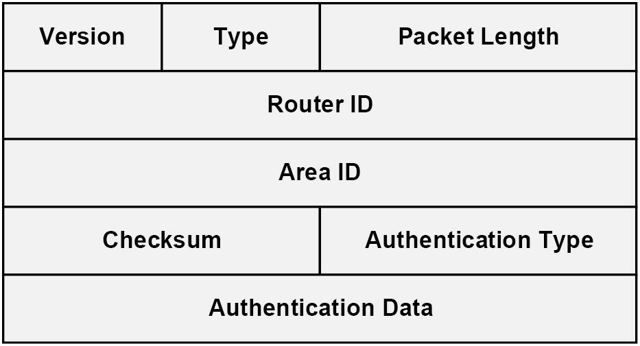

# 第39天

**开放最短路径优先协议**

**OSPF**

## 第39天任务

- 阅读今天的课文（以下）
- 复习昨天的课文
- 完成今天的实验
- 阅读ICND2记诵指南
- 在网站[subnetting.org](http://subnetting.org/)上学习15分钟

与EIGRP一样，对OSPF的讨论也可以花上几天时间，但这里需要针对那些考试要用到的知识点，进行着重学习。CCNA级别的OSPF知识，尚不足以在大多数网络上涉及与部署该路由技术。

今日将学习以下内容：

- OSPF原理
- DR与BDR
- OSPF的配置
- OSPF故障排除

这一课对应了以下CCNA大纲的要求：

- OSPF的配置与验证（单区，single area）
- 邻居临接（Neighbour adjacencies, 或者叫邻居关系的形成）
- OSPF的各种状态
- 对多区的讨论（discuss multi-area）
- OSPFv2的配置
- 路由器ID
- LSA（链路状态通告）的类型


## 指定与后备指定路由器（Designated and Backup Designated Routers）

如同第12天模块中所指出的，OSPF会在广播与非广播网络类型上选举出指定路由器（DR）与/或非后备指定路由器（BDR）。对后备指定路由器并非这些网络类型上的强制性组件这一点的掌握，是重要的。事实上，仅选出指定路由器，而没有后备指定路由器时，OSPF同样能工作；只是在指定路由器失效时，没有冗余而已，同时网络中的OSPF路由器需要再度进行一遍选举流程，以选出新的指定路由器。

在网段上（广播或非广播网络类型），所有非指定/后备指定路由器，都将与指定路由器与选出的后备指定路由器（若有选出后备指定路由器）建立临接关系，而不会与网段上的其它非指定/后备指定路由器形成临接关系。这些非指定/后备指定路由器，将往全指定路由器多播组地址（the AllDRRouters Multicast group address）`224.0.0.6`发出报文与更新。只有指定路由器与后备指定路由器才会收听发到此组地址的多播报文。随后指定路由器将通告报文给全SPF路由器多播组地址（the AllSPFRouters Multicast group address）`224.0.0.5`。这就令到网段上的所有其它OSPF路由器接收到更新。

对于已选出指定路由器与/或后备指定路由器时报文交换顺序的掌握尤为重要。下面作为一个示例，请设想一个有着4台路由器，分别为`R1`、`R2`、`R3`与`R4`，的广播网络。假定`R4`被选作指定路由器，`R3`被选作后备指定路由器。那么`R1`与`R2`就既不是指定也不是后备指定路由器了，因此在思科OSPF命名法中就被成为`DROther`路由器。此时`R1`上有一个配置改变，随后`R1`就发出一个更新报文到`AllDRRouters`多播组地址`226.0.0.6`。指定路由器`R4`接收到该更新，并发出一个确认报文（acknowledgement），回送到`AllSPFRouters`多播组地址`224.0.0.5`上，`R4`随后使用`AllSPFRouters`多播组地址，将该更新发送给所有其它非指定/后备指定路由器。该更新被其它的`DROther`路由器，也就是`R2`接收到，同时`R2`发出一个确认报文到`AllDRRouters`多播组地址`224.0.0.6`。该过程在下图39.1中进行了演示：


*图39.1 -- OSPF的指定与后备指定通告*

> **注意：** 后备指定路由器仅简单地收听发送到`224.0.0.5`（`AllSPFRouters` 多播组地址）与`224.0.0.6`（`AllDRRouters`多播组地址）两个多播组地址的数据包


某台路由器要成为网段的指定路由器或后备指定路由器，其就必须被选中。选举基于以下两点：

- 有着最高的路由器优先级值（the highest router priority value）
- 有着最高的路由器ID（the highest router ID）

默认下所有路由器都有着默认的优先级值`1`。可使用接口配置命令`ip ospf priority <0-255>`对该值进行调整。路由器的优先级值越高，那么其就越有可能被选为该网段的指定路由器。有着第二高优先级的路由器，则将被选为后备指定路由器。如配置了优先级值`0`，则该路由器将不参加到DR/BDR的选举过程。最高路由器优先级与路由器ID原则，仅在参与指定/后备指定路由器选举过程的所有路由器同时加载OSPF进程时才起作用。如这些路由器没有同时加载OSPF进程，则最先完成OSPF进程加载的路由器，将成为网段上的指定路由器。

在确定OSPF路由器ID时，思科IOS将选取已配置的环回接口的最高IP地址。在没有配置环回接口时，IOS软件将使用所有已配置的物理接口的最高IP地址，作为OSPF路由器ID。思科IOS软件还允许管理员使用路由器配置命令`router-id [address]`，来手动指定路由器ID。

重要的是记住在OSPF下，一旦指定路由器与后备指定路由器被选出，那么在进行另一次选举之前，它们都将始终作为指定/后备指定路由器。比如，在某个多路访问网络上已存在一台指定路由器与一台后备指定路由器的情况下，一台有着更高优先级或IP地址的路由器被加入到该同一网段时，既有的指定与后备指定路由器将不会变化。在指定路由器失效时，接过指定路由器的角色的是后备指定路由器，而不是新加入的有着更高优先级或IP地址的路由器。此外，一次新的选举将举行，而那台路由器极有可能被选举为后备指定路由器（Instead, a new election will be held and that router will most likely be elected BDR）。而为了让那台路由器成为指定路由器，就必须将后备路由器移除，或使用`clear ip ospf`命令对OSPF进程进行重置，以强制进行一次新的指定/后备指定路由器选举。一旦完成选举，OSPF像下面这样来使用指定与后备指定路由器：

- 用于减少网段上所要求的临接关系（To reduce the number of adjacencies required on the segment）
- 用于对多路访问网段上的路由器进行通告（To advertise the routers on the Multi-Access segment）
- 用于确保所有更新送达网段上的所有路由器


为了更好地掌握这些基础概念，这里参考下图39.2中的基本OSPF网络拓扑：


*图 39.2 -- OSPF 指定与后备指定路由器基础*

在图39.2中，网段上的各台路由器与指定及后备指定路由器之间建立临接关系，但相互之间并不建立临接关系（Referencing Figure 39.2, each router on the segment establishes an adjacency with the DR and the BDR but not with each other）。也就是说，非指定/后备指定路由器之间不会建立临接关系。这一特性阻止网段上的路由器形成相互之间的`N(N-1)`个临接关系，从而降低过多的OSPF数据包在网段上泛滥。

比如在没有网段上的指定/后备指定路由器概念时，各台路由器都需要与网段上的其它路由器建立临接关系。对于图39.2的情形，这将导致网段上的`4(4-1)`，也就是`12`个临接关系。但有了指定/后备指定路由器后，每台路由器只需与这两台路由器，而无需与其它非指定与后备指定路由器，建立临接关系。指定路由器与后备指定路由器之间也会建立临接关系。此特性降低了网段及各台路由器上的临接关系数目，进而降低各台路由器上资源消耗（比如内存与处理器使用）。

对于第二点，OSPF将一条链路，视为两台路由器或两个节点之间的连接。在多路访问网络，比如以太网中，多台路由器可处于同一网段上，就如同图39.2中所演示的那样。在这样的网络中，OSPF使用网络链路状态通告（Network Link State Advertisement, Type 2 LSA, 类型2的链路状态通告），来对多路访问网段上的路由器进行通告。这种链路状态通告是由指定路由器生成，并仅在该区域传播。因为其它非指定/后备指定路由器并不在各自之间建立临接关系，所以此类链路状态通告就令到那些路由器知悉在该多路访问网段上的其它路由器了。

为进一步说明这一点，这里参考图39.2, 假定该网段上的所有路由器都具有默认的OSPF优先级`1`（并同时加载OSPF进程），因为`R4`有着最高的路由器ID而被选为指定路由器。`R3`因为有着第二高的路由器ID而被选为后备指定路由器。因为`R2`与`R1`既不是指定也不是后备指定路由器，因此它们为称为思科命名法中的`DROther`路由器。可在所有路由器上使用`show ip ospf neighbour`命令对此进行验证，如下所示：

```sh
R1#show ip ospf neighbor
Neighbor ID     Pri     State           Dead Time   Address         Interface
2.2.2.2           1     2WAY/DROTHER    00:00:38    192.168.1.2     Ethernet0/0
3.3.3.3           1     FULL/BDR        00:00:39    192.168.1.3     Ethernet0/0
4.4.4.4           1     FULL/DR         00:00:38    192.168.1.4     Ethernet0/0

R2#show ip ospf neighbor
Neighbor ID     Pri     State           Dead Time   Address         Interface
1.1.1.1           1     2WAY/DROTHER    00:00:32    192.168.1.1     FastEthernet0/0
3.3.3.3           1     FULL/BDR        00:00:33    192.168.1.3     FastEthernet0/0
4.4.4.4           1     FULL/DR         00:00:32    192.168.1.4     FastEthernet0/0
R3#show ip ospf neighbor
Neighbor ID     Pri     State           Dead Time   Address         Interface
1.1.1.1           1     FULL/DROTHER    00:00:36    192.168.1.1     FastEthernet0/0
2.2.2.2           1     FULL/DROTHER    00:00:36    192.168.1.2     FastEthernet0/0
4.4.4.4           1     FULL/DR         00:00:35    192.168.1.4     FastEthernet0/0

R4#show ip ospf neighbor
Neighbor ID     Pri     State           Dead Time   Address         Interface
1.1.1.1           1     FULL/DROTHER    00:00:39    192.168.1.1     FastEthernet0/0
2.2.2.2           1     FULL/DROTHER    00:00:39    192.168.1.2     FastEthernet0/0
3.3.3.3           1     FULL/BDR        00:00:30    192.168.1.3     FastEthernet0/0
```

>  **注意：** 那些`DROther`路由器之所以处于`2WAY/DROTHER`状态，是因为它们仅与指定及后备指定路由器交换它们的数据库。那么就因为`DROther`路由器之间没有完整的数据库交换，所以它们绝不会达到OSPF完整临接状态（The DROther routers remain in the `2WAY/DROTHER` state because they exchange their databases only with the DR and BDR routers. Therefore, because there is no full database exchange between the DROther routers, they will never reach the OSPF FULL adjacency state）。

因为`R4`已被选为指定路由器，它就生成网络链路状态通告（the Network LSA），这类链路状态通告，是就该多路访问网段上的其它路由器进行通告的。可在网段上的任意路由器上，使用`show ip ospf database network [link state ID]`命令，或在指定路由器上使用`show ip ospf database network self-originate`命令，对此加以验证。下面演示了在指定路由器（`R4`）上命令`show ip ospf database network self-originate`命名的输出：

```sh
R4#show ip ospf database network self-originate
            OSPF Router with ID (4.4.4.4) (Process ID 4)
                Net Link States (Area 0)
  Routing Bit Set on this LSA
  LS age: 429
  Options: (No TOS-capability, DC)
  LS Type: Network Links
  Link State ID: 192.168.1.4 (address of Designated Router)
  Advertising Router: 4.4.4.4
  LS Seq Number: 80000006
  Checksum: 0x7E08
  Length: 40
  Network Mask: /24
        Attached Router: 4.4.4.4
        Attached Router: 1.1.1.1
        Attached Router: 2.2.2.2
        Attached Router: 3.3.3.3
```

参考上面的输出，指定路由器（`R4`）发起了表示`192.168.1.0/24`子网的类型2（网络）链路状态通告（the Type 2(Network) LSA）。因为该子网上存在多台路由器，所以该`192.168.1.0/24`子网被称作OSPF命名法中的一条传输链路（a transit link in OSPF terminology）。输出中的通告路由器字段（the Advertising Router field）显示了生成此链路状态通告的那台路由器（`4.4.4.4`, `R4`）。网络掩码字段（the Network Mask field）则显示了该传输网络的子网掩码，也就是24位，或`255.255.255.0`。

> 注：OSPF中链路类型（link type）有4种：P2P、Stub、Transit与Virtual link; 网络类型（network type）有两种：传输网络（Transit network）与末梢网络（Stub network）；链路状态通告有六种：Router LSA（一类）、Network LSA（二类）、Network summary LSA（三类）、ASBR summary LSA（四类）、AS external LSA（五类） 与 NSSA LSA（七类）。[参考链接](http://blog.51cto.com/xiaojiejt/1941362)。

所连接路由器字段（the Attached Router field）列出了在该网络网段上所有路由器的路由器ID。这样就令到该网段上的所有路由器，知悉有哪些其它路由器也同样位处该网段上。下面的输出，演示了在`R1`、`R2`与`R3`上的`show ip ospf database network [link state ID]`命令的输出，反映出同样的信息：

```sh
R2#show ip ospf database network
            OSPF Router with ID (2.2.2.2) (Process ID 2)
                Net Link States (Area 0)
  Routing Bit Set on this LSA
  LS age: 923
  Options: (No TOS-capability, DC)
  LS Type: Network Links
  Link State ID: 192.168.1.4 (address of Designated Router)
  Advertising Router: 4.4.4.4
  LS Seq Number: 80000006
  Checksum: 0x7E08
  Length: 40
  Network Mask: /24
        Attached Router: 4.4.4.4
        Attached Router: 1.1.1.1
        Attached Router: 2.2.2.2
        Attached Router: 3.3.3.3


R1#show ip ospf database network
            OSPF Router with ID (1.1.1.1) (Process ID 1)
                Net Link States (Area 0)
  Routing Bit Set on this LSA
  LS age: 951
  Options: (No TOS-capability, DC)
  LS Type: Network Links
  Link State ID: 192.168.1.4 (address of Designated Router)
  Advertising Router: 4.4.4.4
  LS Seq Number: 80000006
  Checksum: 0x7E08
  Length: 40
  Network Mask: /24
        Attached Router: 4.4.4.4
        Attached Router: 1.1.1.1
        Attached Router: 2.2.2.2
        Attached Router: 3.3.3.3
            OSPF Router with ID (4.4.4.4) (Process ID 4)


R3#show ip ospf database network
            OSPF Router with ID (3.3.3.3) (Process ID 3)
                Net Link States (Area 0)
  Routing Bit Set on this LSA
  LS age: 988
  Options: (No TOS-capability, DC)
  LS Type: Network Links
  Link State ID: 192.168.1.4 (address of Designated Router)
  Advertising Router: 4.4.4.4
  LS Seq Number: 80000006
  Checksum: 0x7E08
  Length: 40
  Network Mask: /24
        Attached Router: 4.4.4.4
        Attached Router: 1.1.1.1
        Attached Router: 2.2.2.2
        Attached Router: 3.3.3.3
```

网络链路状态通告的功能及其与其它类型的链路状态通告，特别是与路由器链路通告（类型一，the Router LSA(Type 1)）的关系，将在本模块稍后进行详细介绍。本小节的重点，应放在对指定路由器就多路访问网段上的网络链路状态通告的生成与通告，从而完成对位处该同一网段上的其它路由器的通告，这一过程的理解上。这是因为网段上的路由器仅与指定及后备指定路由器建立临接关系，而相互之间并不建立临接关系。在没有相互之间的临接关系下，路由器就绝不会知道该多路访问网段上的其它非指定/后备指定路由器。

最后，有关指定/后备指定路由器上的第三点，指定/后备指定路由器确保了网段上的所有路由器都有着完整的数据库。非指定/后备指定路由器将更新发送到多播组地址`224.0.0.6`（`AllDRRouter`）。那么指定路由器就通过将该更新发送到多播组地址`224.0.0.5`（`AllSPFRouters`），将这些更新通告给其它非指定/后备指定路由器。下图39.3演示了从`R1`（一台`DROther`）发往指定路由器组地址，涉及图39.2中的那些路由器的一个更新：


*图 39.3 -- 发到指定/后备指定路由器组地址的一个`DROther`更新*

`R4`（指定路由器）收到该更新，并接着将相同更新发送到多播组地址`224.0.0.5`（`AllSPFRouters`）。该组地址是由所有OSPF路由器使用的，以确保网段上的所有其它路由器都收到此更新。下图39.4对发自`R4`（指定路由器）的该更新进行了演示：



*图 39.4 -- 到OSPF组地址的指定路由器更新*

> **注意**：可以看出这就是来自`R1`的更新，因为图39.3与图39.4中的通告路由器字段（the Advertising Router field）都包含了`R1`的路由器ID（the router ID, RID）, 也就是`1.1.1.1`。


> **注意**：OSPF使用到的其它LSA类型，将在本模块的后面详细介绍。

## 额外的路由器类型（Additional Router Types）

除了多路访问网段上的指定与后备指定路由器外，对OSPF路由器的描述方式，还包括根据它们的位置与在OSPF网络中的作用。在OSPF网络中，通常会发现以下额外的路由器类型：

- 区域边界路由器（Area Border Routers）
- 自治系统边界路由器（Autonomous System Boundary Routers）
- 内部路由器（Internal Routers）
- 骨干路由器（Backbone Routers）


下图39.5演示了一个后两个区域--一个OSPF骨干区域（the OSPF backbone area(`Area 0`)）与一个额外的一般OSPF区域（a additional normal OSPF area(`Area 2`)）, 构成的基本OSPF网络。`R2`有着一个与`R1`的外部边界网关协议邻居关系（an external BGP neighbour relationship）。该图例将用于描述此网络中不同的OSPF路由器类型。


*图 39.5 -- 额外的OSPF路由器类型*

区域边界路由器（An Area Border Router, ABR），是一台将一个或多个OSPF区域，连接到OSPF骨干的OSPF路由器。这就意味着其必须有一个接口在`Area 0`中，同时有其它接口在某个不同的OSPF区域中。区域边界路由器是所有其归属区域的成员，且它们保有着每个其所归属区域的一个单独链路状态数据库（ABRs are members of all areas to which they belong, and they keep a seperate Link State Database for every area to which they belong）。参考图39.5, `R3`就应被认为是一台区域边界路由器，因为它将`Area 2`连接到了OSPF骨干`Area 0`。

而传统意义上的自治系统边界路由器，则是位处路由域的边沿，且定义了内部与外部网络的边界（An Autonomous System Boundary Router(ASBR), in the traditional sense, resides at the edge of the routing domain and defines the boundary between the internal and the external networks）。参考图39.5, `R2`将被认为是一台自治系统边界路由器。除了注入来自其它协议（比如BGP）的路由信息外，在某台路由器将静态路由或是所连接的子网，注入到OSPF网络时，也可将其划分为自治系统边界路由器。

内部路由器的所有运作接口，都保持在单个的OSPF区域中。基于图39.5中演示的网络拓扑，`R4`将被视为一台内部路由器，因为其仅有的接口，出于单个的OSPF区域中。

骨干路由器是那些有一个接口在OSPF骨干中的路由器。骨干路由器可以包括那些有着仅在OSPF骨干区域的接口的路由器，或者有一个接口在OSPF骨干区域，也有接口在其它区域的路由器（也就是区域边界路由器）。基于图39.5中演示的拓扑，路由器`R2`与`R3`都可被视为骨干路由器。

> **注意**：OSPF的路由器可有多个角色。比如上面的`R2`就同时是一台自治系统边界路由器及骨干路由器，`R3`又同时是一台骨干路由器与区域边界路由器。贯穿本模块，将详细审视这些类型的路由器与其在OSPF域中的角色与功能。

## OSPF数据包类型

OSPF路由器发出的不同类型数据包，包含在这些数据包共有的、24字节的OSPF头部（The different types of packets sent by OSPF routers are contained in the common 24-byte OSPF header）。尽管对该OSPF头部细节的深入，超出了CCNA考试要求的范围，但对该头部中所包含的各个字段，以及它们各自用途的基本掌握，仍然重要。下图39.6对此各种数据包共有的24个八位OSPF头部，进行了演示：



*图 39.6 - OSPF协议数据包头部*

其中的8位版本字段，指出了OSPF的版本。该字段的默认值是`2`。但在开启了OSPFv3时，该字段就被设置为`3`。在第13天时，对OSPFv3进行了详细介绍。

接着的8位类型字段，用于指明该OSPF数据包的类型。五种主要的OSPF数据包类型，将在本课程模块接下来进行介绍，它们是：

- 类型1 = `Hello`数据包
- 类型2 = 数据库描述数据包（Database Description packet）
- 类型3 = 链路状态请求数据包（Link State Request packet）
- 类型4 = 链路状态更新数据包（Link State Update packet）
- 类型5 = 链路状态确认数据包（Link State Acknowledgement packet）

随后的16位数据包长度字段，是用于指明该协议数据包的长度。此长度包括了标准的OSPF头部。

下面的32位路由器ID自动，用于指明发出数据包的路由器的IP地址。在思科IOS设备上，该字段将包含运行OSPF的设备上配置的所有物理接口的最高的IP地址。如在设备上配置了环回接口（Loopback interfaces），那么该字段将包含所有配置的环回接口的最高IP地址。或者在显式地有管理员配置或指定了路由器ID时，该字段也可包含那个手动配置的路由器ID。

>  **注意**: 除非重启了路由器，或者获取IP地址的那个接口被关闭或移除，抑或在路由器上使用了提权的`EXEC`命令`clear ip ospf process`命令重置了OSPF进程，否则在路由器ID被选出后，该路由器ID都不会发生改变。

接下来的32位区域ID（Area ID），用于区分该数据包的OSPF区域（the OSPF area）。数据包只能属于单个OSPF区域。在数据包是通过虚拟链路（a virtual link）接收到的时，那么区域ID就会是OSPF的骨干区域，也就是`Area 0`。本课程模块后面后对虚拟链路进行介绍。

校验和字段是16位长的，它指出了该数据包完整内容，从OSPF头部开始，但排除了64位的认证数据字段的标准IP校验和。如该数据包的长度不是正数个的16位字（16-bit words）长时，则会在进行检验和检查钱，以全`0`字节加以补充。

其后的16位认证类型字段（The 16-bit Authentication(Auth) Type field）指出所使用的认证的类型。该字段仅对OSPFv2有效，且可能包含以下3个代码之一：

- `Code 0` - 意思是空（`0`）认证，也就是没有认证；这是默认选项
- `Code 1` - 表明认证类型是普通文本（the authentication type is plain text）
- `Code 2` - 意思是认证类型为消息摘要算法（MD5, Message Digest Algorithm）

OSPF头部最后的64位认证数据字段，则是在开启了认证时，用于具体的认证信息或数据。重要的是记住 **该字段仅对OSPFv2有效**。在使用的是普通文本认证时，该自动包含了认证密钥（the authentication key）。但在使用的是MD5认证时，该自动就被重新定义为几个其它字段，不过这超出了CCNA考试要求范围。下图39.7显示了线路上捕获到的OSPF数据包的不同字段：


*图 39.7 - OSPF数据包头部的线上捕获*

在OSPF数据包头部里头，8位的类型字段用于指明OSPF数据包的类型。这里再度说明一下，如下所示的5种OSPF数据包类型：

- 类型1 = `Hello`数据包
- 类型2 = 数据库描述数据包（Database Description packet）
- 类型3 = 链路状态请求数据包（Link State Request packet）
- 类型4 = 链路状态更新数据包（Link State Update packet）
- 类型5 = 链路状态确认数据包（Link State Acknowledgement packet）


### OSPF `Hello` 数据包

`Hello`数据包用于发现其它直接相连的OSPF路由器，以及在OSPF路由器之间建立OSPF临接关系（OSPF adjacencies between OSPF routers）。对于广播及点对点网络，OSPF使用多播来发送`Hello`数据包。这些数据包被投送到`AllSPFRouters`多播组地址`224.0.0.5`。对于非广播链路（比如帧中继），OSPF使用单播（Unicast）来将`Hello`数据包直接发送给那些静态配置的邻居。

> **注意**：默认情况下，所有OSPF数据包（也就是包括多播与单播），都是以IP存活时间`1`发送的。这就将这些数据包限制到本地链路。也就是说，无法与距离远于一挑的另一台路由器建立OSPF临接关系。这一点也适用于EIGRP。


