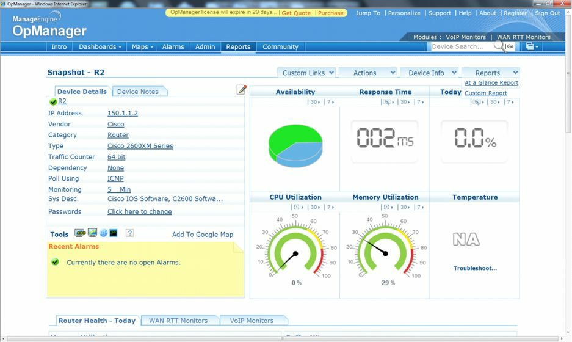
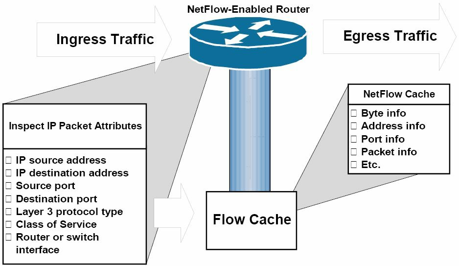

# Syslog、SNMP与Netflow

## 第40天任务

- 阅读今天的课文（下面）
- 复习昨天的课文
- 完成今天的实验
- 阅读ICND2补充指南
- 在[subnetting.org](http://www.subnetting.org)网站上花15分钟


将（系统）消息或事件在本地或某台syslog服务器上进行记录，是一项核心的维护任务。Syslog是一种允许主机将事件通知消息，经由IP网络发送到事件消息收集器（event message collectors），也叫做syslog服务器或syslog守候程序（daemon），的协议。也就是说，某台主机或设备可被配置为，生成一条syslog消息，并将该消息转发到某个特定的syslog守候程序（服务器）的方式。

简单网络管理协议，则是一种广泛使用的管理协议，其定义了一套用于连接到IP网络设备通信的标准。SNMP提供了一种用于对网络设备进行监视与控制的方法。与思科IOS的IP SLA操作（IP Service Level Agreement, IP 网络服务等级协议，该特性通过使用活动流量监视来测量网络性能，而允许客户对IP服务等级进行分析）一样，SNMP可用于收集统计数据、监测设备性能，以及提供到网络的一个基线（a baseline of the network），且SNMP是使用最为广泛的网络维护与监测工具之一。

尽管SNMP可以提供流量统计，但其无法区分各种数据流（While SNMP can provide traffic statistics, SNMP cannot differentiate between individual flows）。不过思科IOS的Netflow就可以做到。数据流（A flow）简单地就是一系列的、有着同样源与目的地址、源与目的端口、协议接口，以及同样的服务参数类（Class of Service parameters）的数据包。

今天将学到有关以下方面的知识：

- Syslog
- SNMP
- Netflow


此课程对应了以下CCNA大纲要求：

+ 配置并验证Syslog
    - `syslog`输出的使用
- 对SNMP版本2与版本3进行描述
- `netflow`数据的使用

## 日志记录（Logging）

所谓某个`syslog`守候程序或某台`syslog`服务器，就是一个对发送给它的`syslog`消息进行监听的实体。将某个`syslog`守候程序配置为请求某台特定设备向其发送`syslog`报文，是不可行的。也就是说，在某台特定设备无法生成`syslog`报文的情况下，那么`syslog`守候程序就什么也不能做。真实世界中，集团公司通常采用`SolarWinds`（或类似）软件来做`syslog`的捕获。此外，诸如`Kiwi Syslog daemon`这类自由软件，也可用于`syslog`的捕获。

`Syslog`使用用户数据报协议（User Datagram Protocol, UDP），作为所采用的传输机制，因此数据包没有被排序与确认。因为UDP没有包含在TCP中的额外开销（the overhead included in TCP），这意味着在某些重度使用的网络中，一些数据包可能被丢弃，而因此导致记录的信息丢失。不过思科IOS软件允许管理员出于冗余目的，配置多台`syslog`服务器。`syslog`方案由两个主要元素构成：`syslog`服务器与`syslog`客户端。

`syslog`客户端将`syslog`报文，使用UDP作为传输层协议，指定一个`513`目的端口，发送给`syslog`服务器。这些报文的大小不能超过`1024`字节；不过没有最小长度的限制。所有`syslog`报文，都包含三个不同的部分：优先级、头部与报文。

`syslog`报文的优先级，同时表示了设施，与报文的严重程度（The priority of a syslog message represents both the facility and the severity of the message）。此数字是一个8位的数字。前3个最低有效位（The first 3 least significant bits），表示报文的严重程度（在3位的情况下，可表示8中不同的严重程度），其它5位表示了某项设施。可使用这些值，来对`syslog`守候程序中的事件进行过滤。

> **注意**：请注意这些值是由那些生成事件的应用产生的，而不是由`syslog`服务器本身产生的。

下表40.1中列出并介绍了思科IOS设备所设置的值（请记住这些严查程度级别与它们的名称）：

*表 40.1 - 思科IOS软件`syslog`的优先级分级与定义*

| 严重程度级别 | 严查程度级别名称 | `syslog`的定义 | 介绍 |
| :---: | :---: | :---: | :--- |
| `0` | 紧急（Emergencies） | `LOG_EMERG` | 此级别用于那些将导致系统不可用的最严重的错误情景。 |
| `1` | 告警（Alerts） | `LOG_ALERT` | 此级别用于表示那些需要管理员立即注意的情况。 |
| `2` | 严重（Critical） | `LOG_CRIT` | 此级别用于表明那些严重性低于告警，但仍需管理员介入的严重情况。 |
| `3` | 错误（Errors） | `LOG_ERR` | 此级别用于表明系统中有错误发生，但这些错误并不会导致系统不可用。 |
| `4` | 警告（Warnings） | `LOG_WARNING` | 此级别用于表示有关系统操作未能成功完成的警告情况。 |
| `5` | 通知（Notifications） | `LOG_NOTICE` | 此级别用于表示系统中的状态改变（比如路由协议临接关系过渡到`down`状态）。 |
| `6` | 消息（Informational） | `LOG_INFO` | 此级别用于表示有关系统正常运行的消息。 |
| `7` | 调试（Debugging） | `LOG_DEBUG` | 此级别用于表示通常用于故障排除目的的实时的（调试的）信息。 |

在`syslog`中，设施（the facility）用于表示生成消息的源。源可以是某个本地设备上的进程、应用，或者甚至操作系统本身。设施是以数字（整数）表示的。在思科IOS软件中，有八个本地使用设施可由进程及应用（以及设备本身）用于发送`syslog`消息。默认思科IOS设备使用设施`local7`来发送`syslog`报文。但要注意大多数思科设备提供了改变默认设施级别的选项。在思科IOS软件中，可使用全局配置命令`loggin facility [facility]`来指定`syslog`的设施。该命令可用的选项如下所示：

```sh
R1(config)#logging facility ?
  auth    Authorization system
  cron    Cron/at facility
  daemon  System daemons
  kern    Kernel
  local0  Local use
  local1  Local use
  local2  Local use
  local3  Local use
  local4  Local use
  local5  Local use
  local6  Local use
  local7  Local use
  lpr     Line printer system
  mail    Mail system
  news    USENET news
  sys10   System use
  sys11   System use
  sys12   System use
  sys13   System use
  sys14   System use
  sys9    System use
  syslog  Syslog itself
  user    User process
  uucp    Unix-to-Unix copy system
```

要通过`syslog`来发送消息，就必须在设备上执行以下顺序的步骤：

1. 使用`logging on`配置命令在路由器或交换机上全局性开启日志记录功能。默认在思科IOS软件中，日志记录是开启的；但仅开启了将消息发送到控制台。对于要将消息发到除控制台外的其它任何目的地，`logging on`命令都是强制要求的。

2. 使用全局配置命令`logging trap [severity]`，指定出要发送到`syslog`服务器的消息的严重程度。可使用数字或使用等价的严重性名称，来指定发送消息的严重程度。

3. 使用全局配置命令`logging [address]`或`logging host [address]`，指定一个或多个的`syslog`服务器目的地址。

4. 作为可选项，使用`logging source-interface [name]`指定在`syslog`报文中的源IP地址。在有着配置的多个接口的设备上，这是普遍的做法。乳未指定此命令，则`syslog`报文将包含路由器或交换机用于抵达服务器的接口的IP地址。而在出于冗余目的有着多个接口时，该地址就会在主要路径（接口）宕掉时发生改变。因此，通常将其设置为某个环回接口。

下面的配置实例，演示了如何将所有信息（informational(level6)）及以下的报文，发送到一台有着IP地址`192.168.1.254`的`syslog`服务器：

```sh
R2(config)#logging on
R2(config)#logging trap informational
R2(config)#logging 192.168.1.254
```

此配置可使用`show syslog`命令进行验证，如下所示：

```sh
R2#show logging
Syslog logging: enabled (11 messages dropped, 1 messages rate-limited, 0 flushes, 0 overruns, xml disabled, filtering disabled)
    Console logging: disabled
    Monitor logging: level debugging, 0 messages logged, xml disabled,filtering disabled
    Buffer logging: disabled, xml disabled, filtering disabled
    Logging Exception size (4096 bytes)
    Count and timestamp logging messages: disabled
No active filter modules.
    Trap logging: level informational, 33 message lines logged
        Logging to 192.168.1.254(global) (udp port 514, audit disabled, link up), 2 message lines logged, xml disabled, filtering disabled
```

一般在配置日志记录时，重要的是要确保路由器或交换机的时钟反映的是真实的当前时间，这可实现与错误数据的关联。日志消息上的不准确或不正确时间戳，会令到使用过滤或关联流程，来做错误与问题隔离十分困难，并十分耗时。在思科IOS软件中，系统时钟可手动配置，或者将设备配置为自动将其时钟与网络时间协议服务器进行同步。在后面的小节将对这两种方法进行讨论。在网络中仅有少数互联网络设备时，手动的时钟或时间配置没有问题。在思科IOS软件中，系统时间是通过使用`clock set hh:mm:ss [day & month | month & day] [year]`特权`EXEC`命令进行配置的。其不是在全局配置模式下配置或指定的。下面的配置示例，演示了如何将系统时钟设置为 2010 年 10 月 20 日上午12:15：

```sh
R2#clock set 12:15:00 20 october 2010
```

也可以向下面这样在路由器上应用同样的配置：

```sh
R2#clock set 12:15:00 october 20 2010
```

在此配置下，可使用`show clock`命令来查看到系统时间：

```sh
r2#show clock
12:15:19.419 utc wed oct 20 2010
```

观察到一个有趣现象，就是在使用`clock set`命令手动配置或设置了系统时间是，其默认到GMT（UTC）时区，如上面所看到的。为了确保系统始终反映对于不在GMT时区的那些正确时区，就必须使用全局配置命令`clock timezone [time zone name] [GMT offset]`。比如，美国有六个不同的时区，每个时区都有不同的GMT偏移量。这些时区分别是东部时间（Eastern Time），中部时间（Central Time），山区时间（Mountain Time），太平洋时间（Pacific Time）、夏威夷时间（Hawaii Time）以及阿拉斯加时间（Alaska Time）。

此外，一些地方使用标准时间（Standard Time）与夏令时间（Dayligh Saving Time）。考虑这个因素，那么在手动配置系统时钟时，确保于所有设备上正确设置系统时间（标准还是夏令时）就很重要了。下面的配置实例，演示了如何将系统时钟，设置为比GMT晚6个小时的中部标准时间（Central Standard Time, CST）时区的2010年10月20日上午12点40分：

```sh
R2#config t
Enter configuration commands, one per line.
End with CNTL/Z.
R2(config)#clock timezone CST -6
R2(config)#end
R2#clock set 12:40:00 october 20 2010
```

依据此配置，本地路由器上的系统时钟现在显示为下面这样：

```sh
R2#show clock
12:40:17.921 CST Wed Oct 20 2010
```

> **注意**：如在`clock timezone`命令之前使用`clock set`命令，那么使用`clock set`命令所指定的时间，将被`clock timezone`命令的使用进行偏移。比如假定上面示例中使用的配置命令是像下面这样输入的时：

```sh
R2#clock set 12:40:00 october 20 2010
R2#config t
Enter configuration commands, one per line.
End with CNTL/Z.
R2(config)#clock timezone CST -6
R2(config)#end
```

因为这里`clock set`命令先使用，所以路由器上的`show clock`命令将显示偏移了6小时的系统时钟，就如使用`clock timezone`命令所指定的那样。在同样的路由器的以下输出对此行为进行了演示：

```sh
R2#show clock
06:40:52.181 CST Wed Oct 20 2010
```

> **注意**：使用全局配置命令`clock summer-time zone recurring [week day month hh:mm week day month hh:mm [offset]]`，可将思科IOS的路由器与交换机可配置为自动切换到夏令时间（summertime, Daylight Saving Time）。这样做可消除标准时间与夏令时期间，在所有手动配置的设备上，手动调整系统时钟的需要。

第二种设置或同步系统时钟的方法，就是使用网络时间协议服务器作为参考时间源了。在那些有着多余几台设备的较大网络中，这是首选方法。NTP是一个设一用于机器网络时间同步的协议。在[RFC 1305](https://tools.ietf.org/html/rfc1305)中对NTP进行了文档说明，其运行在UDP上。

NTP网络通常是从权威的时间源处，比如无线电时钟或连接某台时间服务器的原子钟，获取它的时间。NTP随后经由网络对此时间进行分发。NTP是相当高效的；每分钟不多于一个数据包，就可以将两台机器同步到一毫秒之内。

NTP使用层的概念（a concept of a stratum），来描述某台机器距离权威时间源有多少跳。请记住这不是路由或交换的条数，而是NTP跳数，这是一个完全不同的概念。一台层`1`的时间服务器（A stratum 1 time server），通常具有一个直接安装的无线电或原子钟，同时一台层`2`的时间服务器（a stratum 2 time server），则是通过NTP从层`1`的时间服务器接收其时间，如此等等。在某台设备被配置了多台NTP参考服务器时，它将自动选择有着配置为通过NTP进行通信的最低层编号的机器，作为其时间源（When a device is configured with multiple NTP reference servers, it will automatically choose as its time source the machine with the lowest stratum number that it is configured to communicate with via NTP）。

在思科IOS软件中，使用全局配置命令`ntp server [address]`，来将某台设备配置带有一台或多台NTP服务器的IP地址。如先前指出的那样，可通过重复使用同样的命令，指定多个NTP参考地址。此外，该命令还可用于配置服务器与客户端之间的安全及其它特性。下面的配置实例，演示了如何将某台设备配置为将其时间与一台有着IP地址`10.0.0.1`的NTP进行同步：

```sh
R1(config)#ntp server 10.0.0.1
```

根据此配置，可使用`show ntp accociations`命令来对NTP设备之间的通信进行检查，如下面的输出所示：

```sh
R2#show ntp associations
address     ref clock    st  when  poll  reach  delay  offset  disp
*~10.0.0.1  127.127.7.1  5   44    64    377    3.2    2.39    1.2
* master (synced), # master (unsynced), + selected, - candidate, ~ configured
```

`address`字段表示NTP服务器的IP地址，如同该字段下所指出的值`10.0.0.1`所确认的那样。而`ref clock`字段则表示了那台NTP服务器所使用的参考时钟。在此实例中，IP地址`127.127.7.1`表示该设备使用的是一个内部时钟（`127.0.0.0/8`子网）作为其参考时间源。如该字段包含了另一个值，比如`192.168.1.254`，那么那将是该服务器用作其参考的IP地址。

接着的`st`字段表示该参考的层（the stratum of the reference）。从上面的打印输出，可以看到`10.0.0.1`的NTP设备有着`5`的层数。本地设备的层数，将增加`1`到值`6`，如下所示，因为其是从有着层`5`的服务器出接收到的时间源。如有另一台设备被同步到该本地路由器，那么它将反应出一个`7`的层数，如此等等。用于检查NTP配置的第二个命令，就是`show ntp status`命令了，其输出如下面所示：

```sh
R2#show ntp status
Clock is synchronized, stratum 6, reference is 10.0.0.1
nominal freq is 249.5901 Hz, actual freq is 249.5900 Hz, precision is 2**18
reference time is C02C38D2.950DA968 (05:53:22.582 UTC Sun Mar 3 2002)
clock offset is 4.6267 msec, root delay is 3.16 msec
root dispersion is 4.88 msec, peer dispersion is 0.23 msec
```

该`show ntp status`命令的输出表示时钟是被同步到所配置的NTP服务器（`10.0.0.1`）。此服务器有着层数`5`，因此本地设备反应了一个层数`6`。在配置了NTP是一个观察到的一个有意思的事情，就是本地时间将默认到GMT，如在上面的输出中所看到的那样。为确保该设备显示正确的时区，就必须在该设备上执行`clock time-zone`命令。

在不论是通过手动还是NTP设置好系统时钟之后，都要确保发送给服务器的日志包含正确的时间戳。这是通过使用全局配置命令`service timestamp log [datetime | uptime]`执行的。关键字`[datetime]`支持下面这些字面的额外子关键字：

```sh
R2(config)#service timestamps log datetime ?
  localtime      Use local time zone for timestamps
  msec           Include milliseconds in timestamp
  show-timezone  Add time zone information to timestamp
  year           Include year in timestamp
<cr>
```

而`[uptime]`关键字则没有额外关键字，而将本地路由器配置为仅包含系统运行时间（the system uptime）作为发送的消息的时间戳。下面的配置实例，演示了如何将本地路由器配置为所有消息都包含本地时间、毫秒信息，以及时区：

```sh
R2#configure terminal
Enter configuration commands, one per line.
End with CNTL/Z.
R2(config)#logging on
R2(config)#logging console informational
R2(config)#logging host 150.1.1.254
R2(config)#logging trap informational
R2(config)#service timestamps log datetime localtime msec show-timezone
```

根据此配置，本地路由器的控制台将打印以下消息：

```sh
Oct 20 02:14:10.519 CST: %SYS-5-CONFIG_I: Configured from console by console
Oct 20 02:14:11.521 CST: %SYS-6-LOGGINGHOST_STARTSTOP: Logging to host 150.1.1.254 started - CLI initiated
```

此外，在服务器`150.1.1.254`上的`syslog`守候程序，将反映出同样内容，如下图40.1中的Kiwi Syslog Manager屏幕截图中所示：


*图 40.1 - 日志时间戳的配置*

## 简单网络管理协议（Simple Network Management Protocol）

简单网络管理协议，是一个应用层（`Layer 7`）协议，使用UDP端口`161`与`162`，促进网络设备之间管理信息的交换。一个SNMP管理的网络，由管理系统、代理程序及所管理的设备构成（An SNMP-managed network consists of a management system, agents, and managed devices）。其中，管理系统执行监控应用及对所管理的设备进行控制。其也执行大多数的管理流程，并提供了用于网络管理的大部分存储资源。某个网络科恩该是由一套或多套的管理系统所管理。

代理程序，则是出于各个受管理的设备之上，而对本地管理信息数据，比如性能信息或事件与软件装置中捕获到的错误信息（error information caught in software traps），转换为管理系统可读取的形式。SNMP代理程序使用将数据传输到网络管理软件的[SNMP`get-request`指令](pdfs/06-ch06.pdf)。SNMP代理程序从管理信息库（Management Information Bases, MIBs）或从错误或修改陷阱设置处捕获数据，而管理信息库则是设备参数与网络数据存放的地方（SNMP agents capture data from Management Information Bases(MIBs), which are device parameters and network data repositories, or from error or change **traps**）。

而受管理元素，比如路由器、交换机、计算机或防火墙，是通过SNMP代理程序进行管理的。受管理设备对管理信息进行收集与存储，从而令到这些信息通过SNMP对其它有着相同协议兼容性的管理系统可用。下图40.2演示了SNMP管理的网络的三个主要部件之间的交互：


*图 40.2 - SNMP网络组件的交互*

参考图40.2, `R1`就是SNMP管理的设备。逻辑上出于该设备上的，就是SNMP代理程序。SNMP代理程序，将存储在受管理设备的管理数据库中的本地管理信息数据，转化为这里称为网络管理站（Network Management Station, NMS）的管理系统可读取的形式。

在使用SNMP时，使用三种常见的SNMP命令：`read`、`write`与`trap`，使得受管理的设备得以被监视与控制。网络管理站所使用的`read`命令，用于监视受管理的设备。这是通过NMS对由受管理设备所维护的不同变量进行检查完成的。而`write`命令，则是由NMS用于对受管理设备进行控制的。NMS使用该命令可对存储在受管理设备上的变量的值，进行修改。最后，SNMP的`trap`命令，是由受管理设备，用来将事件报告给NMS的。设备可配置为将SNMP陷阱或通知，发送给NMS。所发送的陷阱或通知，取决于设备上所运行的思科IOS软件版本，以及设备的平台。

SNMP陷阱简单地就是就网络上的某个状况，通知SNMP管理器的消息（SNMP traps are simply messages that alert the SNMP manager of a condition on the network）。一个SNMP陷阱的实例，可能包含了某个接口从`up`状态过渡到了`down`状态。SNMP的主要问题在于它们是无确认的。这就意味着发出设备无法确定该陷阱是否被NMS接收到。

而SNMP通知命令，则是包含了来自SNMP管理器的接收确认的SNMP陷阱。这些消息可用于表示诸如失败的认证尝试，或失去到邻居路由器的连接等消息。管理器在没有接收到通知请求的情况下，它就不发送响应。而发送者在从没有接收到响应的情况下，通知请求可被再度发送。因此，SNMP的通知，更可能抵达其想要的目的（Thus, informs are more likely to reach their intended destination）。

尽管通知比陷阱更为可靠，但不利支出在于它们在路由器上与网络中与消耗了更多的资源。与发出后就丢弃的陷阱不同，在接收到一个响应或请求超时之前，通知请求（an inform request）必须要驻留在内存中。此外陷阱仅发送一次，而通知在没有接收到一个来自SNMP服务器的响应之前，必须多次发送。

下图40.3演示了SNMP管理器与SNMP代理程序之间，发送陷阱与通知的通信：


*图 40.3 - 由网络管理站与SNMP管理的元素所使用的UDP端口*

SNMP的三个版本分别是版本`1`、`2`与`3`。版本`1`，或`SNMPv1`，是SNMP协议的最初实现。`SNMPv1`运行在诸如用户数据报协议（UDP）、互联网协议（IP），以及开放系统互联的无连接网络服务（OSI Connectionless Network Service, CLNS）之上。

`SNMPv1`是广泛使用的，且是互联网社区中使用的事实上的网络管理协议。

`SNMPv2`对`SNMPv1`进行了修订，包含了在性能、安全性、保密性及管理器到管理器通信等方面的提升。`SNMPv2`还定义了两种新的操作（命令、operations）：`GetBulk`与`Inform`。`GetBulk`用于有效地获取大块的数据（large blocks of data）。`Inform`操作允许一个网络管理站发送陷阱信息到另一网络管理站，并于随后接收一个响应。在`SNMPv2`中，如某个对`GetBulk`操作进行响应的代理程序无法在一个清单中提供所有变量的值，那么它就提供部分结果。

`SNMPv3`提供了先前版本的SNMP所不具备的以下三项额外安全服务：消息完整性、认证及加密。`SNMPv3`使用消息完整性来确保数据包在传输过程中不被篡改。`SNMPv3`还使用了用于判断消息是否是来自有效的源。最后`SNMPv3`提供了用于打乱（scramble）数据包内容，以防止其被未授权的源看到的加密机制。

在思科IOS软件中，使用`snmp-server host [hostname | address]`命令，来指定本地设备将发送陷阱或通知的目的主机名或IP地址。为实现网络管理站对本地设备的轮询，`SNMPv1`与`SNMPv2`要求使用全局配置命令`snmp-server community <name> [ro | rw]`，为只读或读写访问，指定一个共有字符串（a community string）。

`SNMPv3`蜜柑有使用这种同样的基于共有的安全形式（the same community-based form of security），而是使用了用户与组的安全（user and group security）。下面的配置实例，演示了如何配置带有两个共有字符串的本地设备，其一用于只读访问，另一个用于读写访问。此外，该本地设备还配置了为思科IOS的SLA（Service Level Agreement, 服务级别协议）操作/命令与`syslog`，而使用只读共有字符串，将SNMP陷阱发送到`1.1.1.1`：

```sh
R2#config t
Enter configuration commands, one per line.
End with CNTL/Z.
R2(config)#snmp-server community unsafe RO
R2(config)#snmp-server community safe RW
R2(config)#snmp-server host 1.1.1.1 traps readonlypassword rtr syslog
```

下图40.4演示了一个基于SNMP轮询（SNMP polling）的、使用ManageEngine OpManager网络监控软件的，设备资源使用情况与可用性的示例报告：



*图 40.4 - 有关设备资源使用情况的示例SNMP报告*

## 思科IOS的NetFlow（Cisco IOS NetFlow）

与SNMP一样，思科IOS的NetFlow是一个强大的维护与监控工具，可用于对网络性能进行基准测量及辅助故障排除。但其与SNMP之间有着一些显著的区别。第一个不同就是SNMP主要报告的是有关设备统计数据（比如资源使用情况等），而思科IOS的NetFlow则是就流量统计数据进行报告（比如数据包与字节）。

这两个工具之间的第二个不同，就是SNMP是一种基于轮询的协议（a poll-based protocol），意味着受管理设备被轮询信息。在那些SNMP设备发送陷阱（甚至报告，even report）到管理站的实例中，也可认为它是基于推送的（push-based）。而思科IOS的NetFlow，则是基于推送的技术，意味着配置了NetFlow的设备，是将其收集的信息发送出来，到某个中心存储库的。由于这个原因，NetFlow与SNMP互为补充，可作为标准网络维护与监控工具套件（the standard network maintenance and monitoring toolkit）的组成部分。但它们并非各自的替代；这是一个常被误解的概念，重要的是记住这一点。

IP（数据）流基于五个，上至七个的一套IP数据包属性，它们可能包含下面这些：

- 目的IP地址
- 源IP地址
- 源端口
- 目的端口
- `Layer 3`的协议类型
- 服务类（Class of Service）
- 路由器或交换机的接口

除了这些IP属性外，（数据）流还包含了其它一些额外信息。这些额外信息包括对于计算每秒数据包与字节数有用的时间戳。时间戳还提供了有关某个数据流生命周期（持续时间）的信息。数据流还包括下一跳IP地址的信息，其包含了边界网关协议的路由器自治系统信息。除了TCP流量的标志外，数据流源与目的地址的子网掩码信息也有包含，而TCP流量的诸多标志，则可用于对TCP握手进行检查。

> **译者注**：总的来说，思科IOS的NetFlow中的数据流，包含了数据包属性（七种）、时间戳、包含BGP路由自治系统的下一跳IP地址信息、TCP流量的诸多标志，以及源与目的地址的子网掩码信息。

简要地讲，思科IOS的NetFlow特性，除了可用于提供有关网络用户与网络应用、峰值用量时间，与流量路由之外，还可用于有关的信息网络流量记账、基于用量的网络计费、网络规划、安全、拒绝服务攻击的监视能力，以及网络监控。所有的这些用途，令到其成为一个非常强大的维护、监控与故障排除工具。

思科IOS的NetFlow软件，对数据流数据进行收集，并将其存储在一个名为“NetFlow缓存”或简单地说就是“数据流缓存”的数据库中。数据流信息会留存到该数据流终止或停止、超时或缓存溢出为止。有两种方式来访问存储在数据流中的数据：使用命令行界面（也就是使用`show`命令），或导出该数据，并通过使用某种类型的报告工具对导出的数据进行查看。下图40.5演示了在思科IOS路由器上的NetWork操作，以及数据流缓存的生成方式：



*图 40.5 - 基本的NetFlow操作与数据流缓存的生成*


