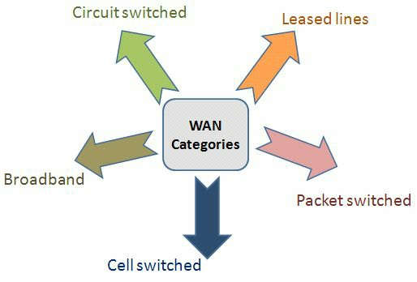

# 第41天 - 广域组网

**Wide Area Networking**

## 第41天任务

- 约定今天的课文（下面）
- 复习昨天的课文
- 完成自主选择的实验
- 阅读ICND2记诵指南
- 在[subnetting.org](http://www.subnetting.org)网站上花15分钟

思科将WAN有关的概念拆分到了ICND1与ICND2考试中，后者关注的是帧中继及PPP协议（Frame Relay and PPP protocols）。因此，本手册将看看基本的WAN概念、技术及协议。

今天，将学习以下知识：

- 关于WAN的组件（WAN components）
- 关于WAN的协议（WAN protocols）
- 基本的串行线路的配置
- WAN连接的故障排除

此课程模块对应了以下ICND2考试大纲的有关有求：

+ 认识不同的广域网技术
    - 城域以太网（Metro Ethernet）
    - 甚小孔径终端（Very Small Aperture Terminal，VSAT，参考[维基百科](https://en.wikipedia.org/wiki/Very-small-aperture_terminal)）
    - T1/E1（参考[维基百科T-carrier](https://en.wikipedia.org/wiki/T-carrier)，[维基百科E-carrier](https://en.wikipedia.org/wiki/E-carrier)）
    - T3/E3
    - 综合业务数字网（Integrated Services Digital Network，ISDN）
    - 数字用户线路（Digital Subscriber Line，缩写：DSL）
    - 同轴线组网
    - 第3代/第4代蜂窝网络（Celluar 3G/4G, 基站蜂窝网络）
    - 虛拟私人/专用网络（Virtual Private Network，VPN） 
    - 多协议标签交换（Multi-Protocol Label Switching，MPLS）

- 配置并验证一条基本的WAN串行连接
- 对PPPoE进行部署与故障排除

## 广域网概述（WAN Overview）

为了提供网络设施不同部分的连通性，广域网跨越极大的地理范围。与局域网环境不同，并非所有的WAN组件都是由其所服务的特定企业保有的。相反，WAN设备或连通性，可从服务提供商处进行短期或长期租用（rended, 短期、口头、临时的租用，leased, 长期、书面、固定期限的租用）。

大多数服务提供商都有良好培训，以确保它们可同时在极大的地理范围上，适当地支持传统数据流量，以及语音与视频业务（这些对延迟都更为敏感）。

有关WANs的另一个有趣的地方，即与LANs不同，这里通常有某种初期固定的投入，以及某种周期性的经常业务费用（Another interesting thing about WANs is that, unlike LANs, there is typically some initial fixed cost and some periodic recurring fees for the services）。在广域组网下，用户既不会拥有连接与某些设备，还将必须持续付费给服务提供商。这就是应避免高配（即购买仅需的带宽）的原因之一。这就带来对部署有效的服务质量机制（implementing effective Quality of Service mechanisms），以避免购买额外WAN带宽的需求。靠开销通常与带宽高配中出现的经常性开支有关（The high costs are usually associated with the recurring fees that might appear in the case of over-provisioning the bandwidth）。

有关WAN技术设计方面的要求，通常派生自以下这些方面：

- 应用的类型（Application type）
- 应用的可用性（Application availability）
- 应用的可靠性（Application reliability）
- 与某种特定WAN技术有关的成本情况（Costs associatedd with a particular WAN technology）
- 应用的使用级别（Usage levels for the application）

## 广域网的类别（WAN Categories）

WAN分类中的一个必要概念就是电路交换技术，该技术最为相关的实例，就是公众交换电话网络了（An essential concept in WAN categorisation is circuit-switched technology， the most relevant example of this technology being the Public Switched Telephone Network, PSTN）。而归入此类别的一种技术，就是综合业务数字网。电路交换WAN连接的工作方式，是在需要连接时变为连接建立状态，并在连接不需要时连接终止。反映这种电路交换行为的另一个实例，就是老式的拨号连接（仅有PSTN的拨号调制解调器的模拟信号访问）。

> **注意**：就在不久之前，拨号技术都还是访问互联网资源的唯一方式，这种方式提供到平均`40kbps`的可用带宽。如今这种技术几乎绝迹了。

电路交换选择的反面，就是长期租用线路技术了（leased-line technology）。这种技术是一条完全专属的连接，持续可用并由租户公司拥有。长租线路的实例，包括基于时分复用的长租线路（Time Division Multiplexing(TDM)-based leased lines）。这类接入方式通常都很昂贵，因为单个客户具有连接的整个使用权。

WAN技术的另一种流行分类，涉及包交换网络（packet-switched networks）。在包交换设施中，共享带宽利用了虚拟电路技术（in a packet-switched infrastruture, shared bandwidth utilises virtual circuits）。客户可通过服务提供商的设施云，创建出一条虚拟路径（与长租线路类似）。此虚拟电路有着专属的带宽，但技术上将虚拟电路并非一条真实的长租线路。帧中继就是此种技术类型的一个实例。

包括作为帧中继前身的`X.25`在内的一些古早WAN技术。这种技术在某些实现中仍有出现，但已经很罕见了（如今帧中继也很少见了）。

另一种可能听过的WAN类别，就是单元交换技术（cell-switched technology）了。这种WAN类型通常包含在包交换技术中，因为它们非常类似。一种单元交换技术的实例，就是异步传输模式（Asynchronous Transfer Mode, ATM，这种技术如今也相当罕见了）。ATM是以固定大小的数据单元运作的，而不是使用数据包（如同在帧中继网络中所用的）。单元交换技术构成一个共享带宽的环境，因此服务提供商可确保客户有着通过其设施的固定水平的带宽。

宽带（Broadband）接入是另一种正在增长中的WAN类别，这种WAN接入方式包含了诸如以下这些技术：

- 数字订户线路（Digital Subscriber Line, DSL）
- 同轴线网络（Cable）
- 无线接入（Wireless）

宽带接入有着此种能力：采用如老式传输电视信号的同轴线的某种连接，并解决如何充分使用该既有带宽的不同方面的能力。比如通过将一个额外的、可与原先的电视信号一同传输的数据信号进行复用。

*图 41.1 - 广域网的类别*

如同在上面的图41.1中详细展示的那样，在讨论广域网的类别时有许多选项，同时这里只是对它们的简单介绍。所有这些技术都可以支持运行在`20/80`设计原则下的现代网络，所谓`20/80`设计原则，指的是`80%`的网络流量使用了某种广域网技术，来访问远端资源。

## 非广播多路复用技术（NBMA Technologies）

出现在广域组网中的一种特殊技术，就是非广播多路复用了。所谓非广播多路复用技术，表示某些在传统广播组网中没有的挑战。当某个需要经由同一网络进行通信系统分组不支持原生的广播时，就出现了非广播多路访问的需求（The need for NBMA arises when there is no native Broadcast support for a group of systems that want to communicate over the same network）。在设备无法原生地发送以多路访问网段上的所有设备为目的的数据包时，问题也就出现了。帧中继、ATM与ISDN默认就是非广播多路访问技术的实例。

所有这些技术都不具备支持广播的任何能力。这一点阻止了它们在其运作中运行那些用到广播的路由协议。在非广播网络中，原生的多播支持也是没有的。在某种路由协议情景下，参与的所有节点都必须接收到多播更新（In the case of a routing protocol, all the nodes that participate must receive Multicast updates）。对于使用非广播多路访问网络的这个问题，一种办法就是作为重复的单播数据包，来发送多播或广播数据包。在这种方式下，广播/多播帧，是单独地发送到拓扑中的各节点的。此场景中的变通部分，就是设备必须想办法找到一种解决`Layer 3`到`Layer 2`解析的办法。特定数据包必须投送到需要接收到它们的特定机器上。

接着这个`Layer 3`到`Layer 2`的解析问题的方法必须存在才行。`Layer 3`的地址通常是IP地址，而`Layer 2`的地址有通常根据所使用的技术而有所不同。在帧中继的情况下，`Layer 2`地址将由数据链路连接标识符（Data Link Connection Identifier, DLCI）编号构成，那么就必须找到一种将DLCI解析到IP地址的方法。

在广播网络的情况下，`Layer 3`的解析，使用MAC地址作为`Layer 2`的地址，且MAC地址也必须被解析到IPv4地址。这是通过地址解析协议（Address Resolution Protocol, ARP）完成的。在基于广播的网络中，设备通过指定其想要与其进行通信的设备（通常经由DNS学习到），及询问特定于那些设备的MAC地址，而广播出解析请求。对地址解析请求的响应，是经由单播并包含了所请求的MAC地址（In a Broadcast-based network, the devices broadcast the requests by specifying the devices it wants to communicate with(typically learned via DNS) and asking for the MAC addresses specific to those devices. The reply is via Unicast and includes the requested MAC addresses）。

在非广播多路访问环境中，仍需要将`Layer 3`地址（IP地址）绑定到`Layer 2`地址（数据链路连接标识符）。这可通过使用反向ARP的一种自动化方式完成（This can be done in an automated fashion using Inverse ARP）。此操作用于将远端的`Layer 3`地址解析到`Layer 2`地址，并仅用于本地。反向ARP可用在帧中继环境中。反向ARP作为一种在非广播多路复用环境中`Layer 3`到`Layer 2`解析的方案，问题在于其受限于直接连接的设备。这就造成在部分网状网络（partial-mesh networks，其中并非所有设备都是直接连接的）中的问题。

非广播多路服务的接口有两种 -- 多点与点对点接口，如下图41.2所示。多点接口要求某种`Layer 3`到`Layer 2`的解析方法。顾名思义，多点接口可作为多个`Layer 2`电路的端节点（As its name implies, it can be the termination point of multiple Layer 2 circuits）。

*图 41.2 - 非广播多路访问接口类型*

在设备的主要物理接口上配置了帧中继时，那个接口将默认成为多点的。而在某个帧中继物理接口上创建了一个子接口时，创建它的选项，就意味着多点存在了（If a subinterface is created on a Frame Relay physical interface, the option of creating it as Multipoint exists）。对于物理接口与子接口（逻辑接口？），都必须配置上`Layer 3`到`Layer 2`的解析。在帧中继中，有两个选项来完成此解析：

- 反向ARP（Inverse ARP）
- 静态映射（Statically map）

