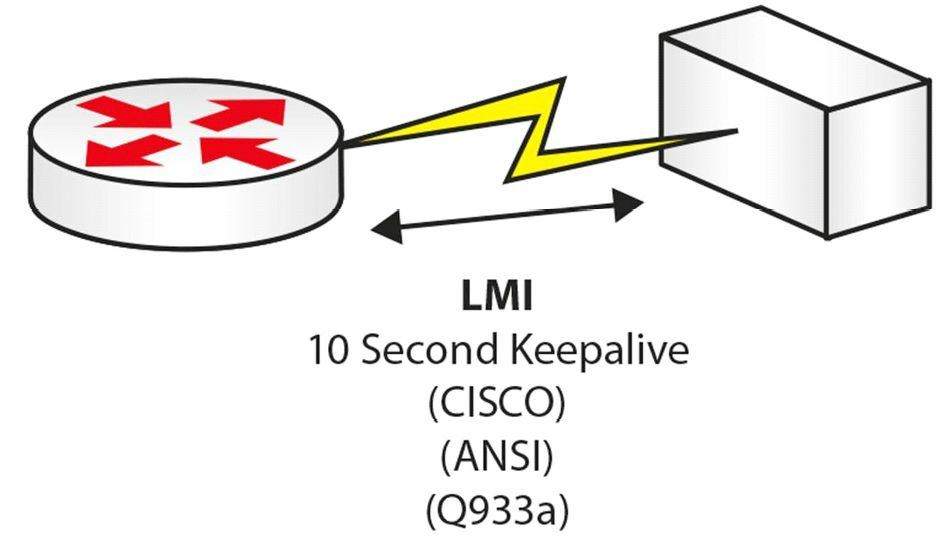
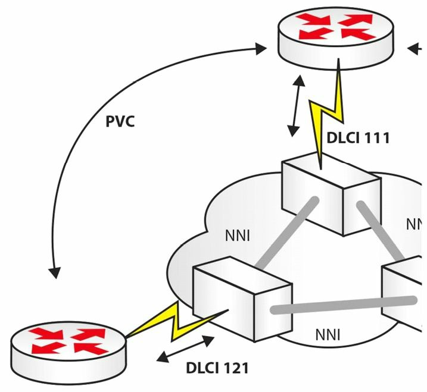

# 帧中继与点对点协议

__Frame Relay and PPP__

## 第 42 天任务

- 阅读今天的课文（下面）
- 复习昨天的课文
- 完成今天的实验
- 阅读ICND2的记诵指南
- 在[subnetting.org](https://subnetting.org/)网站上花15分钟

多年来，帧中继都是CCNA甚至CCIE大纲的重要部分；但由于公司数字订户线路的广泛可用与长租专线的价格越来越亲民，从而导致帧中继技术的流行度近来日渐式微。这里之所以要涉及，是因为其包含在CCNA大纲中。点对点协议仍有广泛使用。

今天将学到以下内容：

- 帧中继的运作（Frame Relay operations）
- 帧中继的配置
- 帧中继的故障排除
- 点对点协议的运作
- 点对点协议的配置
- 点对点协议的故障排除

本课程对应了以下CCNA大纲要求：

+ 识别不同的广域网技术
    - 帧中继技术
+ 配置并验证思科路由器之间的点对点协议

## 帧中继的运作

__Frame Relay Operations__

帧中继是基于较早的名为`X.25`协议的一个`Layer 2`广域网协议，`X.25`协议因为其全面的错误检查能力，也仍被ATM技术所使用（which is still used by ATMs due to its extensive error-checking capatibilities）。帧中继由一条其上可形成许多逻辑电路物理电路构成。帧中继的连接是按需建立的。下图演示了一个帧中继网络的实例：


*图 42.1 - 一个帧中继网络*

## 常见的帧中继术语

__Common Frame Relay Terms__

## 本地管理接口（Local Management Interface, LMI）

本地管理接口是运行在帧中继交换机上的一个保活（机制）（Local Management Interface (LMI) is a keepalive which runs from the Frame Relay switch）。帧中继交换机属于服务提供商，位于服务提供商处。如未使用思科默认的类型，那么就要在自己的路由器上需要指定本地管理接口的类型。本地管理接口有三种可用的类型，如下所示：

- 思科（默认）类型
- ANSI（America National Standard Institution, 美国国家标准学会）类型
- Q933a类型（ITU Telecommunication Stardandization Sector，简写ITU-T, 国际电信联盟电信标准化部门，Q.933 Annex A standard, [wikipedia: Local Management Interface](https://en.wikipedia.org/wiki/Local_Management_Interface) ）

下图42.2演示了这些本地管理接口：



*图 42.2 - 本地管理接口的类型*

在帧中继连接出现错误时，那么对本地管理接口消息的调试，就将是故障排除步骤的其中一步，如下面的输出所示：

```console
RouterA#debug frame-relay lmi

00:46:58: Serial0(in): Status, myseq 55
00:46:58: RT IE 1, length 1, type 0
00:46:58: KA IE 3, length 2, yourseq 55, myseq 55
00:46:58: PVC IE 0x7 , length 0x6 , dlci 100, status 0x2 , bw 0
```

本地管理接口每`10`秒发出，且所有第六个报文为一个完整状态更新。如上所示，希望本地管理接口报告`status 0x2`，表示这是一条活动的链路（An LMI is sent every 10 seconds, and every sixth message is a full status update. As above, you want it to report `status 0x2`, which is an active link）。

### 永久虚拟电路（Permanent Virtual Circuit, PVC）

永久虚拟电路，是自帧中继网络的一端，到另一端所形成的逻辑端对端连接，如下图42.3所示（A Permanent Virtual Circuit(PVC) is the logical end-to-end connection formed from one end of your Frame Relay network to the other, as illustrated in Figure 42.3 below）。每个端点都被赋予到一个数据链路连接标识符编号（a Data Link Connection Identifier, DLCI, number, 请参阅下一小节），以对其进行标示。



*图 42.3 - 永久虚拟电路*
> **注**： NNI: Network-to-Network Interface, 网络到网络接口, 参考[wikipedia: NNI](https://en.wikipedia.org/wiki/Network-to-network_interface)。

##数据链路连接标识符（Data Link Connection Identifier, DLCI）

数据链路连接标识符，是一个本地有意义的编号，用于标识到帧中继交换机的连接，如下图42.4所示。该编号可为`10`到`1007`之间的任意数字，包括了`10`与`1007`。


*图 42.4 - 数据链路连接标识符将用户路由器标识给电信公司（DLCI Identifies Your Router to the Telco）*

通常在对帧中继链路进行故障排除时，故障在于客户或服务提供商，在它们的配置上使用了错误的数据链路连接标识符编号（Often, when troubleshooting Frame Relay links, the issue lies with either the customer or the service provider using the wrong DLCI number on their configuration）。

当数据链路连接标识符为活动状态时，那么端到端连接将按以下步骤形成（When your DLCI is active, an end-to-end connection forms in the following order）：

1. 活动的DLCI发出反向地址解析协议请求（Active DLCI sends Inverse ARP request）
2. DLCI等待带有网络地址的应答（DLCI waits for reply with network address）
3. 远端路由器地址的映射建立起来（Map created of remote router address）
4. DLCI经历`Active/Inactive/Deleted`状态（DLCI status of `Active/Inactive/Deleted`）

## 网络到网络接口（Network-to-Network Interface, NNI）

网络到网络接口，是帧中继交换机之间的连接。

## 关于帧中继技术（Frame Relay Technology）

帧中继是一种非广播多路访问（Non-Broadcast Multi-Access, NBMA）技术。这就意味着必须应付地址解析的问题，除非在使用点对点接口的情形下（Frame Relay is a Non-Broadcast Multi-Access(NBMA) technology. This means that you have to deal with address resolution issues, except for the situations in which you use Point-to-Point interfaces）。

帧中继中的`Layer 2`地址，被称作数据链路连接标识符（Data Link Connection Identifier, DLCI），而这是本地有意义的。比如在轴辐（hub-and-spoke, 中心分支）环境中，中心设备应有着与其各个分支进行通信的唯一DLCI（For example, in a hub-and-spoke environment, the hub device should have a unique DLCI to communicate to each of its spokes）。

在对思科设备上的帧中继永久虚拟电路状态进行检查时，将看到一个由本地管理接口所定义的状态代码，该代码可以是下列的任意一种：

- 活动状态（`Active`, 全都没有问题）
- 不活动状态（`Inactive`，本地节点上没有问题，但在远端节点上可能有故障<no problems on the local node but possibles on the remote node>）
- 已被删除（`Deleted`，服务提供商网络中存在问题）

举例来说，思科设备提供了三种口味本地管理接口（As an example, Cisco device offer three flavours of LMI）：

- `CISCO`, 思科默认的LMI
- `ANSI`，美国国家标准学会LMI
- `Q.933a`, 国际电信联盟电信标准委员会LMI


