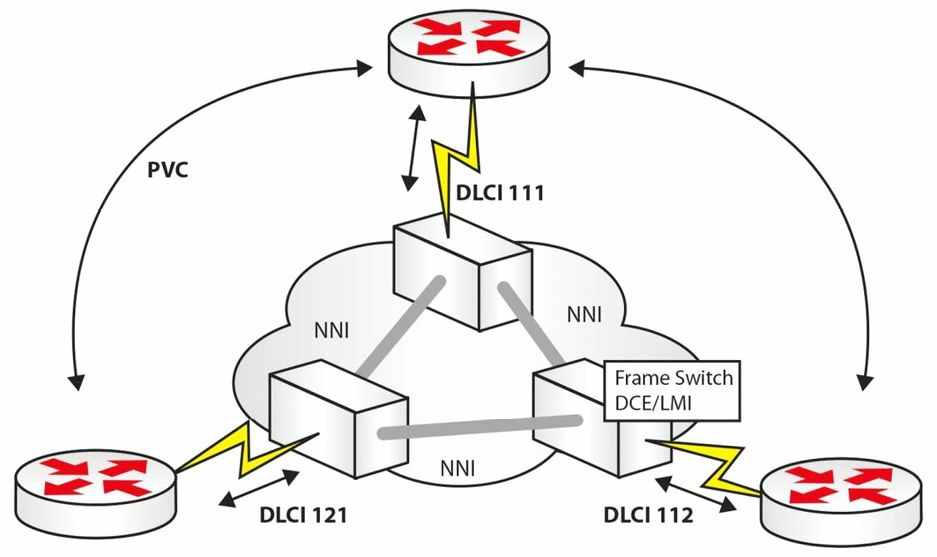
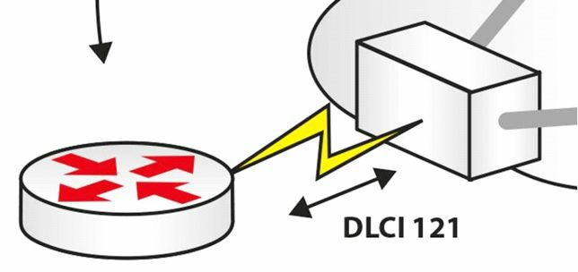

# 帧中继与点对点协议

__Frame Relay and PPP__

## 第 42 天任务

- 阅读今天的课文（下面）
- 复习昨天的课文
- 完成今天的实验
- 阅读ICND2的记诵指南
- 在[subnetting.org](https://subnetting.org/)网站上花15分钟

多年来，帧中继都是CCNA甚至CCIE大纲的重要部分；但由于公司数字订户线路的广泛可用与长租专线的价格越来越亲民，从而导致帧中继技术的流行度近来日渐式微。这里之所以要涉及，是因为其包含在CCNA大纲中。点对点协议仍有广泛使用。

今天将学到以下内容：

- 帧中继的运作（Frame Relay operations）
- 帧中继的配置
- 帧中继的故障排除
- 点对点协议的运作
- 点对点协议的配置
- 点对点协议的故障排除

本课程对应了以下CCNA大纲要求：

+ 识别不同的广域网技术
    - 帧中继技术
+ 配置并验证思科路由器之间的点对点协议

## 帧中继的运作

__Frame Relay Operations__

帧中继是基于较早的名为`X.25`协议的一个`Layer 2`广域网协议，`X.25`协议因为其全面的错误检查能力，也仍被ATM技术所使用（which is still used by ATMs due to its extensive error-checking capatibilities）。帧中继由一条其上可形成许多逻辑电路物理电路构成。帧中继的连接是按需建立的。下图演示了一个帧中继网络的实例：



*图 42.1 - 一个帧中继网络*

## 常见的帧中继术语

__Common Frame Relay Terms__

## 本地管理接口（Local Management Interface, LMI）

本地管理接口是运行在帧中继交换机上的一个保活（机制）（Local Management Interface (LMI) is a keepalive which runs from the Frame Relay switch）。帧中继交换机属于服务提供商，位于服务提供商处。如未使用思科默认的类型，那么就要在自己的路由器上需要指定本地管理接口的类型。本地管理接口有三种可用的类型，如下所示：

- 思科（默认）类型
- ANSI（America National Standard Institution, 美国国家标准学会）类型
- Q933a类型（ITU Telecommunication Stardandization Sector，简写ITU-T, 国际电信联盟电信标准化部门，Q.933 Annex A standard, [wikipedia: Local Management Interface](https://en.wikipedia.org/wiki/Local_Management_Interface) ）

下图42.2演示了这些本地管理接口：


*图 42.2 - 本地管理接口的类型*

在帧中继连接出现错误时，那么对本地管理接口消息的调试，就将是故障排除步骤的其中一步，如下面的输出所示：

```console
RouterA#debug frame-relay lmi

00:46:58: Serial0(in): Status, myseq 55
00:46:58: RT IE 1, length 1, type 0
00:46:58: KA IE 3, length 2, yourseq 55, myseq 55
00:46:58: PVC IE 0x7 , length 0x6 , dlci 100, status 0x2 , bw 0
```

本地管理接口每`10`秒发出，且所有第六个报文为一个完整状态更新。如上所示，希望本地管理接口报告`status 0x2`，表示这是一条活动的链路（An LMI is sent every 10 seconds, and every sixth message is a full status update. As above, you want it to report `status 0x2`, which is an active link）。

### 永久虚拟电路（Permanent Virtual Circuit, PVC）

永久虚拟电路，是自帧中继网络的一端，到另一端所形成的逻辑端对端连接，如下图42.3所示（A Permanent Virtual Circuit(PVC) is the logical end-to-end connection formed from one end of your Frame Relay network to the other, as illustrated in Figure 42.3 below）。每个端点都被赋予到一个数据链路连接标识符编号（a Data Link Connection Identifier, DLCI, number, 请参阅下一小节），以对其进行标示。


*图 42.3 - 永久虚拟电路*
> **注**： NNI: Network-to-Network Interface, 网络到网络接口, 参考[wikipedia: NNI](https://en.wikipedia.org/wiki/Network-to-network_interface)。

##数据链路连接标识符（Data Link Connection Identifier, DLCI）

数据链路连接标识符，是一个本地有意义的编号，用于标识到帧中继交换机的连接，如下图42.4所示。该编号可为`10`到`1007`之间的任意数字，包括了`10`与`1007`。



*图 42.4 - 数据链路连接标识符将用户路由器标识给电信公司（DLCI Identifies Your Router to the Telco）*

通常在对帧中继链路进行故障排除时，故障在于客户或服务提供商，在它们的配置上使用了错误的数据链路连接标识符编号（Often, when troubleshooting Frame Relay links, the issue lies with either the customer or the service provider using the wrong DLCI number on their configuration）。

当数据链路连接标识符为活动状态时，那么端到端连接将按以下步骤形成（When your DLCI is active, an end-to-end connection forms in the following order）：

1. 活动的DLCI发出反向地址解析协议请求（Active DLCI sends Inverse ARP request）
2. DLCI等待带有网络地址的应答（DLCI waits for reply with network address）
3. 远端路由器地址的映射建立起来（Map created of remote router address）
4. DLCI经历`Active/Inactive/Deleted`状态（DLCI status of `Active/Inactive/Deleted`）

## 网络到网络接口（Network-to-Network Interface, NNI）

网络到网络接口，是帧中继交换机之间的连接。

## 关于帧中继技术（Frame Relay Technology）

帧中继是一种非广播多路访问（Non-Broadcast Multi-Access, NBMA）技术。这就意味着必须应付地址解析的问题，除非在使用点对点接口的情形下（Frame Relay is a Non-Broadcast Multi-Access(NBMA) technology. This means that you have to deal with address resolution issues, except for the situations in which you use Point-to-Point interfaces）。

帧中继中的`Layer 2`地址，被称作数据链路连接标识符（Data Link Connection Identifier, DLCI），而这是本地有意义的。比如在轴辐（hub-and-spoke, 中心分支）环境中，中心设备应有着与其各个分支进行通信的唯一DLCI（For example, in a hub-and-spoke environment, the hub device should have a unique DLCI to communicate to each of its spokes）。

在对思科设备上的帧中继永久虚拟电路状态进行检查时，将看到一个由本地管理接口所定义的状态代码，该代码可以是下列的任意一种：

- 活动状态（`Active`, 全都没有问题）
- 不活动状态（`Inactive`，本地节点上没有问题，但在远端节点上可能有故障<no problems on the local node but possibles on the remote node>）
- 已被删除（`Deleted`，服务提供商网络中存在问题）

举例来说，思科设备提供了三种口味本地管理接口（As an example, Cisco device offer three flavours of LMI）：

- `CISCO`, 思科默认的LMI
- `ANSI`，美国国家标准学会LMI
- `Q.933a`, 国际电信联盟电信标准委员会LMI

思科路由器已被配置为自动尝试所有这三种的LMI类型（从`CISCO`LMI开始），并使用与服务提供商匹配的那个类型，因此在设计阶段，有关LMI类型方面无需过多考虑（Cisco routers are configured to automatically try all three of these LMI types(starting with `CISCO` LMI) and use the one that matches whatever the service provider is using, so this should not be of much concern in the design phase）。

在设计阶段需要考虑的最重要方面之一，就是要用到的地址解析方法。如设计中用到多点接口（也就是可端接多个`Layer 2`电路的接口），那么就需要找到某种提供`Layer 3`到`Layer 2`解析的方式（One of the most important aspects that need to be considered in the design phase is the address resolution methodology used. If you are utilising Multipoint interfaces in your design(i.e., interfaces that can terminate multiple `Layer 2` circuits), you need to find a way to provide the `Layer 3` to `Layer 2` resolution）。如同先前所讨论的，有两个选项可帮助实现三层到二层的解析：

- 动态地，使用反向地址解析协议（Dynamically, utilising Inverse ARP）
- 静态地，通过在思科设备上的`frame-relay map`静态配置命令（Statically, via the `frame-relay map` static configration command on Cisco devices）

> **注意**：为检查`Layer 3`到`Layer 2`的成功解析，可使用`show frame-relay map`命令。

在多点接口（a Multipoint interface）上，反向ARP将自动发生。此功能将于给配置为帧中继的接口添加IP地址后，立即启用。在给配置为帧中继的接口添加IP地址那一刻，所有该接口所运行的、被支持的协议的反向ARP请求，就开始从分配到那个特定接口的所有电路上发出（On a Multipoint interface, Inverse ARP would happen automatically. This functionality is enabled right after adding an IP address on an interface configured for Frame Relay. At that moment, requests start being sent out all of the circuits assigned to that specific interface for any supported protocol the interface is running）。

该自动请求过程可通过`no frame-relay inverse-arp`命令关闭，但不能设计一个停止对请求进行响应的网络。经由设计，是无法关闭反向ARP应答的，因此帧中继设备总是会通过帧中继反向ARP，尝试协助其它尝试进行`Layer 3`到`Layer 2`解析的设备（The request process can be disabled with the `no frame-relay inverse-arp` command, but you can never design a network that will stop responding to requests. By design, Inverse ARP replies cannot be disabled, so the Frame Relay speaker will always attempt to assist somebody that attempts to do a `Layer 3` to `Layer 2` resolution via Frame Relay Inverse ARP）。

帧中继设计中的反向地址解析协议行为，将自动协助先前讨论过的经由重复单播方法的广播（The Inverse ARP behaviour in the Frame Relay design will automatically assist with Broadcast through the replicated Unicast approach discussed before）。在使用反向ARP时，广播支持默认就有。

在将两台路由器经由物理接口连接到帧中继云时，就意味着从帧中继角度讲，那些特定接口就是多点的了，因为默认物理帧中继接口就是多点结构。就算两台路由器之间的连接可能看起来是点对点的，但该连接仍是帧中继的多点连接（If you connect two routers to the Frame Relay cloud using physical interfaces, this means that the specific interfaces are Multipoint from a Frame Relay perspective, because a physical Frame Relay interface by default is a Multipoint structure. Even though the connection between the two routers may appear to be Point-to-Point, it is a Frame Relay Multipoint connection）。


*图 42.5 - 帧中继多点实例*

因为两台路由器使用多点接口，所以默认这两台设备将通过使用反向ARP动态处理三层到二层的解析。如打算设计不使用反向ARP的方案，就可在各台设备上关闭动态映射行为，并于随后配置上静态的帧中继映射。

对于三层到二层的解析，点对点配置就是理想的选择，因为解析过程在使用这类接口时不会发生。在配置点对点帧中继时，可使用点对点子接口，而这些子接口不会从LMI获取到DLCI编号分配，这就与多点情况一样（Point-to-point configurations are the ideal choice when it comes to `Layer 2` to `Layer 2` resolution because this process does not occur when using such interface types. When configuring Point-to-Point Frame Relay, you would use Point-to-Point subinterfaces and these subinterfaces would not get the DLCI assignments from LMI, like in the Multipoint situation）。

另一选项将是创建子接口，并将这些创建出来的子接口声明为多点。这类接口将与物理多点接口一样运作，因此需确定要使用的解析方法，也就是反向ARP或静态映射。也可使用两种解析方法的结合，比如在连接的一端部署反向ARP，并在另一端定义静态映射（Another option would be to create subinterfaces and declaring them as Multipoint. These types of interfaces behave exactly like the physical Multipoint interfaces, so you need to decide on the resolution method to be used, either Inverse ARP or static mappings. A combination of these methods can be used, for example, by implementing Inverse ARP on one end of the connection and defining static maps on the other end）。

接口类型设置与所选的三层到二层解析方法仅本地有意义。这意味着在帧中继设计中可以有各种变化（The interface type settings and the selected Layer 3 to Layer 2 resolution method is only locally significant. This means that you can have all kinds of variations in your Frame Relay design），比如下图表42.1中所列出的这些：

*表 42.1 - 帧中继设计中的各种组合*

<table>
<tr>
<th>本地接口</th>
<th rowspan=7>连接到</th>
<th>远端接口</th>
</tr>
<tr>
<td>主接口（Main interface）</td>
<td>主接口（Main interface）</td>
</tr>
<tr>
<td>主接口（Main interface）</td>
<td>点对点接口（Point-to-Point interface）</td>
</tr>
<tr>
<td>主接口（Main interface）</td>
<td>多点接口（Multipoint interface）</td>
</tr>
<tr>
<td>多点接口（Multipoint interface）</td>
<td>点对点接口（Point-to-Point interface）</td>
</tr>
<tr>
<td>多点接口（Multipoint interface）</td>
<td>多点接口（Multipoint interface）</td>
</tr>
<tr>
<td>点对点接口（Point-to-Point interface）</td>
<td>点对点接口（Point-to-Point interface）</td>
</tr>
</table>

部分网状网络的设计与配置，将是最具挑战性的。部分网状网络就意味着在所有涉及帧中继环境的端点之间，并不会全都提供二层电路（Partial-mesh designs and configurations will be the most challenging. This implies that Layer 2 circuits will not be provisioned between all endpoints involved in the Frame Relay environment）。

在轴辐（中心-分支，hub-and-spoke）环境中，分支之间没有直接相连，因此就意味着它们无法通过反向ARP进行彼此解析。为解决这些问题，可执行以下措施：

- 提供额外的静态映射（Provide additional static mappings）
- 配置点对点的子接口（Configure Point-to-Point subinterfaces）
- 对轴辐设施加以设计，使得三层设计可解决解析的问题（比如通过使用OSPF的点对多点网络类型，Design the hub-and-spoke infrastructure so that the Layer 3 routing design can solve the resolution problems(e.g., by using the OSPF Point-to-Multipoint network type)）

帧中继支持可对服务质量（Quality of Service, QoS）施加影响的标记。比如，帧中继头部就包含了一个丢弃资质为（a DE(Discard Eligible) bit）。对于QoS的帧中继环境，数据包可籍由丢弃资质位加以标记，而这就告诉服务提供商那些特定数据包不是非常重要，在壅塞时可被丢弃。这样做将令到那些没有设置丢弃资质位的数据包优先。

在帧中继环境中可配置其它参数，就是向前显式壅塞通知与向后显式壅塞通知（Forward Explicit Congestion Notifications(FECNs) and Backward Explicit Congestion Notifications(BECNs)），这通常会是一个突如其来的考试问题（which commonly crops up as an exam question）。帧中继设备在配置了FECNs或BECNs时，就可通知壅塞设备，并可造成发送速率的下降（The Frame Relay equipment, if configured to do so, can notify devices of congestion and can cause the slowing down of the sending rates）。

## 配置帧中继（Configuring Frame Relay）

不幸的是，配置帧中继较为棘手，这是因为不同的网络类型，要求不同的命令（Unfortunately, it can be somewhat tricky to configure Frame Relay, and this is because different network types require different commands）。这一点的原因，在于要解决WAN上网络地址解析方法，以及路由协议如何运作的问题。配置帧中继的步骤如下所示：

1. 设置封装方式（Set encapsulation）
2. 设置本地管理接口类型（可选的，Set LMI type(optional)）
3. 配置静态/动态地址映射（Configure static/dynamic address mapping）
4. 解决特定于协议的一些问题（Address protocol-specific problems）


